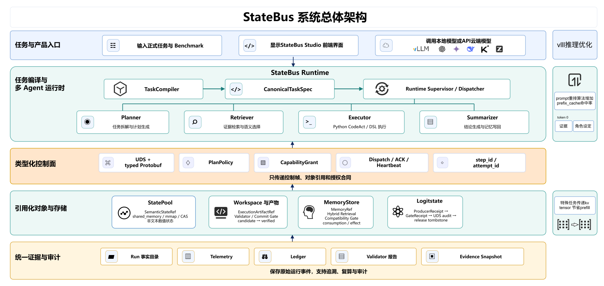

<div align="center">

# StateBus

**面向多 Agent 工作流的类型化状态传递运行时**

让 Planner、Retriever、Executor 与 Summarizer 传递可验证、可追踪、可释放的状态，
而不是不断复制越来越长的文本上下文。

<p>    </p>

<p><a href="#快速开始">快速开始</a> · <a href="#系统架构">系统架构</a> · <a href="#核心能力">核心能力</a> · <a href="#实验结果总览">实验结果</a> · <a href="#项目目录">项目目录</a> · <a href="#实现文档">实现文档</a></p>

</div>

---

## StateBus 是什么

多 Agent 系统经常把所有中间结果重新拼成 prompt：计划、证据、表格、执行输出和
历史记忆都以文本重复传递。这样做容易产生三个问题：上下文不断膨胀、状态来源难以
审计、Agent 输出被误当成已经授权的事实。

StateBus 把任务执行拆成两部分：

- Agent 负责提出计划、检索意图、候选选择和总结；
- Runtime 负责编译任务、批准计划、验证状态、管理引用、执行代码和提交记忆。

> Agent 产生候选，Runtime 决定候选何时获得下游资格。

状态不再是一个跨角色共享的可写字典，而是带身份、摘要、生命周期和消费回执的对象。

## 系统架构

[](docs/contracts/StateBus_系统架构图.svg)

控制面只传任务身份、能力授权、状态引用和运行事件；大对象保留在数据面。跨任务知识
经过兼容门后进入记忆面。模型侧能力默认关闭，只在对应运行模式下参与证据选择、执行
授权或 prefill 复用。

## 可信对象主链

```mermaid
flowchart LR
    TS[CanonicalTaskSpec] --> PP[PlanProposal]
    PP -->|PlanPolicy| AP[ApprovedPlan]
    AP --> ER[EvidenceRequest]
    ER --> EP[CanonicalEvidencePack]
    EP --> SR[SemanticStateRef]
    EP --> EX[Executor Choice]
    SR --> EX
    EX --> AC[Artifact Candidate]
    AC -->|Validators| AV[Artifact Verified]
    AV --> CS[ClaimSet]
    CS --> MC[Memory Commit Candidate]
    MC -->|Commit Gate| MR[MemoryRef Committed]
```



图中的箭头表示对象经过 Runtime 校验后获得新的可见性。`candidate`、`approved`、
`consumed`、`verified` 和 `committed` 分别对应明确的状态提升条件。

## 核心能力

| 能力 | 当前实现 | 运行规则 |
|:--|:--|:--|
| 任务编译 | `CanonicalTaskSpec`、稳定 ID、输入摘要和兼容签名 | 正式任务在执行前统一编译 |
| 计划授权 | Planner 提案、PlanPolicy、CapabilityGrant | PlanPolicy 负责批准和收窄计划 |
| 类型化控制面 | Typed Protobuf、UDS、ACK、心跳和终态事件 | attempt 身份隔离晚到结果 |
| 非文本状态 | shared memory、mmap、CAS、sidecar 和 Ref Registry | Ref 校验 schema、hash、lease 和消费者授权 |
| 证据链 | EvidencePack、locator、hydration、provenance | 结论引用已授权且可回溯的证据 |
| CodeAct | 受限 Python、Transform DSL、Workspace、ArtifactRef | 产物通过 Validator 后进入 verified |
| 共享记忆 | SQLite/FTS、向量检索、兼容判断和 replay gate | 候选经兼容判断与真实消费后产生复用 |
| 可观测性 | Runtime events、task metrics、ledger 和 run artifacts | 指标保留 task、step、attempt 和 trace 维度 |
| Studio | 作业管理、事件流、结果和 artifact API | 页面状态从持久化运行事实重建 |

### 模型侧状态路径

模型侧能力是主链旁路，不取代 TaskSpec、EvidencePack、Artifact 或质量门。

| 路径 | 解决的问题 | 默认状态 |
|:--|:--|:--|
| Embedding State | 跨进程传递稠密 query/candidate matrix，选择证据 | 按状态层配置 |
| Logit Gate | 用闭集候选概率决定执行、重查或结束调度 | `off` |
| Engine-Local Prefix Reuse | 将共同证据放到 token position 0，由同一 vLLM engine 自动复用 | `independent` / `off` |
| Explicit KV Continuation | 同一 Worker 内从 Producer 向 Consumer 继承已计算 parent KV | `off` |

Prefix 是多个完整请求之间的自动 block 命中；显式 KV 是同一任务相邻角色之间的 handle
传递。两者都只改变重复 prefill 的物理来源，不改变业务事实和输出合同。

## 实验结果总览

统一实验使用单张 NVIDIA A100 80GB、Qwen3-32B 和离线确定性任务。正式任务覆盖 20 个
连续任务与五类 25 个独立 case；Prefix、Logit 和显式 KV 使用各自的专项任务与统计分母。

| 机制 | 主要结果 | 正确性 |
|:--|:--|:--|
| 完整 StateBus | 总 Token `33,974 -> 17,870`，下降 `47.40%`；wire `36,069 -> 12,677 B`，下降 `64.85%` | 10/10 |
| 结构化通信 | control bytes 下降 `83.05%`；wire bytes 下降 `68.95%` | 10/10 |
| Embedding 状态 | raw evidence 下降 `84.04%`；总 Token 下降 `49.16%` | 9/9 状态跨 PID 消费并改变选择 |
| Logit Gate | Validator `8/12 -> 12/12`；歧义任务 `3/5 -> 5/5`；错误放行 `2 -> 0` | 19/19 状态消费并释放 |
| 共享记忆 | 配对耗时下降 `18.49%`；Token 下降 `23.75%` | 连续任务 20/20；7/20 查询 actual-use |
| CodeAct | 五类任务总体正确率 `56% -> 100%`，即 `14/25 -> 25/25` | 五类全部通过 |
| 显式 KV | computed prefill 下降 `85.22%`；TTFT 下降 `61.62%`；完整主链下降 `5.69%` | A/B 质量等价 10/10 |
| Prefix | block hit rate `0% -> 78.02%`；平均 TTFT 下降 `68.7%`；端到端下降 `43.0%` | 40/40 请求合同通过 |

完整任务、逐项数据、统计公式与原始日志路径见[实验结果总览](docs/experiments/README.md)。

## 运行模式

| 模型服务 | 普通主链 | Logit | Prefix | 显式 KV |
|:--|:--:|:--:|:--:|:--:|
| 外部 OpenAI-compatible API | 支持 | 由服务端 logprobs 能力决定 | 由远端服务管理 | 标准 API 路径 |
| 本地 vLLM `standard` | 支持 | 支持 | 支持 APC 与 metrics | 关闭 |
| 本地 vLLM `kv` | 支持实验角色调用 | 独立运行 | APC 显式关闭 | 支持 |

本地推理环境固定在 [requirements-vllm.txt](requirements-vllm.txt)，当前对应 Python
3.11、vLLM 0.9.2、PyTorch 2.7.0 和 Transformers 4.52.4。StateBus 没有修改或
内置 vLLM 源码；显式 KV 作为仓库内插件通过 vLLM 扩展入口加载。

## 快速开始

详细配置见 [Docker 与模型服务启动说明](docker/README.md)。下面只保留最短路径。

### 1. 选择模型服务

使用外部 API：

```bash
cp deploy/statebus_llm.yaml.example deploy/statebus_llm.yaml.local
cp deploy/statebus_llm.env.example deploy/statebus_llm.env.local
```

修改本地 YAML 中的 `base_url`、模型名和角色参数，并在 env 文件中填写 API Key。

使用宿主机 Qwen3-32B vLLM：

```bash
cp deploy/vllm.env.example deploy/vllm.env.local
scripts/vllm/manage_qwen3_32b.sh print-config
scripts/vllm/manage_qwen3_32b.sh start
```

vLLM 默认监听 `127.0.0.1:53334`，只使用物理卡 1。依赖安装与显式 KV 模式切换见
[部署说明](docker/README.md#固定的推理环境)。

### 2. 准备应用容器

```bash
cp docker/.env.example docker/.env
sed -i "s/^STATEBUS_UID=.*/STATEBUS_UID=$(id -u)/" docker/.env
sed -i "s/^STATEBUS_GID=.*/STATEBUS_GID=$(id -g)/" docker/.env
```

使用已有镜像启动，不重新构建：

```bash
docker compose \
  --env-file docker/.env \
  -f docker/compose.yaml \
  up -d --no-build
```

### 3. 运行 Smoke

```bash
docker compose \
  --env-file docker/.env \
  -f docker/compose.yaml \
  exec statebus-dev bash
```

容器内执行：

```bash
source /usr/local/bin/activate_statebus_container.sh
python -m statebus.runtime.smoke --role-path-mode local_vllm
```

外部 API 模式将 `local_vllm` 替换为 `api`，并在 `docker/.env` 中把
`STATEBUS_LLM_CONFIG_FILE` 指向 `deploy/statebus_llm.yaml.local` 的容器路径。

### 4. 启动 Studio

```bash
source /usr/local/bin/activate_statebus_container.sh
scripts/run_statebus_studio.sh
```

Studio 服务默认监听 `http://127.0.0.1:8765`。

## 常用开关

普通主链保持全部关闭：

```dotenv
STATEBUS_PREFIX_ALIGNMENT_MODE=independent
STATEBUS_PREFIX_POLICY=off
STATEBUS_LOGIT_GATE_MODE=off
STATEBUS_ENGINE_LOCAL_KV_MODE=off
```

| 配置 | 可选值 |
|:--|:--|
| `STATEBUS_PREFIX_ALIGNMENT_MODE` | `independent`、`shared_evidence_prefix` |
| `STATEBUS_PREFIX_POLICY` | `off`、`observe`、`on` |
| `STATEBUS_LOGIT_GATE_MODE` | `off`、`telemetry`、`retry_once` |
| `STATEBUS_ENGINE_LOCAL_KV_MODE` | `off`、`full_replay`、`continuation` |

修改 `docker/.env` 后使用 `--no-build --force-recreate` 让容器读取新配置。

## 项目目录

```text
statebus/
  benchmark/              离线任务、正式任务族、runner 与指标聚合
  contracts/              Task、Plan、Evidence、Ref、Artifact 等数据合同
  control/                Typed Protobuf、UDS 和 Worker transport
  integrations/vllm_kv/  显式 KV Connector、Middleware 与 Worker Extension
  memory/                 SQLite/FTS、向量检索、兼容与提交
  provenance/             证据来源、locator 和 lineage
  refs/                   Ref Registry 与解析规则
  retrieval/              证据检索、投影和 hydration
  runtime/                编译、调度、角色路径、Gate、执行和重放
  state/                  shared memory、mmap、CAS 与状态生命周期
  studio/                 Studio API、作业和运行事实重建

tests/                    合同、Runtime、状态、模型侧路径和基准回归
docs/implementation/      当前源码对应的实现手册
deploy/                   Host、API 和 vLLM 环境配置
docker/                   openEuler 应用容器配置
scripts/                  启动、诊断和实验入口
studio-ui/                Studio 前端源码
```

### 任务与数据位置

| 内容 | 目录 |
|:--|:--|
| Operating / Financial 连续任务 | `statebus/benchmark/samples/continuous_task_families/` |
| 五类 25 个正式 case | `statebus/benchmark/samples/formal_financial_family/`、`tasks/formal/` |
| Embedding 与 Logit 专项任务 | `statebus/benchmark/samples/semantic_holdout/`、`statebus/benchmark/samples/logit_retry_challenge/` |
| Prefix 任务 | `statebus/benchmark/samples/continuous_task_families/kv_prefix_reuse/` |
| 显式 KV 任务 | `statebus/benchmark/samples/engine_local_kv_continuation/`、`statebus/benchmark/samples/engine_local_kv_mainline_10round/` |
| CSV 数据 | `datasets/operating_metrics/` |

任务 ID、Gold 和 Validator 规则见[基准任务与数据集目录](docs/implementation/benchmark-task-and-dataset-catalog.md)。

## 开发与验证

宿主机开发环境：

```bash
source deploy/activate_statebus_host.sh
python -m pytest -q
python -m statebus.runtime.smoke
```

只验证 Docker 配置，不构建或启动容器：

```bash
docker compose \
  --env-file docker/.env.example \
  -f docker/compose.yaml \
  config
```

## 实现文档

| 主题 | 文档 |
|:--|:--|
| 总入口 | [StateBus 实现手册](docs/implementation/README.md) |
| 系统分层 | [系统架构](docs/implementation/01-system-architecture.md) |
| 任务与控制面 | [任务合同与控制面](docs/implementation/02-task-contract-and-control-plane.md) |
| 非文本状态 | [语义状态与数据面](docs/implementation/03-semantic-state-and-data-plane.md) |
| CodeAct 与产物 | [CodeAct、Artifact 与质量门](docs/implementation/05-codeact-artifact-and-quality.md) |
| 端到端走读 | [端到端任务](docs/implementation/07-end-to-end-task-walkthrough.md) |
| 模型侧能力 | [模型侧状态路径](docs/implementation/runtime/model-state-paths.md) |
| 实验与数据 | [实验结果总览](docs/experiments/README.md)、[任务与数据集目录](docs/implementation/benchmark-task-and-dataset-catalog.md) |
| 可观测与恢复 | [Telemetry 与失败恢复](docs/implementation/08-observability-and-recovery.md) |
| 代码地图 | [扩展与代码地图](docs/implementation/09-code-map-and-extension-guide.md) |
| 部署运行 | [Docker 与模型服务](docker/README.md) |
