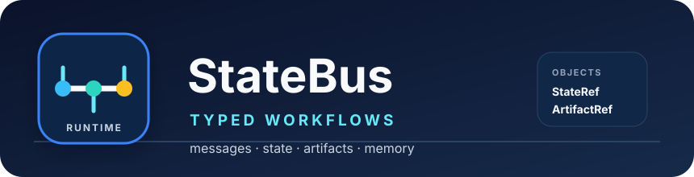
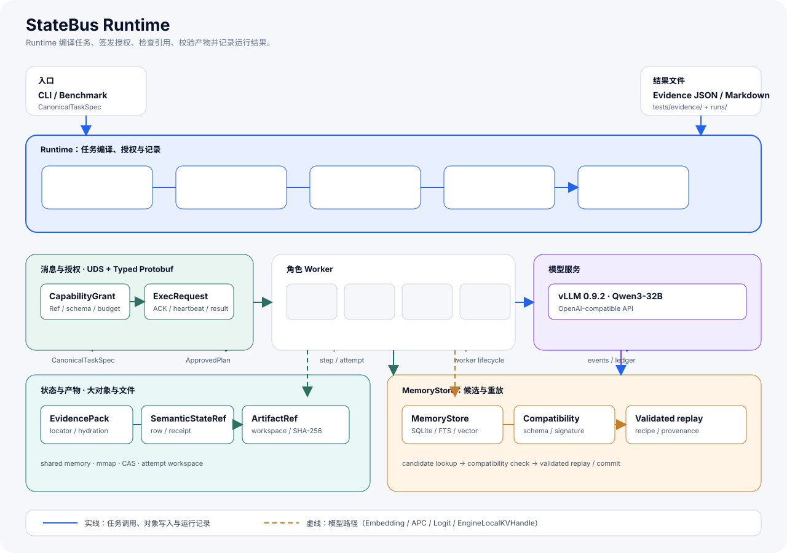

<div align="center">

# StateBus Runtime

**面向多 Agent 工作流的类型化状态传递与共享记忆运行时**

Typed state transfer and shared memory for multi-agent workflows.

<p>
  
</p>
<p>
  
  
  
  
  
</p>

<p>
  <a href="#快速开始">快速开始</a> ·
  <a href="#studio">Studio</a> ·
  <a href="#测试">测试</a> ·
  <a href="#系统架构">系统架构</a> ·
  <a href="#实验结果">实验结果</a> ·
  <a href="#实现文档">实现文档</a> ·
  <a href="#赛题对应关系">赛题对应关系</a>
</p>

</div>

---

## StateBus 是什么

多 Agent 协作时，计划、证据、表格、执行输出和历史经验常被重新拼进 prompt。上下文会变长，角色还要重复解析已经存在的内容。

StateBus 把控制消息和较大的状态对象分开。Planner、Retriever、Executor、Summarizer 负责提出计划、检索结果、执行程序和组织结论；Runtime 负责编译任务、批准计划、检查引用、验证产物并记录运行事实。

当前实现包含 Python Runtime、UDS + Protobuf、`StateRef` / `ArtifactRef` / `MemoryRef`、shared memory/mmap/CAS、受限 CodeAct，以及 vLLM 侧的 APC、显式 KV 和 Logit utility。模型专项从各自的实际接入位置读取数据，默认任务流程继续使用同一组对象合同。

## 系统架构



图中实线表示任务调用、对象写入和运行记录；虚线表示可选模型专项。消息与授权传递任务身份、授权、Ref 和事件，状态与产物保存运行对象，历史复用保存可检索的历史对象。图示对应的源码入口见 [`docs/architecture/README.md`](docs/architecture/README.md)。

## 赛题对应关系

| 赛题要求 | 当前实现 | 代码与结果入口 |
| --- | --- | --- |
| 三类以上 Agent 协作 | Planner、Retriever、Executor、Summarizer | [`src/statebus/runtime/`](src/statebus/runtime/) |
| 结构化通信 | typed Protobuf、UDS、ACK、心跳和终态事件 | [`src/statebus/control/`](src/statebus/control/) |
| 非文本状态 | `SemanticStateRef`、`LogitStateRef`、APC、`EngineLocalKVHandle` | [`src/statebus/state/`](src/statebus/state/)、[`src/statebus/integrations/vllm_kv/`](src/statebus/integrations/vllm_kv/) |
| 共享记忆 | SQLite/FTS、向量检索、兼容性检查、validated replay | [`src/statebus/memory/`](src/statebus/memory/) |
| 可复现实验 | 标准任务 24 对、机制位置 24 个、utility 位置 28 个 | [`tests/evidence/README.md`](tests/evidence/README.md)、[`docs/experiments/README.md`](docs/experiments/README.md) |

## 实验结果

实验分为主实验、Memory/State 机制实验和 APC/KV/Logit 模型侧专项。主页保留关键结果，逐任务数据和字段说明见 [`docs/experiments/results.md`](docs/experiments/results.md)。

| 实验 | 分母 | 主要对照 | 关键结果 |
| --- | ---: | --- | --- |
| 主实验 | 24 对、48 次执行 | `SB-FULL` / `P-TEXT` | 质量 24/24；requests **降低 31.67%**；provider tokens **降低 39.05%**；Executor generations **降低 52.78%**；repairs **降低 58.33%**；E2E **降低 24.47%** |
| Memory | 16 个位置 | `off` / `on` | 质量 8/8；requests **降低 33.33%**；provider tokens **降低 44.12%**；任务耗时 **降低 27.12%**；4/8 进入 validated replay |
| State | 8 个位置 | `off` / `on` | 质量 4/4；任务耗时 **降低 3.43%**；publish/transfer/consume `10/10/10`；S1 的 behavioral effect 为 `changed` |
| APC | 8 个位置 | `independent` / `shared` | consumer TTFT **降低 89.59%**；hit tokens `48 → 5,168`；task wall **降低 4.29%** |
| 显式 KV | 8 个位置 | `full_replay` / `continuation` | computed prefill **降低 90.37%**；TTFT **降低 60.88%**；request wall **降低 11.88%**；task wall **降低 3.58%** |
| Logit | 12 个位置 | `full` / `compact` / `selective` | logical input **降低 75.21%**；request wall **降低 17.18% / 18.51%**；9 个 resolved case 通过，3 个正确 `abstention` |

详细实验结果：[`docs/experiments/README.md`](docs/experiments/README.md) → [`docs/experiments/results.md`](docs/experiments/results.md)。

## 快速开始

所有命令从仓库根目录执行：

```bash
cd /home/qcrs/statebus/os
```

### 1. 真实启动：Runtime、vLLM 和应用容器

完成一次 Host 环境安装后，下面第三条命令就是实际启动入口。它会读取 profile，启动或复用匹配的 vLLM 服务，启动 `statebus-runtime` 容器，并执行服务检查和 smoke：

```bash
nvidia-smi -L
scripts/start_statebus.sh qwen3-32b-gpu2-u050 --print-config
scripts/start_statebus.sh qwen3-32b-gpu2-u050
```

`--print-config` 只显示解析后的配置；不带该参数的命令才执行启动。可用 profile：

```bash
scripts/start_statebus.sh --list-profiles
```

启动完成后，Runtime 使用 `http://127.0.0.1:53334/v1` 的 Qwen3 服务，应用容器由 `statebus-runtime` 管理。

### 2. Host 环境

`statebus_host` 安装脚本会安装 `requirements-host.txt`、`requirements-studio.txt` 并以 editable 方式安装当前源码：

```bash
deploy/install_statebus_host.sh
source deploy/activate_statebus_host.sh
python -c 'import statebus; print(statebus.__file__)'
```

已有环境只需执行 `source deploy/activate_statebus_host.sh`。

### 3. vLLM 配置与手动服务管理

vLLM 使用独立 Conda 环境和 host GPU。配置文件位置如下：

| 文件 | 内容 |
| --- | --- |
| `deploy/vllm.env.local` | 模型路径、服务端口、物理 GPU、context、显存比例和 APC/KV 模式 |
| `deploy/statebus_llm.yaml.local` | Runtime 的 provider、角色模型和请求参数 |
| `deploy/statebus_llm.env.local` | API key、embedding 和临时环境变量 |

```bash
cp deploy/vllm.env.example deploy/vllm.env.local
cp deploy/statebus_llm.local_vllm.example deploy/statebus_llm.yaml.local
cp deploy/statebus_llm.env.example deploy/statebus_llm.env.local
nvidia-smi -L
scripts/vllm/manage_qwen3_32b.sh print-config
scripts/vllm/manage_qwen3_32b.sh start
scripts/vllm/manage_qwen3_32b.sh health
```

默认 profile 为 Qwen3-32B、`http://127.0.0.1:53334/v1`、物理 GPU 2、`max-model-len=8192` 的配置。正式 profile 可由 `scripts/start_statebus.sh --list-profiles` 查看。

### 4. 单独启动 Runtime 容器

需要拆开启动步骤时，使用同一个 profile。脚本会先检查并复用健康的 vLLM 服务，再启动 `statebus-runtime`：

```bash
scripts/start_statebus.sh --list-profiles
scripts/start_statebus.sh qwen3-32b-gpu2-u050 --print-config
scripts/start_statebus.sh qwen3-32b-gpu2-u050
```

只查看 Docker Compose 配置：

```bash
docker compose --env-file docker/.env.example -f docker/compose.yaml config
```

镜像构建入口为 `deploy/build_statebus_image.sh --dry-run`；容器、挂载和环境变量说明见 [`docker/README.md`](docker/README.md)。

### 5. Live smoke

`start_statebus.sh` 启动时会执行一次 smoke。服务保持运行后，可以用 benchmark dispatcher 再执行完整的 host、vLLM、容器和 Runtime smoke：

```bash
tests/benchmarks/run_statebus.sh smoke
```

这个命令会访问 `127.0.0.1:53334/health`，在 `statebus-runtime` 中运行 `statebus.runtime.smoke --role-path-mode local_vllm`，并把本次结果写入 `runs/`。`--dry-run` 只打印底层命令，不会执行 smoke。入口说明见 [`tests/benchmarks/README.md`](tests/benchmarks/README.md)。

### 6. Demo

使用本地 vLLM 和 Runtime 启动 Studio Demo。API 和 UI 分别在两个终端运行：

终端一：

```bash
source deploy/activate_statebus_host.sh
demo/run_demo.sh --local-vllm
```

终端二：

```bash
scripts/run_statebus_studio_ui.sh
```

浏览器访问 `http://127.0.0.1:50173`。`demo/run_demo.sh --offline` 只回放已保存的结果，不访问服务。命令说明见 [`demo/README.md`](demo/README.md)。

### 7. Live benchmark

先执行上面的真实启动命令并通过 smoke，再启动 benchmark。Benchmark runner 不负责启动或重启 vLLM 和容器；每次执行写入新的 `runs/` 子目录。

主实验（24 对、48 次执行）：

```bash
tests/benchmarks/run_statebus.sh mainline-24
```

Memory / State 机制实验：

```bash
tests/benchmarks/run_statebus.sh mainline-mechanisms
```

APC、显式 KV 和 Logit utility suite：

```bash
tests/benchmarks/run_statebus.sh utility --execute --yes
```

只运行一个 utility phase 时，将 `utility` 换为 `apc`、`kv` 或 `logit`。运行前可用对应命令加 `--dry-run` 查看解析后的 runner 参数；完整参数和输出目录见 [`tests/benchmarks/README.md`](tests/benchmarks/README.md)。

## Studio

Studio API 默认监听 `http://127.0.0.1:50080`，Vite 开发页面默认监听 `http://127.0.0.1:50173`。先启动 vLLM 和 Runtime 所需的 host 环境，再开两个终端：

终端一：

```bash
source deploy/activate_statebus_host.sh
scripts/run_statebus_studio.sh
```

终端二：

```bash
cd src/studio-ui
npm ci
cd ../..
scripts/run_statebus_studio_ui.sh
```

浏览器打开 `http://127.0.0.1:50173`。需要由 API 直接提供构建后的页面时，执行 `cd src/studio-ui && npm ci && npm run build`，然后访问 `http://127.0.0.1:50080`。

## 测试

测试入口和命令索引见 [`tests/README.md`](tests/README.md)。离线测试不需要 vLLM：

```bash
source deploy/activate_statebus_host.sh
PYTHONDONTWRITEBYTECODE=1 python -m pytest -q tests/unit
PYTHONDONTWRITEBYTECODE=1 python -m pytest -q tests/integration
PYTHONDONTWRITEBYTECODE=1 python -m pytest -q tests/benchmarks
```

Studio 前端类型检查和流程测试：

```bash
cd src/studio-ui
npm ci
npm run typecheck
npm run test:flow
```

离线查看 benchmark 计划（不会访问 vLLM、GPU 或 Docker）：

```bash
tests/benchmarks/run_statebus.sh smoke --dry-run
tests/benchmarks/run_statebus.sh mainline-24 --dry-run
tests/benchmarks/run_statebus.sh mainline-mechanisms --dry-run
tests/benchmarks/run_statebus.sh utility --dry-run
```

需要实际执行时，使用上面的 [`Live benchmark`](#7-live-benchmark) 命令；`utility` 必须显式带 `--execute --yes`。

汇总精选结果：

```bash
python tests/evidence/summarize_results.py
python tests/evidence/summarize_results.py --json
```

实时 runner 依赖 vLLM、GPU、Docker 和模型文件；启动顺序、健康检查和各配置字段见 [`docker/README.md`](docker/README.md) 与 [`AGENTS.md`](AGENTS.md)。

## 实现文档

| 想了解什么 | 入口 |
| --- | --- |
| 文档地图 | [`docs/README.md`](docs/README.md) |
| 系统分层、对象和源码归属 | [`docs/architecture/README.md`](docs/architecture/README.md) |
| 一次任务、Runtime、Embedding、APC、显式 KV、Logit 的接入位置 | [`docs/implementation/README.md`](docs/implementation/README.md) |
| 实验分母、结果和复现 | [`docs/experiments/README.md`](docs/experiments/README.md) |
| 精选机器结果 | [`tests/evidence/README.md`](tests/evidence/README.md) |
| 部署和服务检查 | [`docker/README.md`](docker/README.md) |

## 目录导航

```text
os/
├── README.md
├── docs/
├── src/
├── tests/
├── scripts/
├── demo/
├── docker/
├── presentation/
├── deploy/
├── tasks/
├── tools/
├── datasets/
└── runs/
```

目录入口：

| 目录 | 入口 |
| --- | --- |
| `docs/` | [`docs/README.md`](docs/README.md) |
| `src/` | [`src/README.md`](src/README.md) |
| `tests/` | [`tests/README.md`](tests/README.md) |
| `scripts/` | [`scripts/README.md`](scripts/README.md) |
| `demo/` | [`demo/README.md`](demo/README.md) |
| `docker/` | [`docker/README.md`](docker/README.md) |
| `presentation/` | [`presentation/README.md`](presentation/README.md) |
| `deploy/` | [`deploy/`](deploy/) |
| `tasks/` | [`tasks/`](tasks/) |
| `tools/` | [`tools/`](tools/) |
| `datasets/` | [`datasets/`](datasets/) |
| `runs/` | [`runs/`](runs/)（运行输出） |

## 统计

- 标准任务、机制位置和 utility suite 使用独立任务集合与分母：`24 对 / 48 个位置`、`24 个位置`、`28 个位置`。
- `provider tokens`、`task_e2e_ms`、`computed prefill`、`TTFT`、state bytes 和 KV bytes 是不同指标，按各自实验范围解读。
- Memory 的候选命中、实际消费和 validated replay 分开记录；State 的事件记录与业务字段变化分开记录。
- raw run 位于 [`runs/`](runs/)；精选结果位于 [`tests/evidence/README.md`](tests/evidence/README.md)。
