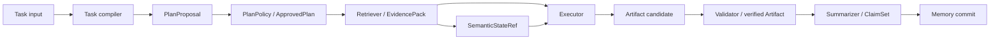

# StateBus

StateBus 是面向多 Agent 工作流的 Python Runtime。`Runtime` 编译任务、批准计划、调度角色、验证产物，并记录 `State`、`Memory`、`Artifact` 和 telemetry 的生命周期。

当前源码位于 `src/`：

```text
src/statebus/       Python Runtime、contracts、state、memory、benchmark、Studio backend
src/studio-ui/      React/TypeScript Studio frontend
tasks/              任务定义和运行输入
tests/              单元、集成、benchmark contract、精选 evidence
scripts/            服务、运行和实验入口
docs/               架构、实现、实验、设计和报告索引
```

## 从哪里开始

| 目的 | 入口 |
| --- | --- |
| 了解文档结构 | [`docs/README.md`](docs/README.md) |
| 查看系统组成和代码归属 | [`docs/architecture/README.md`](docs/architecture/README.md) |
| 追踪一次任务 | [`docs/implementation/README.md`](docs/implementation/README.md) |
| 复现实验或核对结果 | [`docs/experiments/README.md`](docs/experiments/README.md) |
| 查看稳定命令 | [`scripts/README.md`](scripts/README.md)、[`tests/benchmarks/README.md`](tests/benchmarks/README.md) |
| 查看部署边界 | [`docker/README.md`](docker/README.md)、[`AGENTS.md`](AGENTS.md) |

## Runtime 主链

Runtime 让角色生成候选，让合同和策略决定候选何时可以进入下一步。典型对象关系如下：


```mermaid
flowchart LR
    T[Task input] --> C[Task compiler]
    C --> P[PlanProposal]
    P --> A[PlanPolicy / ApprovedPlan]
    A --> R[Retriever / EvidencePack]
    R --> S[SemanticStateRef]
    R --> E[Executor]
    S --> E
    E --> X[Artifact candidate]
    X --> V[Validator / verified Artifact]
    V --> U[Summarizer / ClaimSet]
    U --> M[Memory commit]
```

控制面使用 typed messages 和 UDS transport 传递身份、授权、引用和运行事件；较大的 state、artifact 和 workspace 内容由数据面或持久化 store 保存。`StateRef`、`ArtifactRef` 和 `MemoryRef` 的读取、消费和释放都带有当前 task、step、attempt 和 grant 约束。

## 三条结果链

结果页面必须按不同分母阅读：

| 结果链 | 当前范围 | 当前精选结果 |
| --- | --- | --- |
| 主链 `SB-FULL` / `P-TEXT` | finance 12 轮 + service_ops 12 轮；两种 variant 共 24 轮、48 个任务位置 | 48/48 通过质量门；24/24 配对质量一致 |
| Memory / State 机制实验 | 16 个 Memory 位置 + 8 个 State 位置，共 24 个计划位置 | 当前汇总 24/24 通过质量门；State-on 观测到 `publish/transfer/consume/release`，其中 `semantic-holdout-s1` 的 `behavioral_effect=changed` |
| APC / 显式 KV / Logit utility | APC 8、KV 8、Logit 12，共 28 个计分位置 | APC 8/8、KV 8/8；Logit 9 个 resolved case 通过、3 个正确 `abstention` |

精选 evidence：[`tests/evidence/mainline/`](tests/evidence/mainline/)、[`tests/evidence/mechanisms/`](tests/evidence/mechanisms/)、[`tests/evidence/model-assist/`](tests/evidence/model-assist/)。主链的 `provider tokens` 是模型服务用量，不是 Agent 间通信 token；当前主链没有采集 `wire_bytes`、`typed_bytes` 或对象边界 serialization bytes。State 的 publish/transfer/consume/release 事件也不能单独证明业务收益。

## 快速检查

不启动服务的入口检查：

```bash
cd /home/qcrs/statebus/os
source ./deploy/activate_statebus_host.sh
python -c 'import statebus; print(statebus.__file__)'
tests/benchmarks/run_statebus.sh --help
tests/benchmarks/run_statebus.sh mainline-24 --dry-run
tests/benchmarks/run_statebus.sh mainline-mechanisms --dry-run
tests/benchmarks/run_statebus.sh utility --dry-run
```

离线回归测试：

```bash
PYTHONDONTWRITEBYTECODE=1 python -m pytest -q tests/unit tests/integration tests/benchmarks
```

实时主链、机制实验和 utility suite 都需要已获准的服务环境。runner 会检查环境，但不会替用户启动或重启 vLLM；GPU、容器和服务边界见 [`AGENTS.md`](AGENTS.md) 与 [`docker/README.md`](docker/README.md)。

## 运行入口

```text
src/statebus/benchmark/contest_dsl_mainline.py       主链实现
src/statebus/benchmark/contest_mechanisms.py         Memory / State 机制实现
src/statebus/benchmark/model_assist_utility/         APC / KV / Logit utility 实现
scripts/run_contest_dsl_mainchains.sh                主链 launcher
scripts/run_contest_mechanisms.sh                    机制 launcher
scripts/experiments/contest_model_assist/             utility launcher
tests/benchmarks/run_statebus.sh                     稳定 dispatcher
tests/evidence/summarize_results.py                  evidence 汇总
```

`project/` 是历史运行参考库，不是本 checkout 的源码入口。本 README 只描述 `/home/qcrs/statebus/os` 的当前文件、当前 runner 和精选 evidence；完整 raw run 保留在 `runs/`。
