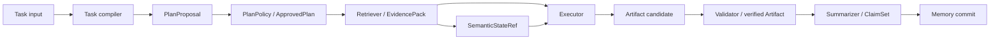

# StateBus

StateBus 是面向多 Agent 工作流的 Python Runtime：角色提出候选，Runtime 编译任务、批准计划、管理 `State` / `Memory` / `Artifact` 生命周期，并在质量门和来源证据闭合后交付结果。

## 先看结果

当前 evidence 分成三条链，不能把它们合并成一个分母：

| 结果链 | 对照 | 当前结果 | 这张表回答什么 |
| --- | --- | --- | --- |
| 主链：24 轮 / 48 任务位置 | `SB-FULL` vs `P-TEXT`，finance 与 `service_ops` 各 12 轮 | 两侧均 `24/24` 质量通过；`SB-FULL` provider tokens `74,180` vs `121,702`，少 `39.05%`；requests `41` vs `60`，少 `31.67%`；任务总耗时 `1,543.3 s` vs `2,043.4 s`，少 `24.48%` | 完整产品在相同任务和质量门下的观测差异 |
| Memory / State 机制：24 个计划位置 | Memory `off/on` 16 个位置；State `off/on` 8 个位置 | Memory `on` tokens `17,581` vs `31,466`，少 `44.12%`；State 两侧 `4/4`，on 侧 `publish/transfer/consume=10/10/10` 且全部 release | 被测机制实际改变了什么、付出了什么成本 |
| APC / KV / Logit utility：28 个计分位置 | APC、显式 KV、Logit 各自使用独立配对 | APC `8/8`、KV `8/8`；Logit `9` 个 resolved case 通过、`3` 个正确 `abstention`；APC consumer TTFT `2540.2 -> 264.3 ms`，KV computed prefill `5666.5 -> 545.5 tokens` | 模型侧旁路能否在真实调用中生效以及代价边界 |

### 主链对比

`SB-FULL` 和 `P-TEXT` 使用同一批 24 对任务，质量均为 `24/24`。这是完整产品级对照：当前两条路径的执行责任和机制开关并不完全相同，因此数字用于展示 StateBus 产品在本次 campaign 的整体观测差异，不把差额单独归因于 typed protocol。

| 指标 | `SB-FULL` | `P-TEXT` | `SB-FULL` 相对变化 |
| --- | ---: | ---: | ---: |
| 质量通过 | 24/24 | 24/24 | 保持 |
| provider requests | 41 | 60 | `-31.67%` |
| provider prompt tokens | 60,544 | 103,534 | `-41.52%` |
| provider completion tokens | 13,636 | 18,168 | `-24.94%` |
| provider total tokens | 74,180 | 121,702 | `-39.05%` |
| Executor generations | 17 | 36 | `-52.78%` |
| Executor repairs | 5 | 12 | `-58.33%` |
| 24 个任务总耗时 | 1,543.3 s | 2,043.4 s | `-24.48%` |

按业务 family 的任务总耗时也保持同方向：finance `927.1 s -> 1,266.4 s`，`-26.79%`；`service_ops` `616.2 s -> 777.0 s`，`-20.69%`。两侧均质量通过，失败和 repair 没有从分母删除。

这不是通信 wire benchmark：当前主链没有采集等价的 `wire_bytes`、`typed_bytes` 或对象边界 serialization bytes。`P-TEXT` 的 `780,825` text bytes 与 `SB-FULL` 的进程内 typed carrier 不能直接做字节比率。

### 机制对比

Memory 的 `off/on` 是同一机制 runner、同一质量门和同一任务集合的直接对照：`18 -> 12` provider requests，`31,466 -> 17,581` provider tokens，`550.2 s -> 401.0 s` 任务耗时总和；8 个 on 位置中 4 个进入 validated replay。候选命中、实际消费、replay 和跳过 Executor generation 是不同事件。

State 的 `off/on` 两侧均为 `4/4` 通过：requests `21 -> 21`，tokens `42,035 -> 42,235`，任务耗时总和 `614.5 s -> 593.4 s`。on 侧 4 个位置均观察到 `publish`、`transfer`、`consume` 和 `release`；`semantic-holdout-s1` 的最新 on 记录为 `success`，`behavioral_effect=changed`。这证明状态被消费和改变选择，不单独证明业务收益。

## Runtime 主链


```mermaid
flowchart LR
    T[Task input] --> C[Task compiler]
    C --> P[PlanProposal]
    P --> A[PlanPolicy / ApprovedPlan]
    A --> R[Retriever / EvidencePack]
    R --> S[SemanticStateRef]
    R --> E[Executor]
    S --> E
    E --> X[Artifact candidate]
    X --> V[Validator / verified Artifact]
    V --> U[Summarizer / ClaimSet]
    U --> M[Memory commit]
```

控制面使用 typed messages 和 UDS transport 传递身份、授权、引用和运行事件；较大的 state、artifact 和 workspace 内容由数据面或持久化 store 保存。`StateRef`、`ArtifactRef` 和 `MemoryRef` 的读取、消费和释放都受当前 task、step、attempt 和 grant 约束。

当前源码入口：

```text
src/statebus/       Python Runtime、contracts、state、memory、benchmark、Studio backend
src/studio-ui/      React/TypeScript Studio frontend
tasks/              任务定义和运行输入
tests/              单元、集成、benchmark contract、精选 evidence
scripts/            服务、运行和实验入口
docs/               架构、实现、实验和证据索引
```

## 从哪里开始

| 目的 | 入口 |
| --- | --- |
| 阅读实验对照和口径 | [`docs/experiments/README.md`](docs/experiments/README.md) |
| 查看精选机器结果 | [`tests/evidence/`](tests/evidence/) |
| 了解系统组成和代码归属 | [`docs/architecture/README.md`](docs/architecture/README.md) |
| 追踪一次任务 | [`docs/implementation/README.md`](docs/implementation/README.md) |
| 复现实验或做 dry-run | [`tests/benchmarks/README.md`](tests/benchmarks/README.md) |
| 查看部署边界 | [`docker/README.md`](docker/README.md)、[`AGENTS.md`](AGENTS.md) |

## 快速检查

```bash
cd /home/qcrs/statebus/os
source ./deploy/activate_statebus_host.sh
python -c 'import statebus; print(statebus.__file__)'
tests/benchmarks/run_statebus.sh --help
tests/benchmarks/run_statebus.sh mainline-24 --dry-run
tests/benchmarks/run_statebus.sh mainline-mechanisms --dry-run
tests/benchmarks/run_statebus.sh utility --dry-run
PYTHONDONTWRITEBYTECODE=1 python tests/evidence/summarize_results.py
```

实时 runner 需要已获准的 vLLM、GPU 和容器环境；runner 会检查环境，不会替用户启动或重启服务。完整 raw run 保留在 `runs/`，`project/` 只作为历史运行参考库，不是本 checkout 的源码入口。

## 运行入口

```text
src/statebus/benchmark/contest_dsl_mainline.py       主链实现
src/statebus/benchmark/contest_mechanisms.py         Memory / State 机制实现
src/statebus/benchmark/model_assist_utility/         APC / KV / Logit utility 实现
scripts/run_contest_dsl_mainchains.sh                主链 launcher
scripts/run_contest_mechanisms.sh                    机制 launcher
scripts/experiments/contest_model_assist/             utility launcher
tests/benchmarks/run_statebus.sh                     稳定 dispatcher
tests/evidence/summarize_results.py                  evidence 汇总
```

更完整的 Runtime、角色、State、Memory、Artifact 和 Studio 说明见 [`docs/implementation/README.md`](docs/implementation/README.md)。
