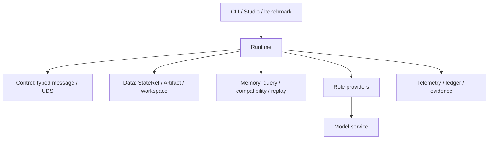

# 架构索引

架构页回答系统由哪些组件组成、目录各自负责什么，以及一次主链任务中的对象如何取得后续使用资格。实验数字留在 `docs/experiments/` 与 `tests/evidence/`，运行日志和 raw run 留在 `runs/`。

## 系统分层

`src/statebus/` 是 Python Runtime 和 backend；`src/studio-ui/` 是前端；`tasks/` 保存任务输入和 validator；`src/statebus/benchmark/` 保存可复用 runner、taskpack 和样本逻辑。两者职责不能互换。

## 主链对象

`CanonicalTaskSpec` 进入 compiler 后形成计划提案。`PlanPolicy` 和 capability grant 产生批准计划；Retriever 产出 evidence 与可选的 `SemanticStateRef`；Executor 产出候选程序或动作，经过 sandbox、artifact verifier 和 quality gate 后才能交给 Summarizer；validated `ClaimSet` 才能进入 Memory commit。

模型侧路径是旁路：Embedding 用于 candidate/evidence 选择；Logit gate 用于候选概率决策；APC 依赖同一 vLLM engine 的共同 token prefix；显式 KV continuation 依赖指定 producer 的 engine-local handle。它们不改变业务对象或 quality gate，也不属于主链默认开关。

## 索引

- [`directory-map.md`](directory-map.md)：当前目录和职责。
- [`code-index.md`](code-index.md)：源码、脚本、测试和 evidence 的对应关系。
- [`../implementation/README.md`](../implementation/README.md)：Runtime 调用路径和专题页面。
