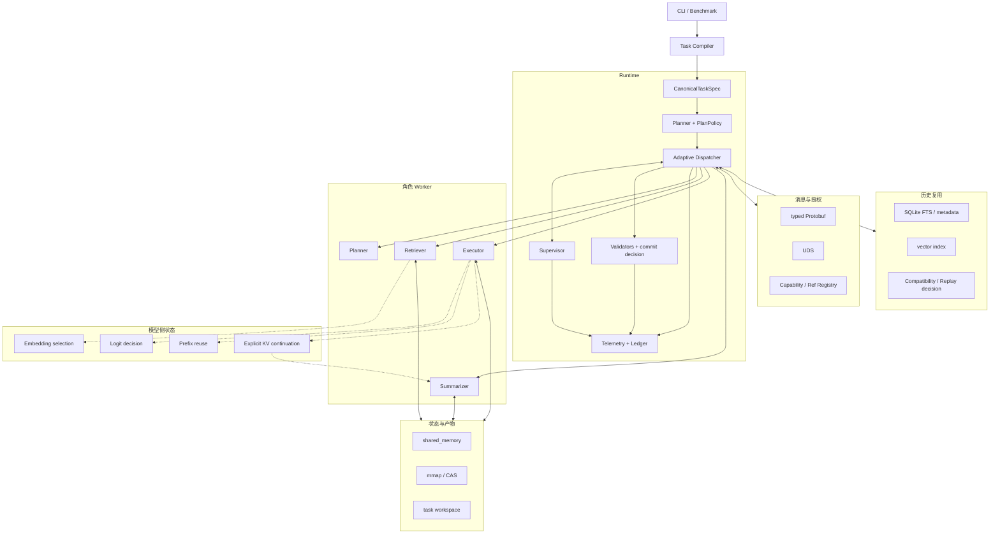
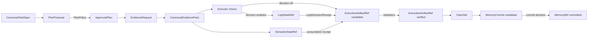
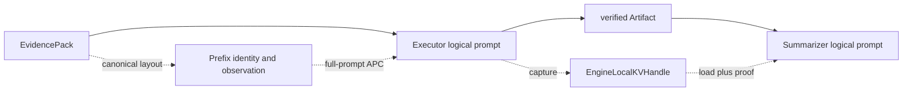
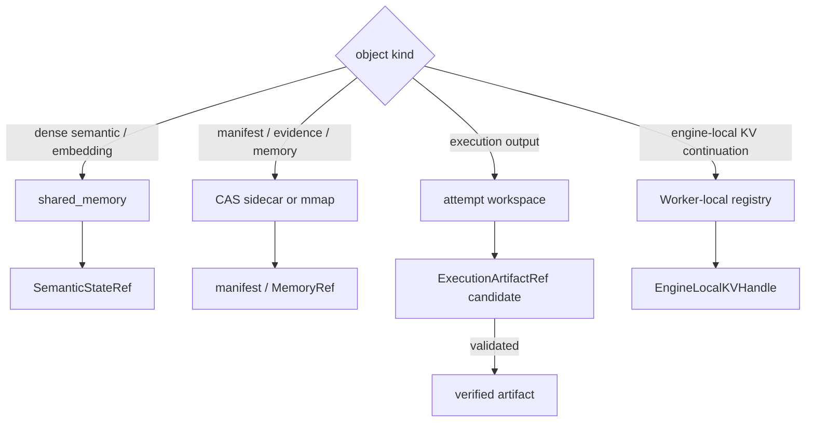

# 架构索引

本页说明 StateBus 的调用关系、对象位置、进程拓扑和源码归属。实验数字集中在 [`docs/experiments/README.md`](../experiments/README.md)，运行日志和 raw run 保留在 [`runs/`](../../runs/)。

## 调用关系

Runtime 负责任务编译、计划批准、Worker 会话、引用检查、产物校验和异常结束。Planner、Retriever、Executor 与 Summarizer 产生各自阶段的候选对象，Runtime 校验后把对象交给后续步骤。

传统文本工作流通常让上游把中间结果写成一段自然语言，再由下游重新解析。这样虽然容易搭建，却把控制指令、业务证据、数值状态、执行文件和历史经验混在同一载体中。StateBus 将它们分别放入消息与授权、状态与产物、历史复用三类职责，并用 task、step、attempt、Ref、hash 和 schema 保持关联。



消息与授权回答“谁在什么授权下做什么”。线路上主要传 task/step/attempt、目标角色、operation、超时、能力授权 hash 和按类型分离的 Ref。完整证据、embedding 矩阵、候选概率向量与执行文件不随消息重复传输。

状态与产物回答“真实对象放在哪里”。短生命周期稠密状态优先进入 shared memory，回放对象和 manifest 进入 mmap/CAS，执行输出进入 attempt 隔离的 workspace。消费方必须根据 Ref Registry 解析载体，并重新核对对象类型、状态、hash、schema 和授权范围。

历史复用回答“历史对象是否适合当前任务”。关键词、标签和向量索引先给出候选；任务意图、I/O schema、数据 manifest、lineage、Runtime signature 和角色视图再决定兼容性，实际复用记录在消费事件中。

模型侧状态回答“同一份证据如何影响选择或减少重复推理”。Embedding 和 Logit 分别进入证据选择与执行授权；Prefix 依赖 vLLM Automatic Prefix Caching，角色请求仍携带完整 prompt；显式 KV 以 Worker-local handle 让 Summarizer 继承 Executor 已计算的 parent。EvidencePack、Artifact 和质量检查继续负责业务结果。

四角色在业务上形成顺序，各自读取 Runtime 投影出的输入视图，输出先进入候选状态。Planner 的计划需要批准，Retriever 的状态需要消费验证，Executor 的文件需要质量检查，Summarizer 读取 verified 产物。

控制消息和物理载体可以独立更换。例如 dense state 保持 `SemanticStateRef` 语义不变时，可以从 shared memory 切换到 mmap；Executor 新增 DSL 操作时，CapabilityGrant 和 Artifact Validator 仍按同一合同校验。

相关源码入口：[`src/statebus/runtime`](../../src/statebus/runtime)、[`src/statebus/control`](../../src/statebus/control)、[`src/statebus/state`](../../src/statebus/state)、[`src/statebus/memory`](../../src/statebus/memory) 和 [`src/statebus/integrations/vllm_kv`](../../src/statebus/integrations/vllm_kv)。模型侧四条路径的职责见[模型侧状态路径](../implementation/runtime.md#模型侧状态路径)。

---

### 三类对象职责

| 职责 | 保存内容 | 主要源码 |
| --- | --- | --- |
| 消息与授权 | `ControlHeader`、`CapabilityGrant`、`ExecRequest`、ACK、heartbeat 和终态事件 | `src/statebus/control/`、`src/statebus/runtime/` |
| 状态与产物 | `EvidencePack`、`SemanticStateRef`、`ArtifactRef`、workspace 和 hash | `src/statebus/state/`、`src/statebus/retrieval/`、`src/statebus/refs/` |
| 历史复用 | candidate、兼容性结果、validated replay、recipe 和来源信息 | `src/statebus/memory/`、`src/statebus/provenance/` |

---

## 对象与数据流

StateBus 用类型化对象连接四个角色。Runtime 通过对象识别内容的身份、来源、生命周期和可见范围。角色 Worker 产生候选，PlanPolicy 和 Validator 根据合同更新对象状态。



Prefix 与显式 KV 位于对象合同的标准任务流程可选模型路径。Prefix 生成 canonical layout、exact-token identity
和 counter observation；显式 KV 生成 `EngineLocalKVHandle` 与 `KVForwardProof`。Summarizer
与记忆写回继续以 verified Artifact 为输入。



`CanonicalTaskSpec` 是任务信息，记录 task family、intent、目标实体、期间、输出和工具要求。它的 hash 会进入计划、Replay 与 Ledger，使一次历史结果能够回到当时的任务定义。

`PlanProposal` 是 Planner 生成的候选 DAG。PlanPolicy 校验能力 owner、角色基数、依赖、预算、输入 Ref、输出合同和 Validator 后，才产生 `ApprovedPlan`。批准计划同时固定 policy report hash 和 capability registry digest，记录 Runtime 接受的执行图。

`CanonicalEvidencePack` 保存可回溯证据，内部按 hard facts、structured evidence、semantic
contexts、lexical hints 和 conflicts 分桶。证据项带 source locator，pack 带源文档 hash 和
自身 hash。`SemanticStateRef` 与 EvidencePack 配套保存 query/candidate embedding 的数值选择矩阵，
来源事实继续由 EvidencePack 承载。

`LogitStateRef` 保存 Executor 闭集候选的概率投影和 `other_mass`。独立 PID 的决策进程计算
top-1 与 margin，并把 action 设为执行、受限重查或 fail closed。计划、能力和业务事实仍由
PlanPolicy、CapabilityGrant 与 Validator 分别处理。

`ExecutionArtifactRef` 表示 Executor 产生的文件型结果。创建时通常为 `candidate`，output schema、业务事实、来源关系和质量检查通过后变为 `verified`。程序退出码为 0 是一项验证信号，对象状态由完整检查结果决定。

`ClaimSet` 是 Summarizer 输出的结构化结论集合。每条结论绑定已验证 Artifact 或 Evidence
locator。通过最终质量检查后，适合跨任务保存的摘要、策略和产物关系形成 `MemoryCommit`，
并在提交成功后成为 `MemoryRef`。

| 状态词 | 真实含义 | 典型对象 |
|:--|:--|:--|
| proposed / candidate | 对象已生成，但尚未获得下游消费资格 | PlanProposal、Artifact candidate、MemoryCommit candidate |
| approved | 计划、能力或操作经过确定性策略批准 | ApprovedPlan、CapabilityGrant |
| active | Ref 已发布且在 lease/Registry 中有效 | SemanticStateRef、LogitStateRef、可读输入 Ref |
| consumed | 具体角色在具体 step/attempt 中读取了对象并留下回执 | StateConsumptionRecord、MemoryConsumption |
| verified | Validator 与质量条件通过，可交给下游 | ExecutionArtifactRef |
| committed | 通过写回条件，可进入跨任务索引 | MemoryRef |
| invalidated | 对象保留诊断信息，但关闭下游可见性 | 失败产物、失效记忆 |

对象之间通过 hash 连接。Plan 保存 spec/registry/report 摘要，Grant 保存 ApprovedPlan hash，Artifact 保存 blob/manifest hash，Memory 保存输入输出合同和 Runtime signature，Replay Ledger 再把这些摘要组合成可审计记录。

对象的生成和批准由不同组件执行：Planner 生成计划、PlanPolicy 批准计划；Executor 生成
业务结果、Validator 验证结果；Retriever 发现相似记忆、兼容性检查判定是否可用；
Summarizer 读取 verified 对象。每种对象均记录 producer、validator、consumer、状态提升条件
和清理责任。

`EngineLocalKVHandle` 具有 `PREPARING -> READY -> CONSUMING -> CONSUMED -> RELEASED`
生命周期，由 vLLM Worker-local registry 管理。其对象关系见[Ref 类型职责](../implementation/state.md)
和[显式 KV Continuation](../implementation/runtime.md)。

主要类型位于 [`src/statebus/contracts/models.py`](../../src/statebus/contracts/models.py)、[`src/statebus/contracts/adaptive.py`](../../src/statebus/contracts/adaptive.py)、[`src/statebus/refs/models.py`](../../src/statebus/refs/models.py) 和 [`src/statebus/memory/models.py`](../../src/statebus/memory/models.py)。

---

## 进程、模块与存储拓扑

StateBus 的目标运行形态是单个 Docker + openEuler 容器，容器内由多个进程协作。Runtime
驱动角色 Worker，二者通过 UDS 交换控制消息；数值状态通过 shared memory 或 mmap 交接；
执行输出落入独立 workspace；Telemetry 和 sidecar 进入当前 Run 根目录。跨 PID 状态消费、Worker 租约和异常结果都写入运行记录。

```text
┌────────────────────── Runtime process ─────────────────────────────┐
│ Compiler  PlanPolicy  Dispatcher  Supervisor  Registry  Telemetry │
└───────────────┬──────────────────────────┬─────────────────────────┘
                │ typed Protobuf / UDS     │ JSONL + sidecars
                ▼                          ▼
       ┌──────── Agent worker ───────┐    run root
       │ ACK / START / HEARTBEAT     │
       │ resolve refs               │
       │ execute capability         │
       │ return refs + receipts     │
       └────────────┬────────────────┘
                    │ bounded read/write
                    ▼
        shared_memory | mmap/CAS | task workspace
        semantic state  manifests   execution artifacts

        ┌──────────── vLLM engine / Worker ────────────┐
        │ APC blocks | bounded KV registry | paged KV │
        └──────────────────────────────────────────────┘
```

| 模块 | 主要实现 | 进程内责任 |
|:--|:--|:--|
| 任务编译 | [`compiler.py`](../../src/statebus/runtime/compiler.py) | 规范化任务并拒绝不合格 formal 输入 |
| 计划与调度 | [`plan_policy.py`](../../src/statebus/runtime/plan_policy.py)、[`adaptive_dispatcher.py`](../../src/statebus/runtime/adaptive_dispatcher.py) | 批准计划、路由 capability、构造角色输入 |
| Worker 会话 | [`driver.py`](../../src/statebus/runtime/driver.py)、[`supervisor.py`](../../src/statebus/runtime/supervisor.py) | 管理 step/attempt、超时、终态和 GC |
| 控制传输 | [`messages.py`](../../src/statebus/control/messages.py)、[`transport.py`](../../src/statebus/control/transport.py) | Protobuf 编解码、长度帧、UDS 收发 |
| 状态存储 | [`store.py`](../../src/statebus/state/store.py)、[`semantic_state.py`](../../src/statebus/state/semantic_state.py) | 选择载体、发布/解析数值状态、管理 lease |
| 模型侧布局 | [`prefix_identity.py`](../../src/statebus/runtime/prefix_identity.py)、[`role_path.py`](../../src/statebus/runtime/role_path.py) | 共同证据交集、position-0 prompt、exact-token identity |
| 显式 KV sideband | [`src/statebus/integrations/vllm_kv`](../../src/statebus/integrations/vllm_kv) | loopback 私有 API、paged KV capture/load、bounded registry |
| 产物工作区 | [`workspace.py`](../../src/statebus/runtime/workspace.py) | attempt 隔离目录、候选产物和生命周期 |
| 记忆索引 | [`src/statebus/memory`](../../src/statebus/memory) | metadata/FTS、向量、兼容与提交 |
| 事实记录 | [`telemetry.py`](../../src/statebus/runtime/telemetry.py)、[`ledger.py`](../../src/statebus/runtime/ledger.py) | 事件、指标、Replay 决策与关联摘要 |

数据载体按对象生命周期选择。`DENSE_SEMANTIC_STATE` 和 `EMBEDDING_STATE` 默认偏向 shared memory，适合短期同机跨进程读取；EvidencePack、HydrateManifest、MemoryMatch 和 MemoryCommit 偏向 CAS sidecar/mmap，便于 hash 与回放；ExecutionArtifact 进入 workspace root，只有验证后才可能复制或登记为长期对象。



Ref 是逻辑身份，物理载体是实现选择。消息只传 Ref；消费方读取 Registry 和 metadata sidecar 后才能打开物理对象。路径必须落在登记的 root 内，shared memory 名称、mmap path、workspace relpath 和内容 hash 需要交叉验证。

`EngineLocalKVHandle` 由 Worker-local registry 管理，拥有独立的生命周期。它在同一 vLLM engine generation 内解析，底层 4k Qwen3-32B BF16 parent 约占 1 GiB Worker host tensor；registry 以 entry 数、总字节、TTL 和 one-shot 状态限制占用。Prefix APC block 由 vLLM 创建和淘汰，StateBus 保存 token identity 与 counter observation。

Runtime、Worker 与存储都使用 task/step/attempt 关联对象。重试产生新的 attempt 和 workspace，
旧 Worker 的晚到结果进入诊断记录；上游 verified Ref 可按新 Grant 重新授权，新尝试始终写入
自己的 workspace。

当前部署路径为单容器 Docker + openEuler，宿主机同时提供开发和测试入口。每次环境验证结果
记录在对应 Run、服务快照和部署日志中。

---

## 源码与目录索引

### 主要目录

| 路径 | 职责 |
| --- | --- |
| `src/statebus/contracts/` | Task、Plan、Capability、Artifact、State、KV、Logit 合同 |
| `src/statebus/control/` | Protobuf/UDS message、admission 和 subprocess transport |
| `src/statebus/runtime/` | compiler、dispatcher、attempt、replay、telemetry |
| `src/statebus/state/` | semantic、memory、logit state 和 store lifecycle |
| `src/statebus/memory/` | embedding、candidate index、compatibility 和 store |
| `src/statebus/benchmark/` | 标准任务、机制实验、utility runner 和样本 |
| `tasks/` | 任务 manifest、公开输入和 validator |
| `tests/evidence/` | 三组精选结果的 Markdown/JSON 汇总 |
| `scripts/` | 服务检查、实验 launcher、诊断和报告工具 |
| `runs/` | raw run、服务日志和运行材料 |

### Runtime 与实验入口

| 结果集合 | Python 实现 | launcher | 精选 evidence |
| --- | --- | --- | --- |
| 标准任务 `SB-FULL` / `P-TEXT` | `src/statebus/benchmark/contest_dsl_mainline.py`、`contest_dsl_taskpack.py`、`contest_dsl_scorer.py` | `scripts/run_contest_dsl_mainchains.sh` | `tests/evidence/mainline/` |
| Memory / State | `src/statebus/benchmark/contest_mechanisms.py`、`memory_ablation.py` | `scripts/run_contest_mechanisms.sh` | `tests/evidence/mechanisms/` |
| APC / KV / Logit | `src/statebus/benchmark/model_assist_utility/`、`src/statebus/integrations/vllm_kv/`、`src/statebus/runtime/prefix_*`、`src/statebus/runtime/logit_*` | `scripts/experiments/contest_model_assist/run_utility_suite.sh` | `tests/evidence/model-assist/` |

稳定 dispatcher：

```bash
tests/benchmarks/run_statebus.sh smoke --dry-run
tests/benchmarks/run_statebus.sh mainline-24 --dry-run
tests/benchmarks/run_statebus.sh mainline-mechanisms --dry-run
tests/benchmarks/run_statebus.sh utility --dry-run
```

dispatcher 只选择已有 runner，不启动或停止模型服务。

更完整的实现说明见 [`../implementation/README.md`](../implementation/README.md)；模型侧状态接入位置见 [`../implementation/runtime.md`](../implementation/runtime.md)。
