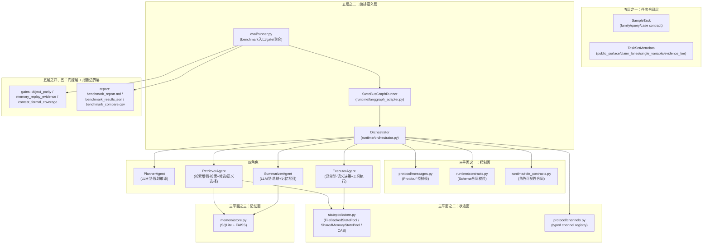

# 系统架构与数据流说明

本文档是理解 StateBus 项目结构的核心文档。它回答：

1. 当前最新架构是什么。
2. 每个模块做什么。
3. 数据如何从任务流到结果。
4. 四角色（Agent 角色）、三平面（控制/状态/记忆面）、五层架构分别是什么关系。

---

## 1. 总架构图



```text
TaskSet YAML / bundle
  → eval/runner.py
      → StateBusGraphRunner (runtime/langgraph_adapter.py)
          → Orchestrator (runtime/orchestrator.py)
              → Planner / Retriever / Executor / Summarizer
              → StatePool (mmap/shared_memory/CAS)
              → MemoryStore (SQLite + vector index)
              → Schema / role / replay / fairness gates
      → result aggregation + report gates
      → benchmark_report.md / benchmark_results.json / compare CSV
```

---

## 2. 为什么需要三套视角

StateBus 架构需要从三套视角交叉解释，因为它们是正交的分层维度：

| 视角 | 回答的问题 | 不能和什么混淆 |
|---|---|---|
| **五层架构** | 系统从哪几层理解。任务→编排→状态基座→记忆门控→报告边界。这是"纵向分层"。 | 不能和四角色混淆——角色是"谁在工作"，架构层是"系统在哪层组织"。 |
| **三平面** | 信息在哪几类表面上传递。控制面、状态面、记忆面各有不同的存储位置和传递方式。 | 不能和五层架构混淆——平面是"数据走哪条路"，不是"模块如何分层"。 |
| **四角色** | 谁在做。Planner、Retriever、Executor、Summarizer 各自负责什么。 | 不能和其他概念混淆——validate 是语义角色/图节点，不是第五个 Agent。 |

---

## 3. 五层架构逐层解释

### 层一：任务合同层

- **对应代码**：`tasks/sample_tasks.py`、`tasks/*.yaml`
- **作用**：定义 formal task（正式任务）、pack contract（包合同）、reading boundary（读法边界）
- **主要输入**：赛题要求、benchmark 设计需要
- **主要输出**：`SampleTask`（任务定义）、`TaskSetMetadata`（任务集元数据——包含 `public_surface`、`claim_lanes`、`single_variable`、`variable_axes`、`evidence_tier`、`formal_structure_clean_retrieval`、`plan_source_default`）
- **和上下游关系**：向下游 runtime 层提供"这个 pack 应该怎么跑、怎么读、怎么判"的完整合同

### 层二：编排语义层

- **对应代码**：`runtime/orchestrator.py`、`runtime/langgraph_adapter.py`
- **作用**：task 执行的核心语义引擎。负责 plan 编译、semantic_role 驱动调度、replay gate、schema 校验、task commit 密封
- **主要输入**：`SampleTask`、plan source（yaml/llm）、capability 注册
- **主要输出**：`RunContext`（运行时总线）、`StepResult`、`TaskCommit`
- **和上下游关系**：向上读取 task contract，向下驱动 state/memory 层的读写，并产出 metrics 给评测层
- **LangGraph 与 Orchestrator 的真实关系**：
  - LangGraph 负责：建固定节点图 `planner → retriever → [validate] → executor → summarizer`、维护 graph state snapshot、节点间状态传播、失败传播
  - Orchestrator 负责：`RunContext` 创建、plan 编译、handshake/capability、semantic_role 到执行逻辑映射、step input ref 准备、replay gate、execute prune、schema validation、role context slice、result registration、task commit sealing
  - **关键结论**：LangGraph 已经是正式运行引擎外壳，但核心业务语义仍然集中在 Orchestrator。当前的 graph 更像"固定 DAG + 条件路由 + 状态传播"适配层，还不是深度依赖 LangGraph 高级动态能力的原生图系统。

### 层三：typed state 基座层

- **对应代码**：`protocol/messages.py`（StateRef 定义）、`statepool/store.py`（StatePool 实现）、`protocol/channels.py`（Channel 定义）
- **作用**：提供非文本状态的生产、存储、引用、消费基础设施
- **主要输入**：Retriever/Executor 产出的 typed state
- **主要输出**：`StateRef` 指针、StatePool 中的实际数据块
- **和上下游关系**：接收来自 Retriever/Executor 的写入，为 Executor/Summarizer 提供读访问

### 层四：replay / 记忆门控层

- **对应代码**：`memory/store.py`（MemoryStore）、`runtime/orchestrator.py`（replay gate）
- **作用**：记忆的持久化、检索、复用控制。区分 `assist`（辅助）、`validated_replay`（验证回放）、`exact_replay`（精确回放）三级复用
- **主要输入**：Summarizer 产生的 `MemoryCommit`，Retriever 产生的 replay candidate
- **主要输出**：`MemoryHit`（记忆命中）、replay decision（回放决策）
- **和上下游关系**：向上为 Retriever 提供记忆查询结果，为 Orchestrator 提供 replay gate 决策依据

### 层五：报告与结论边界层

- **对应代码**：`eval/runner.py`（gate 函数、aggregation、report 生成）
- **作用**：不只是一般聚合平均值，还负责 formal gate（正式门控）：`object_parity_gate`、`memory_replay_evidence_gate`、`contest_formal_coverage_gate`、`headline_memory_replay_effect_gate`
- **主要输入**：所有 task 的执行 metrics
- **主要输出**：`benchmark_report.md`、`benchmark_results.json`、`benchmark_compare.csv`、`benchmark_message_breakdown.csv`、`benchmark_message_sizes.md`
- **和上下游关系**：这一层把"结果能不能被正式读出来"内建到评测层

---

## 4. 三平面逐面解释

### 4.1 控制面（Control Plane）

- **承载什么信息**：Agent 间的协议消息——谁做什么、下一步是什么。当前控制面消息对象包括：`Hello`（握手）、`Capability`（能力发现）、`Plan`（执行计划）、`PlanStep`（步骤定义）、`StepResult`（步骤结果）、`MemoryQuery`（记忆查询）、`MemoryHit`（记忆命中）、`MemoryCommit`（记忆写入）、`ChannelPatch`（通道补丁）、`ChannelSnapshot`（通道快照）、`RemoteStepRequest`、`RemoteStepResponse`、`TaskCommit`（任务提交）
- **为什么不该放到别的平面**：这些是"编排决策"层面的信息，必须经过线上传输。状态面只负责传实际数据负载。
- **当前代码里落在哪**：`protocol/messages.py`（消息定义+Protobuf/JSON序列化）、`runtime/contracts.py`（Schema合同校验）、`runtime/orchestrator.py`（消息收发）

### 4.2 状态面（State Plane）

- **承载什么信息**：实际数据——检索结果、工具产物、特征向量、回放兼容性数据等。通过 `StateRef` 引用，存储在本地的 `StatePool`（mmap 文件/共享内存/CAS blob）中。
- **为什么不该放到别的平面**：这些信息量大（数 KB 到数 MB），不应该进入控制面消息体。控制面只传指针（StateRefLite），Agent 本地读取。
- **当前代码里落在哪**：`protocol/messages.py`（StateRef 数据类）、`statepool/store.py`（FileBackedStatePool、SharedMemoryStatePool、ContentAddressedBlobStore）、`protocol/channels.py`（typed channel registry）

### 4.3 记忆面（Memory Plane）

- **承载什么信息**：历史经验——每次 task 的摘要、证据引用、replay 线索。存储于 SQLite（元数据）和 FAISS（向量索引）。
- **为什么不该放到别的平面**：记忆需要跨 task 持久化和语义检索，不应混入单次 task 的控制或状态生命周期。它是跨任务的知识积累层。
- **当前代码里落在哪**：`memory/store.py`（MemoryStore）、`runtime/orchestrator.py`（replay gate 和记忆查询调度）

---

## 5. 四角色逐角色解释

先加一条当前实现边界：

- 当前四个角色都可能进入 role-specific LLM contract。
- 但它们进入 LLM 的方式不同：Planner / Summarizer 直接以生成任务为主；Retriever / Executor 先完成较重的检索、候选、校验或工具执行准备，再进入较窄的语义选择。
- 当前 benchmark report 只单独拆出了 `planner_total_tokens` 与 `summarizer_total_tokens`，没有单独给出 `retriever_total_tokens` / `executor_total_tokens`。

### 5.1 Planner（规划器）

- **类型**：LLM 型 Agent
- **输入**：user task text（用户任务文本）、capability table（能力表）、可选 MemoryHit（记忆命中）
- **输出**：`Plan`（执行计划）——包含 `PlanStep[]`（步骤序列），每个 step 带 `semantic_role`（语义角色：retrieve/validate/execute/summarize）、`owner_agent`（负责 Agent）、`action`（动作类型）、`depends_on`（依赖关系）
- **依赖对象**：`CapabilityTable`（能力表）、LLM client
- **text 和 StateBus 路径差异**：在两种模式下 Planner 角色相同，但 protocol planner 会收到更紧凑的 prompt，输出仍是完整 JSON DAG。当前 protocol planner 仍输出完整 `{"steps":[...]}` DAG，compact parser（紧凑解析器 `r/x/s`）虽已存在但主 prompt 未真正切换。
- **代码位置**：`agents/sample_agents.py::PlannerAgent`

### 5.2 Retriever（检索器）

- **类型**：检索增强的语义选择 Agent
- **输入**：query（查询文本）、tags（标签）、top_k（检索数量）、assist memory hits
- **输出**：`DENSE_EVIDENCE`（稠密证据）、`FEATURE_BUNDLE`（特征包——route/signals/query_terms）、`TOOL_CANDIDATE_SET`（工具候选集）、`CHANNEL_PATCH`（通道补丁）、`CHANNEL_SNAPSHOT`（通道快照）、`REPLAY_ELIGIBILITY_BUNDLE`（回放资格包）
- **依赖对象**：corpus（语料库）、embedding model（嵌入模型）、MemoryStore、role-specific LLM client
- **处理过程**：
  - 前半段先做 corpus retrieval、memory assist lookup、feature bundle 构造、tool candidate 生成
  - 后半段再通过 `retriever` 角色的 LLM contract 做 semantic selection（当前代码会走 `LLMClient.complete(..., purpose=\"retriever\")`，没有真实 API client 时退到 `DeterministicLLMClient`）
- **text 和 StateBus 路径差异**：text 路径下 Retriever 会把可见候选和证据组织成文本 handoff；protocol 路径下 Retriever 会产出 typed state 并通过 StateRef 传递。两条路径共用同一套检索、候选和结构化状态生产框架，但 carrier 和下游消费方式不同。
- **代码位置**：`agents/sample_agents.py::RetrieverAgent`

### 5.3 Executor（执行器）

- **类型**：语义决策 + 工具执行混合 Agent
- **输入**：plan step、输入 StateRef[]（evidence、decision_packet、validation_gate_packet）、工具参数
- **输出**：`StepResult` + `TOOL_ARTIFACT`（工具产物）、`VALIDATION_GATE_PACKET`（校验门控包）
- **依赖对象**：ToolRegistry（工具注册表）、ToolSpec（工具规格）、corpus docs、role-specific LLM client
- **处理过程**：
  - validate 路径由 `_validate_route_step(...)` 负责，生成 `VALIDATION_GATE_PACKET`
  - execute 路径会先读取 retrieve/validate 产出的结构化信息，再通过 `executor` 角色的 LLM contract 做 route/tool/action_contract 语义选择
  - 最后才进入 `execute_playbook_step(...)` 做真实工具执行；如果启用 UDS transport，也可以走外部多进程 executor 样机
- **text 和 StateBus 路径差异**：
  - text 路径：Executor 收到自然语言 handoff 文本，需要从中恢复 route/tool 决策信息
  - protocol 路径：Executor 直接收到 `EXECUTOR_DECISION_PACKET`（已包含 route、tool_name、signals），优先消费结构化 decision
  - 这就是 typed-state 机制的核心：Executor 不再只依赖原始长文本做路由
- **额外能力**：UDS 外部多进程 transport 样机、`VALIDATE_ROUTE` 语义角色（形成 `VALIDATION_GATE_PACKET`）
- **代码位置**：`agents/sample_agents.py::ExecutorAgent`、`runtime/executor_runtime.py`

### 5.4 Summarizer（总结器）

- **类型**：LLM 型 Agent
- **输入**：evidence 摘要、execution 产物摘要、可选命中记忆
- **输出**：summary（面向人的报告）+ `MemoryCommit`（记忆写入记录）
- **依赖对象**：LLM client、adapter（适配器——整理后的结构化摘要，不是裸向量）
- **text 和 StateBus 路径差异**：
  - text 路径：Summarizer 收到的是原文 evidence 文本（`text_whole_lane` 下 ~2800 bytes）
  - protocol 路径：Summarizer 收到的是经过 adapter 整理的结构化摘要（更紧凑）
  - 这解释了 protocol 路径下 summarizer token 更低，但 wall-time 略高的现象——处理结构化字段需要重建关系
- **代码位置**：`agents/sample_agents.py::SummarizerAgent`

### ⚠️ Validate 不是第五个 Agent

`validate` 是 PlanStep 的一种 `semantic_role`（语义角色），也是 LangGraph 图中的一个可选节点（当 plan 包含 validate step 时，在 retriever 和 executor 之间插入 validate 节点）。它的执行由 ExecutorAgent 的 `_validate_route_step` 方法完成，产出 `VALIDATION_GATE_PACKET`。

**系统只有四个 Agent 角色**：Planner、Retriever、Executor、Summarizer。不要再增加第五个。

---

## 6. 核心对象字典

| 对象 | 是什么 | 从哪来 | 传给谁 | 谁消费 |
|---|---|---|---|---|
| `SampleTask`（任务定义） | 一个完整任务定义，包含 `task_id`、`query`、`family`（任务族）、`complexity_bucket`（复杂度桶）、`case contract`（用例合同）、`expected_route/tool`、`prior dependency` 等 | `tasks/sample_tasks.py` | Orchestrator | 全链路 |
| `Plan`（执行计划） | 结构化的执行步骤序列，包含 `PlanStep[]` 数组 | Planner（yaml 或 LLM 编译） | Orchestrator | Retriever → Executor → Summarizer |
| `PlanStep`（计划步骤） | 单个执行步骤的定义：`step_id`、`owner_agent`、`action`（RETRIEVE_EVIDENCE/EXECUTE_PLAYBOOK/SUMMARIZE_AND_COMMIT/VALIDATE_ROUTE）、`semantic_role`、`input_state_refs`、`params`、`depends_on` | Plan 内 | Orchestrator 调度 | 对应 role 的 Agent |
| `StepResult`（步骤结果） | 步骤执行完成后的结果，包含 `output_state_refs`（输出状态引用列表）、`status`、`metrics` | 各 Agent 执行后 | Orchestrator → Summarizer | Summarizer 汇总，Orchestrator 注册到 RunContext |
| `StateRef`（状态引用） | 轻量级引用对象：`state_id`、`kind`、`length`、`blob_hash`、`channel`、`storage`、`handle`、`checksum`、`compatibility` | Retriever/Executor 写入 StatePool 后创建 | 控制面消息（PlanStep/StepResult 中） | Executor/Summarizer 通过 StatePool 本地读取 |
| `MemoryHit`（记忆命中） | 记忆查询的结果：`memory_id`、`score`、`tier`、`source_agent_id`、`summary`、`evidence_refs` | MemoryStore 查询返回 | Retriever / Orchestrator | replay decision |
| `MemoryCommit`（记忆写入记录） | 任务完成后的记忆写入：`memory_id`、`source_agent_id`、`task_theme`、`summary`、`evidence_refs`、`replay_episode` | Summarizer 产出 | MemoryStore | 后续任务的 Retriever |
| `RunContext`（运行时上下文） | 一次 task 运行的总线对象：session、state refs、metrics、results、memory hits、replay decision、execution DAG | `Orchestrator.create_context()` | 全链路 | GraphRunner → 最终 report |

---

## 7. 单任务时序图

以 `checkout_regression` 族中一个 `reusable`（S2）任务为例，展示完整时序：

```text
  eval/runner.py                  Orchestrator                Planner    Retriever    Executor   Summarizer   StatePool   MemoryStore
       │                              │                         │          │            │           │            │            │
       │  run_task(task, mode)        │                         │          │            │           │            │            │
       ├─────────────────────────────►│                         │          │            │           │            │            │
       │                              │ compile_task_plan()     │          │            │           │            │            │
       │                              ├────────────────────────►│          │            │           │            │            │
       │                              │◄── Plan{steps:          │          │            │           │            │            │
       │                              │    retrieve, validate,  │          │            │           │            │            │
       │                              │    execute, summarize}  │          │            │           │            │            │
       │                              │                         │          │            │           │            │            │
       │                              │ [semantic_role=retrieve]│          │            │           │            │            │
       │                              │── memory query ──────────────────────────────────────────────────────────────────────►│
       │                              │◄─ MemoryHit ──────────────────────────────────────────────────────────────────────────│
       │                              │── invoke_plan_step() ──►│          │            │           │            │            │
       │                              │                         │── corpus │            │           │            │            │
       │                              │                         │   search│            │           │            │            │
       │                              │                         │── build │            │           │            │            │
       │                              │                         │   DENSE_EVIDENCE      │           │            │            │
       │                              │                         │   + FEATURE_BUNDLE    │           │            │            │
       │                              │                         │   + REPLAY_ELIGIBILITY │           │            │            │
       │                              │                         │── store ───────────────────────────────────►│            │
       │                              │◄── StepResult{          │◄─       │            │           │            │            │
       │                              │    output_state_refs}   │  StateRef           │           │            │            │
       │                              │                         │          │            │           │            │            │
       │                              │ [replay gate 检查]       │          │            │           │            │            │
       │                              │ fresh route == stored   │          │            │           │            │            │
       │                              │ route? YES              │          │            │           │            │            │
       │                              │ skip_execute → YES      │          │            │           │            │            │
       │                              │                         │          │            │           │            │            │
       │                              │ [semantic_role=summarize]│          │            │           │            │            │
       │                              │── invoke_plan_step() ──────────────────────────────────────►│            │            │
       │                              │                         │          │            │  LLM call  │            │            │
       │                              │                         │          │            │  summary   │            │            │
       │                              │◄── StepResult{          │          │            │◄───────────│            │            │
       │                              │    summary +            │          │            │            │            │            │
       │                              │    MemoryCommit}        │          │            │            │            │            │
       │                              │                         │          │            │            │── commit ──►│            │
       │                              │ seal_task_commit()      │          │            │            │            │            │
       │                              │◄── TaskCommit           │          │            │            │            │            │
       │◄── GraphRunnerResult ────────│                         │          │            │            │            │            │
       │  (metrics/state channels/    │                         │          │            │            │            │            │
       │   replay decision)           │                         │          │            │            │            │            │
```

**关键观察**：
1. Planner 通常只在入口阶段生成或修复一次 `Plan`，后续步骤不重复规划
2. Retriever 会先做检索和结构化状态生产，再把 typed state 通过 StateRef 传递而非内联在消息中
3. replay gate 在 retrieve 和 execute 之间做检查：如果新鲜 route 与存储 route 匹配，跳过 execute
4. Executor 在 S2 reusable 任务中可能被 skip，Summarizer 直接基于已有 evidence 完成总结
5. Summarizer 产出 MemoryCommit 写入 MemoryStore，供后续任务复用

---

## 8. 当前代码层的主模块分工

### 8.1 `runtime/`

| 文件 | 职责 |
|---|---|
| `orchestrator.py` | 语义核心：RunContext 管理、plan 编译、semantic_role 调度、replay gate、schema validation、role context slice、result registration、task commit sealing |
| `langgraph_adapter.py` | LangGraph 图执行适配器：5 节点 DAG（planner→retriever→[validate]→executor→summarizer）、条件路由、状态传播 |
| `contracts.py` | Schema 与 StateContract 校验：CapabilityTable、SchemaInterceptor、StateContractRegistry |
| `role_contracts.py` | 角色可见性与输入输出合同：`RoleExecutionContract`、projection_class/included_fields/omitted_fields |
| `executor_runtime.py` | 执行与 handoff 消费逻辑：transfer strategy 分派、ToolRegistry、build_feature_bundle()、execute_playbook_step() |
| `reuse_contract.py` | 复用合同：4 级复用策略（reuse_disabled→assist_allowed→validated_replay→exact_replay）+ 3 个 boolean gate |
| `task_profile.py` | 任务配置归一化：9 种 handoff profile、8 种 transfer strategy、4 种 benchmark lane |
| `llm.py` | LLM 抽象层：OpenAICompatibleLLMClient + DeterministicLLMClient + prompt 构造 + JSON extraction |

### 8.2 `protocol/`

| 文件 | 职责 |
|---|---|
| `messages.py` | 14 种消息类型的 dataclass + Protobuf/JSON 双向序列化 + StateRef 定义 |
| `channels.py` | StateChannel 定义 + 8 个 channel registry（evidence/route/tool_candidates/replay_gate/legacy_features/embedding/artifact/ranked_evidence） |
| `statebus.proto` | WireEnvelope oneof 定义 |
| `statebus_pb2.py` | 编译生成的 Python protobuf stub |

### 8.3 `statepool/`

| 文件 | 职责 |
|---|---|
| `store.py` | FileBackedStatePool(mmap) + SharedMemoryStatePool + ContentAddressedBlobStore(SHA-256) |

### 8.4 `memory/`

| 文件 | 职责 |
|---|---|
| `store.py` | MemoryStore：SQLite 元数据 + FAISS 向量索引 + 多信号融合排序（semantic×tier + 0.25×BM25 + 0.20×tag + 0.10×recency） + 4 个 tier |

### 8.5 `agents/`

| 文件 | 职责 |
|---|---|
| `base_agent.py` | BaseAgent 抽象基类 |
| `sample_agents.py` | PlannerAgent + RetrieverAgent + ExecutorAgent + SummarizerAgent 默认实现 |

### 8.6 `tasks/`

| 文件 | 职责 |
|---|---|
| `sample_tasks.py` | SampleTask + TaskSetMetadata + pack builder + formal task contract + reusable/prior dependency contract |
| `contest_family_spec.py` | contest 族定义 + pack payload 生成 |

### 8.7 `eval/`

| 文件 | 职责 |
|---|---|
| `runner.py` | run_benchmark() 主入口：task 加载 → mode 交替执行 → 指标聚合 → gate → 6 层聚合 → report 生成 |
| `metrics.py` | TaskMetrics dataclass：60+ 基础指标 + derived properties |
| `fairness_gates.py` | CarrierFairnessGate、parity 审计 |

---

## 9. 当前最容易误解的点

### 9.1 `validate` 和 Agent 角色的关系

`validate` 是 PlanStep 的 `semantic_role`（语义角色）和 LangGraph 图中的一个可选节点。它的逻辑由 ExecutorAgent 的 `_validate_route_step()` 方法执行。**它不是第五个 Agent**。系统只有四个 Agent：Planner、Retriever、Executor、Summarizer。

### 9.2 `memory` 和结构化通信不是两条平行主线

memory 是整体方法的一部分，不是独立外挂系统。在运行时：
- Retriever 查询 MemoryStore 获取历史命中
- Orchestrator 根据 replay gate 决定是否跳过步骤
- Summarizer 写入 MemoryCommit 沉淀经验
- 下一个 task 的 Retriever 再次查询

memory 和通信/状态传递是**协同工作**的，不应拆成平行章节分别讲述。

### 9.3 `StateRef` 不是简单字符串 ID

`StateRef` 是一个结构化对象，至少包含：`state_id`、`kind`（状态种类）、`length`（数据长度）、`blob_hash/checksum`（内容哈希）、`channel`（归属通道）、`storage`（存储后端标识）、`handle`（后端句柄）、`fetch_uri`（访问路径）、`compatibility`（兼容性元数据）。它不是"一个 ID 字符串"，而是一个**带完整元数据的结构化引用**。

### 9.4 LangGraph 与 Orchestrator 的分工

LangGraph 当前负责图结构、状态传播和条件路由。Orchestrator 负责所有业务语义（plan 编译、replay gate、schema 校验、role context slice 等）。两者不是替代关系——LangGraph 是外层执行引擎，Orchestrator 是内层语义核心。当前不应把 StateBus 说成"LangGraph 原生图系统"。

### 9.5 `handoff_wire_bytes` ≠ `handoff_payload_bytes`

`handoff_wire_bytes` 是线上真正传输的 StateRefLite 指针字节数（50-80 字节/个）。`handoff_payload_bytes` 是 StatePool 中本地可访问的 payload 数据量（可以是数 KB）。**只有 `handoff_wire_bytes` 才是通信开销指标**。
