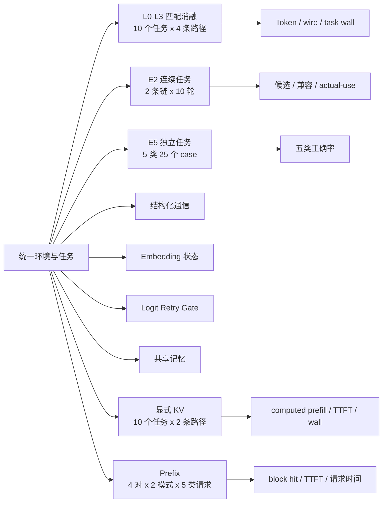
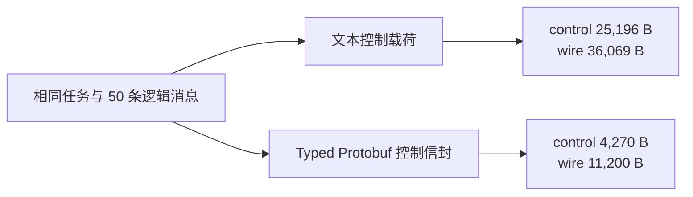
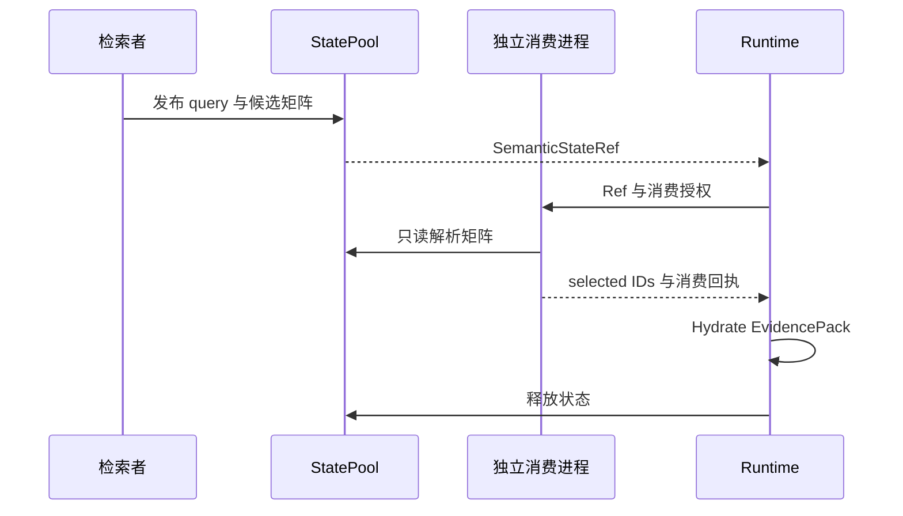
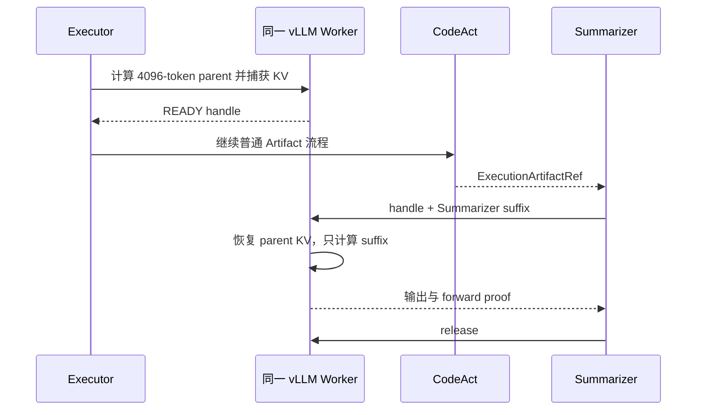
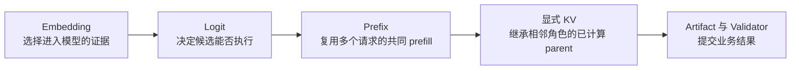

# StateBus 实验结果总览

更新日期：2026-07-30

本文汇总 StateBus 正式实验的任务、对照方法、统计指标、逐项结果与原始记录。表中的任务数、
请求数、查询数、候选数和状态数分别保留各自分母，逐项结果均可回溯到对应运行目录。

## 1. 实验地图



45 个正式任务实例由两部分组成：

| 正式任务 | 数量 | 关系 | 任务入口 |
|:--|--:|:--|:--|
| E2 Operating | 10 | 一条连续链，后续轮次引用前序已验证对象 | `statebus/benchmark/samples/continuous_task_families/formal_operating_metrics/manifest.json` |
| E2 Financial | 10 | 一条连续链，覆盖抽取、差值、字段别名和趋势汇总 | `statebus/benchmark/samples/continuous_task_families/formal_financial_reports/manifest.json` |
| E5 五类能力 | 25 | 25 个独立 case，数量为 `8 + 5 + 5 + 4 + 3` | `statebus/benchmark/task_registry.py` 与 `tasks/formal/` |
| 合计 | 45 | 20 个连续任务 + 25 个独立任务 | [任务与数据集目录](../implementation/benchmark-task-and-dataset-catalog.md) |

E1 取 E2 两条链的前五轮，在 L0、L1、L2、L3 四条路径中重复计量，用于匹配消融。
Logit 的 12 个挑战任务、Prefix 的 40 个请求和显式 KV 的 10 个任务分别按状态、请求和任务统计。

## 2. 统一实验环境

| 项目 | 配置 |
|:--|:--|
| GPU | NVIDIA A100 80GB PCIe，单卡执行 |
| Driver / CUDA | 565.57.01 / CUDA 12.7 |
| 操作系统 | openEuler 24.03 LTS SP3 |
| 模型 | Qwen3-32B |
| 推理方式 | 同一模型、同一单卡配置，正式时延任务串行执行 |
| 输入 | 离线财务 corpus、财报 Markdown、疾病 CSV、天气 CSV、Nova/Orion 运营报告 |
| 正确性 | `CanonicalTaskSpec`、JSON Schema、确定性 Gold、Validator、Artifact 校验 |

模型推理依赖版本见仓库根目录的 `requirements-vllm.txt`。正式数据均在仓库内，实验过程
不依赖在线检索。

## 3. 结果总览

| 实验 | 对照 | 主要结果 | 质量结果 |
|:--|:--|:--|:--|
| 完整 StateBus | L0 纯文本 -> L3 完整路径 | 总 Token `33,974 -> 17,870`，下降 `47.40%`；wire `36,069 -> 12,677 B`，下降 `64.85%`；总耗时下降 `6.32%` | `10/10 -> 10/10`，50 条逻辑消息保持一致 |
| 结构化通信 | L0 -> L1 | control bytes 下降 `83.05%`；wire bytes 下降 `68.95%` | 两侧均 `10/10` |
| Embedding 状态 | L1 -> L2 | raw evidence 下降 `84.04%`；总 Token 下降 `49.16%` | 匹配任务 `10/10`；独立状态 `9/9` 跨 PID 消费并改变选择 |
| Logit Gate | `off` -> `retry_once` | Validator `8/12 -> 12/12`；歧义任务 `3/5 -> 5/5`；错误放行 `2 -> 0` | `19/19` 状态跨 PID 消费并释放 |
| 共享记忆 | 无记忆 -> 记忆复用 | 配对耗时 `516.1 -> 420.7 s`，下降 `18.49%`；Token `28,379 -> 21,638`，下降 `23.75%` | 连续链 `20/20`；7/20 查询 actual-use；39/48 不兼容候选完成拒绝 |
| CodeAct 能力 | 传统纯模型 -> 启用 CodeAct 的自适应执行 | 总体正确率 `56% -> 100%`，即 `14/25 -> 25/25` | 五类任务全部通过 |
| 显式 KV | full replay -> continuation | computed prefill 下降 `85.22%`；TTFT 下降 `61.62%`；完整主链 wall 下降 `5.69%` | A/B 质量等价 `10/10`，两条路径共 `20/20` 通过 |
| Prefix | independent -> shared prefix | 命中率 `0% -> 78.02%`；平均 TTFT `2,357 -> 738 ms`，下降 `68.7%`；平均端到端 `4,117 -> 2,345 ms`，下降 `43.0%` | `40/40` 请求成功且输出合同通过 |

## 4. 完整系统 L0 与 L3

四条实验路径逐步打开 StateBus 能力：

| 路径 | 结构化控制 | Embedding 状态与证据裁剪 | 共享记忆 |
|:--|:--:|:--:|:--:|
| L0 | 关闭 | 关闭 | 关闭 |
| L1 | 开启 | 关闭 | 关闭 |
| L2 | 开启 | 开启 | 关闭 |
| L3 | 开启 | 开启 | 开启 |

L0 与 L3 使用同一批 10 个任务、同一输入、同一模型、同一角色图与同一 Validator。总体结果为：

| 指标 | L0 | L3 | 变化 |
|:--|--:|--:|--:|
| Prompt Token | 29,876 | 13,885 | `-53.52%` |
| Completion Token | 4,098 | 3,985 | `-2.76%` |
| 总 Token | 33,974 | 17,870 | `-47.40%` |
| wire bytes | 36,069 | 12,677 | `-64.85%` |
| 10 任务总耗时 | 315.678 s | 295.728 s | `-6.32%` |
| 质量通过 | 10/10 | 10/10 | 保持一致 |
| Agent 逻辑消息 | 50 | 50 | 保持一致 |

逐任务数据如下，`k` 表示以千为单位的显示值：

| 任务 | 分析内容 | 总 Token L0 -> L3 | wire L0 -> L3 | 任务耗时 L0 -> L3 |
|:--|:--|--:|--:|--:|
| O1 | 表结构与缺失率 | 4.38k -> 1.74k | 5.21k -> 1.23k B | 33.5 -> 24.3 s |
| O2 | 病例统计 | 4.62k -> 1.84k | 5.40k -> 1.23k B | 31.3 -> 24.4 s |
| O3 | IQR 异常 | 4.70k -> 1.74k | 5.61k -> 1.23k B | 33.3 -> 27.4 s |
| O4 | 天气表分析 | 4.85k -> 1.79k | 4.36k -> 1.23k B | 33.3 -> 30.8 s |
| O5 | 前四轮汇总 | 1.39k -> 1.15k | 1.72k -> 1.18k B | 28.4 -> 24.6 s |
| F1 | ACME 2026Q1 | 2.76k -> 1.90k | 2.46k -> 1.31k B | 32.6 -> 35.6 s |
| F2 | ACME 2025Q4 | 2.86k -> 2.04k | 2.79k -> 1.31k B | 33.3 -> 34.3 s |
| F3 | ACME 跨期差值 | 2.81k -> 1.77k | 2.90k -> 1.31k B | 30.1 -> 26.4 s |
| F4 | BETA 2026Q1 | 2.79k -> 2.02k | 2.69k -> 1.31k B | 29.7 -> 33.1 s |
| F5 | ACME/BETA 对比 | 2.81k -> 1.89k | 2.93k -> 1.31k B | 30.1 -> 34.8 s |

Operating 组的总 Token、wire 和平均任务耗时分别下降 `58.58%`、`72.64%` 和 `17.73%`；
Financial 组的总 Token 与 wire 分别下降 `31.53%` 和 `52.23%`，平均任务耗时增加 `5.39%`；
10 个任务的串行总耗时为 `315.678 -> 295.728 s`，下降 `6.32%`。

## 5. 结构化通信消融

L0 与 L1 保持 10 个任务、50 条逻辑消息和质量结果一致，只改变控制消息的表示方式。



| 分组 | control bytes L0 -> L1 | wire bytes L0 -> L1 | 质量 |
|:--|--:|--:|--:|
| Operating 5 个任务 | 16,961 -> 2,090 | 22,305 -> 5,435 | 5/5 -> 5/5 |
| Financial 5 个任务 | 8,235 -> 2,180 | 13,764 -> 5,765 | 5/5 -> 5/5 |
| 合计 | 25,196 -> 4,270，`-83.05%` | 36,069 -> 11,200，`-68.95%` | 10/10 -> 10/10 |

该阶段总 Token 为 `33,974 -> 34,891`。结构化通信的收益集中在控制载荷与线路字节；
下一阶段由 Embedding 状态和证据投影处理进入模型的长证据。

## 6. Embedding 非文本状态

L2 将 query 与 candidate embedding 作为 `SemanticStateRef` 发布到 StatePool。独立进程只读打开
同一 `float32` 矩阵，计算余弦相似度和 top-k，再由 Runtime 将 selected IDs hydrate 回
`EvidencePack`。



L1 与 L2 的 10 个匹配任务结果：

| 指标 | L1 | L2 | 变化 |
|:--|--:|--:|--:|
| raw evidence bytes | 73,266 | 11,693 | `-84.04%` |
| Prompt Token | 30,737 | 13,599 | `-55.76%` |
| Completion Token | 4,154 | 4,140 | `-0.34%` |
| 总 Token | 34,891 | 17,739 | `-49.16%` |
| 10 任务总耗时 | 302.063 s | 305.237 s | `+1.05%` |
| SemanticState 传递 | 0 | 9 | 新增 9 次 |

逐任务观测：

| 任务 | raw evidence L1 -> L2 | 总 Token L1 -> L2 | 耗时 L1 -> L2 |
|:--|--:|--:|--:|
| O1 | 13.0k -> 1.6k B | 4.46k -> 1.74k | 24.6 -> 24.1 s |
| O2 | 13.0k -> 1.6k B | 4.62k -> 1.84k | 24.1 -> 24.2 s |
| O3 | 13.0k -> 1.5k B | 4.89k -> 1.91k | 36.5 -> 36.8 s |
| O4 | 9.3k -> 859 B | 5.02k -> 1.84k | 32.6 -> 32.3 s |
| O5 | 0 -> 0 B | 1.44k -> 1.15k | 24.4 -> 24.5 s |
| F1 | 5.0k -> 1.2k B | 2.85k -> 1.90k | 34.4 -> 35.8 s |
| F2 | 5.0k -> 1.2k B | 2.91k -> 1.87k | 33.2 -> 33.7 s |
| F3 | 5.0k -> 1.3k B | 2.84k -> 1.77k | 25.7 -> 26.4 s |
| F4 | 5.0k -> 1.2k B | 2.89k -> 1.84k | 32.1 -> 32.5 s |
| F5 | 5.0k -> 1.3k B | 2.96k -> 1.89k | 34.5 -> 35.0 s |

独立 E4 holdout 进一步记录跨进程生命周期：

| 任务 | 物理状态 | 跨 PID 消费 | 改变选择 | 发布 / 释放字节 |
|:--|--:|--:|--:|--:|
| `semantic-holdout-s1` | 3 | 3/3 | 3/3 | 110,592 / 110,592 |
| `semantic-holdout-s2` | 3 | 3/3 | 3/3 | 110,592 / 110,592 |
| `semantic-holdout-s3` | 0 | 0 | 0 | 0 / 0 |
| `semantic-holdout-s4` | 3 | 3/3 | 3/3 | 73,728 / 73,728 |
| 合计 | 9 | 9/9 | 9/9 | 294,912 / 294,912 |

## 7. Logit Retry Gate

Logit Gate 位于 Executor 完成闭集候选选择之后、业务 Worker 启动之前。模型返回单 token
候选别名，Runtime 从真实 `top_logprobs` 提取候选概率与 `other_mass`，发布 12 B 的
`LogitStateRef`。独立 Gate PID 计算 top-1 和 margin；margin 达到 `0.10` 时授权执行，
低 margin 时展开合同并进行一次重查。

| 任务组 | 数量 | Gate off | Retry once | 重查触发 | 结果 |
|:--|--:|--:|--:|--:|:--|
| 简单对照 | 5 | 5/5 | 5/5 | 0/5 | 首次高 margin 直接通过 |
| 受控歧义 | 5 | 3/5 | 5/5 | 5/5 | 2 个错误路由被纠正 |
| 等价或未授权负例 | 2 | 0/2 | 2/2 | 2/2 | Worker 错误放行由 2 次降为 0 次 |
| 全部 Validator | 12 | 8/12 | 12/12 | 7/12 | 机制挑战全部通过 |

`retry_once` 共形成 19 次状态尝试：5 个简单任务各 1 次、5 个歧义任务各 2 次、2 个负例
各 2 次。19/19 状态由独立 PID 消费，19/19 完成释放，总 payload 为 228 B。

| 模式 | vLLM 调用 | 总 Token |
|:--|--:|--:|
| `off` | 24 | 6,110 |
| `retry_once` | 38 | 9,952 |

增加的 14 次调用对应 7 个低 margin 任务的 AB/BA 重查。该成本换取了完整合同展开、二次
数值授权和负例终止。

## 8. 共享记忆

共享记忆按“召回候选、兼容判断、角色消费、行为效果”四层记录。E2 的两条 10 轮连续链
给出运行中的实际使用情况：

| 分组 | 查询 | 有候选的查询 | 候选 | 兼容候选 | actual-use 查询 | 拒绝候选 | 跳过步骤 |
|:--|--:|--:|--:|--:|--:|--:|--:|
| Operating 10 轮 | 10 | 9 | 25 | 2 | 2 | 23 | 0 |
| Financial 10 轮 | 10 | 9 | 23 | 7 | 5 | 16 | 2 |
| 合计 | 20 | 18 | 48 | 9 | 7 | 39 | 2 |

20/20 连续任务通过质量门，7/20 查询产生 actual-use，9 条 consumption/effect receipt
分布在 7 个任务中。E3 的 6 个机制 case 进一步记录 6/6 质量通过、23/23 消费与效果、
1 个运行签名不兼容候选完成拒绝和当前任务重算，以及 1 次步骤和 1 次 LLM 调用节省。

六组无记忆与记忆复用的逐任务结果如下：

| 任务 | 无记忆耗时 | 记忆复用耗时 | 无记忆 Token | 记忆复用 Token |
|:--|--:|--:|--:|--:|
| M1 ACME Q1 | 137.7 s | 130.4 s | 7.08k | 7.09k |
| M2 ACME Q2 | 128.8 s | 97.9 s | 7.07k | 4.82k |
| M3 ACME Q3 | 118.8 s | 95.4 s | 7.01k | 4.82k |
| M4 ACME Q4 | 115.4 s | 114.8 s | 6.76k | 6.76k |
| M5 BETA Q1 | 119.6 s | 117.9 s | 6.80k | 6.77k |
| M6 运行签名负例 | 130.7 s | 97.0 s | 7.22k | 4.90k |

任务摘要一致的 M1、M2、M3、M6 四对聚合结果如下：

| 指标 | 无记忆 | 记忆复用 | 变化 |
|:--|--:|--:|--:|
| 总耗时 | 516.090 s | 420.677 s | `-18.49%` |
| 总 Token | 28,379 | 21,638 | `-23.75%` |
| 跳过 LLM | 0 | 3 | 新增 3 次 |

## 9. CodeAct 能力

同一五类、25 个任务注册表比较传统纯模型与启用 CodeAct 能力的自适应执行系统：

| 任务族 | case 数 | 传统纯模型 | CodeAct 系统 | 提升 |
|:--|--:|--:|--:|--:|
| 财报指标抽取 | 8 | 4/8，50% | 8/8，100% | `+50.0 pp` |
| 多期趋势 | 5 | 1/5，20% | 5/5，100% | `+80.0 pp` |
| 跨表关联 | 5 | 4/5，80% | 5/5，100% | `+20.0 pp` |
| 条件聚合 | 4 | 3/4，75% | 4/4，100% | `+25.0 pp` |
| 异常清洗 | 3 | 2/3，66.7% | 3/3，100% | `+33.3 pp` |
| 合计 | 25 | 14/25，56% | 25/25，100% | `+44 pp` |

启用 CodeAct 后，Planner 在批准的能力表中选择受限 Python 或 Transform DSL。正式自适应
运行记录了 18 个受限 Python 工作流和 7 个 DSL 工作流；Python 路径依次完成候选代码生成、
AST/Policy 审计、受限执行、JSON Schema 与 Gold 校验，两种执行表示最终汇入同一个
`ExecutionArtifactRef` 质量门。

## 10. 显式 KV Continuation

显式 KV 实验将完整 StateBus 主链中的 Executor 与 Summarizer 角色边改为计算状态继承。
Planner、Retriever、CodeAct、Artifact、Summarizer 输出合同和质量门保持原流程。



### 10.1 对照设计

| 条件 | Full replay | Continuation |
|:--|:--|:--|
| 模型与 GPU | Qwen3-32B，物理卡 1 | 相同 |
| 任务 | Nova/Orion 共 10 个指标抽取任务 | 相同 |
| Parent | 4,096 token | 相同 token IDs |
| Consumer 输入 | parent + suffix | handle + suffix |
| APC | 关闭 | 关闭 |
| temperature / seed | 0 / 7 | 相同 |
| 执行顺序 | 先 10 个 baseline | 后 10 个 continuation |
| 预热 | 每阶段 1 次，排除在统计外 | 每阶段相同 |

### 10.2 汇总结果

| 指标 | Full replay p50 | Continuation p50 | 变化 | 正向任务 |
|:--|--:|--:|--:|--:|
| Consumer computed prefill | 4,806.5 token | 710.5 token | `-85.22%` | 10/10 |
| Summarizer TTFT | 1,618.138 ms | 620.980 ms | `-61.62%` | 10/10 |
| Consumer 请求体 | 20,151.0 B | 3,210.5 B | `-84.07%` | 10/10 |
| Summarizer wall | 5,218.342 ms | 4,110.769 ms | `-21.22%` | 10/10 |
| Executor wall | 4,346.624 ms | 4,624.557 ms | `+6.39%` | 1/10 |
| Executor + Summarizer | 9,575.671 ms | 8,742.196 ms | `-8.70%` | 10/10 |
| 完整主链 wall | 30,917.693 ms | 29,158.521 ms | `-5.69%` | 10/10 |

每个 continuation 继承 4,096 token。单 handle 为 1 GiB；KV store p50 为 `1,712.952 ms`，
load p50 为 `297.430 ms`。Store 已计入 Executor wall，load 已计入 Summarizer wall。

### 10.3 逐任务结果

| # | 任务 | computed A -> B | TTFT A -> B | 请求字节 A -> B | Summarizer wall 降幅 | 主链降幅 | store / load |
|--:|:--|--:|--:|--:|--:|--:|--:|
| 1 | Nova revenue | 4,808 -> 712 | 1,611.4 -> 620.9 ms | 20,104 -> 3,200 B | 13.80% | 5.02% | 1,697.9 / 295.6 ms |
| 2 | Nova gross margin | 4,806 -> 710 | 1,616.3 -> 672.2 ms | 20,112 -> 3,208 B | 48.61% | 12.19% | 1,747.0 / 349.4 ms |
| 3 | Nova operating expense | 4,810 -> 714 | 1,615.4 -> 620.6 ms | 20,136 -> 3,232 B | 18.73% | 5.51% | 1,726.3 / 294.9 ms |
| 4 | Nova churn | 4,807 -> 711 | 1,617.5 -> 616.4 ms | 20,099 -> 3,195 B | 24.75% | 6.60% | 1,693.5 / 297.4 ms |
| 5 | Nova on-time delivery | 4,807 -> 711 | 1,618.2 -> 621.2 ms | 20,123 -> 3,219 B | 24.12% | 4.94% | 1,686.9 / 297.9 ms |
| 6 | Orion revenue | 4,805 -> 709 | 1,621.5 -> 663.3 ms | 20,171 -> 3,205 B | 16.29% | 5.43% | 1,792.3 / 342.0 ms |
| 7 | Orion gross margin | 4,803 -> 707 | 1,621.7 -> 621.0 ms | 20,179 -> 3,213 B | 18.85% | 6.05% | 1,706.7 / 297.4 ms |
| 8 | Orion operating expense | 4,807 -> 711 | 1,618.1 -> 620.5 ms | 20,203 -> 3,237 B | 21.16% | 5.55% | 1,699.1 / 296.8 ms |
| 9 | Orion churn | 4,804 -> 708 | 1,620.4 -> 663.5 ms | 20,166 -> 3,200 B | 14.85% | 3.51% | 1,719.2 / 341.7 ms |
| 10 | Orion on-time delivery | 4,804 -> 708 | 1,619.4 -> 613.8 ms | 20,190 -> 3,224 B | 19.56% | 5.20% | 1,763.0 / 295.0 ms |

### 10.4 正确性与生命周期

| 检查 | 结果 |
|:--|--:|
| 两条路径质量门 | 20/20 |
| A/B 必需事实一致 | 10/10 |
| 结构化 Artifact core 一致 | 10/10 |
| Producer logical token 与输出 token 一致 | 10/10 |
| 完整 Artifact hash 一致 | 7/10 |
| capture / load / release | 10/10/10 |
| scheduler 与 Worker 双证明 | 10/10 |
| fallback | 0 |
| 运行结束 registry | 0 entry / 0 byte |

3 个完整 Artifact hash 差异来自自由文本 `summary_text` 的措辞，必需数值字段和结构化 core
均保持一致。

## 11. Engine-Local Prefix Reuse

Prefix 实验不传递 handle。Prompt Compiler 将五类请求共同可见的 Orion 长证据编译到
token position 0，把角色、任务和输出合同放入动态 suffix，再由同一 vLLM 实例的 Automatic
Prefix Caching 自动匹配完整 block。

### 11.1 对照设计

| 项目 | 设置 |
|:--|:--|
| 请求 | Planner、Retriever、Executor、Summarizer、Verifier |
| Pair | 4 对，每对 Shared 与 Independent 各 5 个请求，共 40 请求 |
| 顺序 | Shared-first、Independent-first 交替 |
| 证据 | 同一 Orion 报告，重复 4 次，28,866 B |
| 模型 | Qwen3-32B |
| 生成 | temperature 0、max tokens 64、JSON response format |
| Shared | 共同证据位于 position 0，动态角色字段位于 suffix |
| Independent | 动态角色字段先出现，共同证据不形成相同父链 |

### 11.2 总体结果

| 指标 | 未启用 | 启用 Shared Prefix | 变化 |
|:--|--:|--:|--:|
| 请求数 | 20 | 20 | 40/40 完成 |
| task-local block hit | 0 / 7,200 | 5,458 / 6,996 | `0% -> 78.016%` |
| 全部请求平均 TTFT | 2,356.536 ms | 738.322 ms | `-68.7%` |
| 全部请求平均端到端时间 | 4,116.549 ms | 2,345.346 ms | `-43.0%` |
| JSON 与角色合同 | 20/20 | 20/20 | 40/40 通过 |

全量均值覆盖每个模式的 20 个请求，并包含 Verifier：

| 请求角色 | TTFT 未启用 -> 启用 | 端到端未启用 -> 启用 |
|:--|--:|--:|
| Planner | 2,650.941 -> 2,624.921 ms | 4,374.059 -> 4,363.384 ms |
| Retriever | 2,275.529 -> 270.228 ms | 4,077.681 -> 2,069.348 ms |
| Executor | 2,282.767 -> 266.365 ms | 4,010.147 -> 1,619.358 ms |
| Summarizer | 2,286.492 -> 264.826 ms | 4,100.918 -> 1,755.816 ms |
| Verifier | 2,286.952 -> 265.269 ms | 4,019.940 -> 1,918.825 ms |

Planner 是每个模式的首个请求，负责建立前缀块；其余四类请求复用相同父链。四个 pair 的
warm 请求均观测到 Shared 更快：

| Pair | 顺序 | Shared warm TTFT | Independent warm TTFT | Shared warm 端到端 | Independent warm 端到端 |
|--:|:--|--:|--:|--:|--:|
| 1 | Shared-first | 268.361 ms | 2,259.095 ms | 1,877.435 ms | 4,021.576 ms |
| 2 | Independent-first | 266.034 ms | 2,273.344 ms | 1,855.560 ms | 4,080.579 ms |
| 3 | Shared-first | 268.085 ms | 2,292.431 ms | 1,794.934 ms | 4,055.210 ms |
| 4 | Independent-first | 264.208 ms | 2,306.869 ms | 1,835.419 ms | 4,051.323 ms |

两侧平均 prompt 字节为 `29,362.0` 与 `29,439.6`，字节估算输入 token 为 `7,340.2` 与
`7,359.4`，输入规模只相差约 `0.26%`。Prefix 的主要变化是同一长前缀的 prefill 由 block
hit 提供；decode 仍按请求执行，因此端到端降幅小于 TTFT 降幅。

## 12. Prefix 与显式 KV 的系统关系

| 维度 | Prefix | 显式 KV |
|:--|:--|:--|
| 复用对象 | vLLM 自动缓存的共同 token prefix | Executor 已计算的指定 parent KV |
| 触发方式 | 多个完整请求具有相同 position-0 token blocks | Producer capture，Consumer load handle |
| 传递对象 | 完整 prompt，StateBus 记录身份与 counter | handle + suffix，StateBus 记录 capture/load/release proof |
| 典型关系 | 同语料的多个角色或任务 | 同一任务的 Executor -> Summarizer |
| 请求字节 | 输入规模基本保持一致 | Consumer 请求体显著缩小 |
| 主要观测 | hit/query、TTFT、请求总时间 | inherited/computed token、TTFT、store/load、主链 wall |
| 实验结果 | TTFT `-68.7%`，端到端 `-43.0%` | TTFT `-61.62%`，完整主链 `-5.69%` |

两者形成两级复用：Prefix 服务于多个独立请求的共同前缀，显式 KV 服务于同一任务相邻
角色的精确计算状态。运行时按 token 身份、engine、model、tokenizer 和 cache generation
选择一种来源，并对 inherited token 记一次账。

Embedding、Logit、Prefix 与显式 KV 在统一系统中的作用顺序为：



## 13. 指标定义

| 指标 | 计算方式 |
|:--|:--|
| 总 Token | Prompt Token 与 Completion Token 之和 |
| wire bytes | Runtime 记录的控制帧与数据面线路字节之和 |
| raw evidence bytes | 投影前进入角色上下文的原始证据字节 |
| TTFT | 客户端发起流式请求到收到首个生成 token 的时间 |
| task-local Prefix hit rate | 同一请求窗口内 `hit_delta / query_delta` |
| computed prefill | Consumer 实际执行 prefill 的 token 数 |
| inherited KV | Consumer 从显式 handle 恢复的 parent token 数 |
| Consumer wall | Summarizer 请求发起到生成完成的时间 |
| 完整主链 wall | Runtime 从任务开始到质量门、Artifact 和清理全部结束的时间 |
| actual-use | 兼容 MemoryRef 进入目标角色输入并产生消费与行为效果记录 |
| 正确率 | 通过当前任务 JSON Schema、Gold、Artifact 与 Validator 的任务数 / 总任务数 |

## 14. 原始记录索引

| 实验 | 主记录 |
|:--|:--|
| E1 L0-L3 | `/home/qcrs/statebus/runs/contest_evidence_closure_20260720/e1_causal_serial_20260720_150801/summary.json` |
| E2 连续任务 | `/home/qcrs/statebus/runs/contest_evidence_closure_20260720/e2_stress_serial_20260720_152924/summary.json` |
| E3 记忆机制 | `/home/qcrs/statebus/runs/contest_evidence_closure_20260720/e3_adaptive_memory_final_20260720_160244/summary.json` |
| E4 Embedding holdout | `/home/qcrs/statebus/runs/contest_evidence_closure_20260720/e4_semantic_holdout_final4_20260720_175430/summary.json` |
| E5 自适应能力 | `/home/qcrs/statebus/runs/contest_evidence_closure_20260720/e5_adaptive_final_20260720_190107/summary.json` |
| 记忆配对 | `/home/qcrs/statebus/runs/contest_evidence_closure_20260720/fresh-adaptive-memory-gpu0-20260723a/summary.json` |
| Logit Gate | `/home/qcrs/statebus/runs/logit_retry_challenge_20260727_222823/summary.json` |
| Prefix 40 请求 | `/home/qcrs/statebus/runs/targeted_prefix_alignment_repeats_json_contract_20260714/repeat_summary.json` |
| 显式 KV 10 任务 | `/home/qcrs/statebus/runs/engine_local_kv_mainline_10round/mainline-10round-grouped-20260730_085030/summary.json` |

显式 KV 目录同时保存：

```text
summary.json                         聚合、逐任务 comparison、服务前后状态
records.jsonl / records.csv          20 次正式计量记录
rounds/<task>/<mode>/record.json     单任务结果、质量、时延、token 与 digest
rounds/<task>/<mode>/runtime/        Runtime 事件、事实、sidecar 与 KV proof
warmups/                             两次排除在统计外的预热记录
kv_service.log                       连接器与 Worker 服务日志
```

Prefix 的四个 `repeatXX/pair_summary.json` 保存交替顺序、配对 TTFT、请求时间、counter 有效性
和输出合同；各请求记录保存 role、prompt bytes、hit/query delta、TTFT、latency 与 completion。

## 15. 文档与实现入口

| 主题 | 入口 |
|:--|:--|
| 全部任务与 Gold | [任务与数据集目录](../implementation/benchmark-task-and-dataset-catalog.md) |
| 模型侧统一流程 | [模型侧状态路径](../implementation/runtime/model-state-paths.md) |
| Logit | [Logit Retry Gate](../implementation/runtime/logit-retry-gate.md) |
| Prefix | [Engine-Local Prefix Reuse](../implementation/runtime/engine-local-prefix-reuse.md) |
| 显式 KV | [显式 KV Continuation](../implementation/runtime/engine-local-kv-continuation.md) |
| Embedding 状态 | [稠密语义状态](../implementation/state/dense-semantic-state.md) |
| 共享记忆 | [兼容判断与真实消费](../implementation/memory/compatibility-and-consumption.md) |
| CodeAct | [受限 Python CodeAct](../implementation/execution/bounded-python-codeact.md) |
