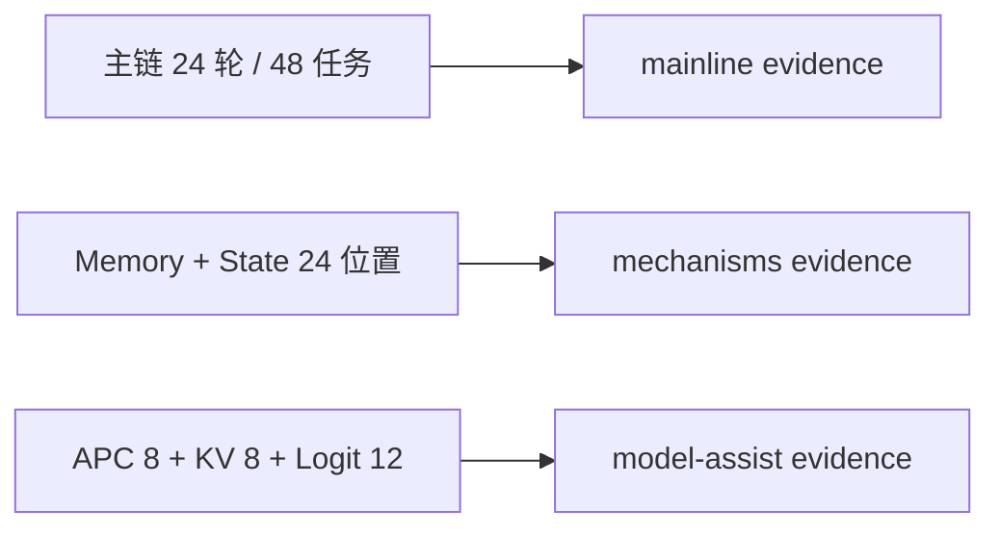

# 实验与证据

本页只汇总当前精选 evidence 的三条结果链。每条链使用自己的任务、条件和分母；`provider tokens`、logical tokens、消息文本、state bytes、KV bytes 和 `task_wall_ms` 不能互换。

## 结果地图


```mermaid
flowchart LR
    A[主链 24 轮 / 48 任务] --> B[mainline evidence]
    C[Memory + State 24 位置] --> D[mechanisms evidence]
    E[APC 8 + KV 8 + Logit 12] --> F[model-assist evidence]
```

## 主链：24 轮、48 个任务位置

实现和入口：

```text
src/statebus/benchmark/contest_dsl_mainline.py
scripts/run_contest_dsl_mainchains.sh
tests/benchmarks/run_statebus.sh mainline-24
tests/evidence/mainline/
```

`SB-FULL` 和 `P-TEXT` 都运行 finance 12 轮与 service_ops 12 轮，共 24 对配对任务。精选结果（collection date `2026-09-27`）为：

| 字段 | 结果 |
| --- | ---: |
| planned / started / passed | 48 / 48 / 48 |
| quality pass rate | 1.0 |
| SB-FULL / P-TEXT quality match | 24 / 24 |
| provider requests | 101 |
| provider prompt / completion / total tokens | 164,078 / 31,804 / 195,882 |
| Runtime message count | 197 |
| observed state publish / transfer / consume / release | 24 / 24 / 24 / 24 |
| observed state payload/read bytes | 491,520 / 491,520 |
| Memory query / candidate / actual consumption / replay | 24 / 132 / 12 / 12 |
| skipped executor generation | 12 |

`P-TEXT` 与 `SB-FULL` 的 provider token/request 差异是产品级描述性对照。两个 variant 的 backend、validator、output contract 等条件没有被收敛为单一协议因果实验，因此文档不把差异写成“协议格式单独造成”。`wire_bytes`、`typed_bytes`、对象边界 serialization bytes 和 avoided provider tokens 在 evidence 中是未观测量。

主链中的 State downstream effect 当前汇总为 `no_effect`；publish/transfer/consume/release 证明生命周期事件发生，不等于业务收益。Memory 的 `queries_with_candidate`、`actual_consumption`、`replay_count`、`skipped_executor_generation` 是不同事件，不能合并为一个命中率。

## Memory / State 机制实验：24 个计划位置

实现和入口：

```text
src/statebus/benchmark/contest_mechanisms.py
src/statebus/benchmark/memory_ablation.py
scripts/run_contest_mechanisms.sh
tests/benchmarks/run_statebus.sh mainline-mechanisms
tests/evidence/mechanisms/
```

当前结果见 [`../../tests/evidence/mechanisms/`](../../tests/evidence/mechanisms/)：`planned=24`、`started=24`、`passed=24`，质量门通过率为 `24/24`。State-on 的 4 个位置均观察到 `publish`、`transfer`、`consume` 和 `release`；`semantic-holdout-s1` 的 `behavioral_effect=changed`。质量门用于确认任务输出有效，不等同于机制收益。

### Memory

Memory 对照使用 off/on 成对任务。四轮汇总如下：

| family | variant | started / passed | requests | provider tokens | task wall sum (ms) |
| --- | --- | ---: | ---: | ---: | ---: |
| finance | off | 4 / 4 | 9 | 16,886 | 332,444.389 |
| finance | on | 4 / 4 | 6 | 9,527 | 236,734.899 |
| service_ops | off | 4 / 4 | 9 | 14,580 | 217,736.053 |
| service_ops | on | 4 / 4 | 6 | 8,054 | 164,239.112 |

报告分别记录 `candidate`、兼容性、`actual consumption`、`validated replay`、跳过 executor generation 和 replay class。只有进入当前角色输入并产生 consumption/effect receipt 的记录才算 actual consumption；candidate hit 不是复用证明。

### State

State 当前汇总按 4 个 off/on 配对报告：off/on 均为 `4/4` 通过，on 侧合计 `publish=10`、`transfer=10`、`consume=10`、`release=true`（每个位置均释放）。`behavioral_effect` 是运行时观测字段，不单独构成业务收益证明。

## APC / 显式 KV / Logit utility：28 个计分位置

该 suite 是独立的 long-text 链，只有显式选择 utility phase/profile 时才运行，不是主链新的 24 轮，也不改变 `mainline` 分母。

实现和入口：

```text
src/statebus/benchmark/model_assist_utility/
src/statebus/integrations/vllm_kv/
src/statebus/runtime/prefix_feedback.py
src/statebus/runtime/prefix_identity.py
src/statebus/runtime/logit_gate.py
scripts/experiments/contest_model_assist/run_utility_suite.sh
tests/benchmarks/run_statebus.sh apc|kv|logit|utility
tests/evidence/model-assist/
```

当前计分分母和质量字段：

| 模块 | 位置 | 结果 |
| --- | ---: | --- |
| APC | 8 | 8/8 完成并通过 |
| KV | 8 | 8/8 完成并通过 |
| Logit | 12 | 9 个 resolved case 通过，3 个正确 `abstention` |
| 合计 | 28 | `demo_completed=true`、`standard_restored=true`、`business_quality_passed=true` |

精选 summary 的局部指标为：APC consumer TTFT `2540.2 -> 264.3 ms`，观测命中 token `48 -> 5168`；KV consumer computed prefill `5666.5 -> 545.5 tokens`、consumer TTFT `2570.6 -> 1005.7 ms`；Logit resolved case logical input 平均减少 `75.21%`，compact/selective provider request wall 方向性下降 `17.18%/18.51%`。完整 `task_wall_ms` 包含 Runtime、producer/consumer、服务切换和清理成本，不能用局部 prefill 降幅替代端到端结论。

APC 是同一 vLLM engine 的 engine-local prefix cache；显式 KV 是 producer capture 到 consumer load 的 handle 路径；Logit 的正确拒答是质量门的一部分。三者都不表示跨进程 hidden-state 或 KV tensor 的任意传输。

## 证据、分母和复现

```bash
python tests/evidence/summarize_results.py
python tests/evidence/summarize_results.py --json
```

精选文件：

- [`tests/evidence/mainline/results.md`](../../tests/evidence/mainline/results.md)、`results.json`、`tasks.csv`、`tasks.jsonl`；
- [`../../tests/evidence/mechanisms/results.md`](../../tests/evidence/mechanisms/results.md)、`results.json`、`tasks.csv`、`tasks.jsonl`；
- [`tests/evidence/model-assist/summary.md`](../../tests/evidence/model-assist/summary.md)、`report.md`、`metrics.json`。

完整 raw run 和服务材料按结果中的 run ID 保存在 [`runs/`](../../runs/)。`null` 表示未观测，`0` 表示实际为零；`unavailable`、`blocked`、`not_started` 不应从分母删除。
