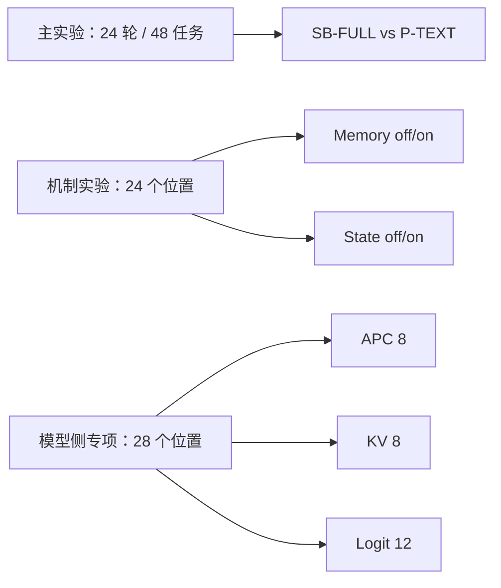

# 实验与证据

本页按 proposal 约定展示“主实验、机制实验、模型侧专项”三层结果。每个对照都同时回答质量是否保持、实际少做了什么、为此付出了什么成本。每条链使用自己的任务、条件和分母；`provider tokens`、Agent 文本通信、state bytes、KV bytes 和 `task_e2e_ms` 不能互换。

## 结果地图


```mermaid
flowchart LR
    A[主实验：24 轮 / 48 任务] --> A1[SB-FULL vs P-TEXT]
    B[机制实验：24 个位置] --> B1[Memory off/on]
    B --> B2[State off/on]
    C[模型侧专项：28 个位置] --> C1[APC 8]
    C --> C2[KV 8]
    C --> C3[Logit 12]
```

## 一、主实验：完整产品对比

`SB-FULL` 与 `P-TEXT` 使用同一批 finance 12 轮、`service_ops` 12 轮任务，共 24 对、48 个任务位置。两侧均由同一质量门判断，失败、repair 和额外请求都保留在分母。当前 evidence 的 collection date 为 `2026-09-27`。

实现和入口：`src/statebus/benchmark/contest_dsl_mainline.py`、`scripts/run_contest_dsl_mainchains.sh`、`tests/benchmarks/run_statebus.sh mainline-24`、[`tests/evidence/mainline/`](../../tests/evidence/mainline/)。

| 指标 | `SB-FULL` | `P-TEXT` | `SB-FULL` 相对变化 |
| --- | ---: | ---: | ---: |
| 质量通过 | 24/24 | 24/24 | 保持 |
| provider requests | 41 | 60 | `-31.67%` |
| provider prompt tokens | 60,544 | 103,534 | `-41.52%` |
| provider completion tokens | 13,636 | 18,168 | `-24.94%` |
| provider total tokens | 74,180 | 121,702 | `-39.05%` |
| Executor generations | 17 | 36 | `-52.78%` |
| Executor repairs | 5 | 12 | `-58.33%` |
| 24 个任务总耗时 | 1,543.3 s | 2,043.4 s | `-24.48%` |

按 family 展开，finance 的 provider tokens 为 `44,968 -> 75,275`、任务总耗时为 `927.1 s -> 1,266.4 s`（`-26.79%`）；`service_ops` 为 `29,212 -> 46,427`、`616.2 s -> 777.0 s`（`-20.69%`）。两组都 `12/12` 通过。

这是一张完整产品级对照表，不是 typed protocol 的单机制因果表：当前两个 variant 的执行责任和机制开关并不完全相同。不能把全部 token 或时间差额直接写成“协议格式造成”。`P-TEXT` 记录了 `780,825` text bytes 和 108 条 UTF-8 text carrier；`SB-FULL` 记录了 89 条 in-process typed carrier。当前没有等价的 `wire_bytes`、`typed_bytes` 或对象边界 serialization bytes，因此不写伪造的字节节省比例。

SB-FULL 另外观察到 `publish/transfer/consume/release=24/24/24/24`、逻辑 payload/read bytes `491,520/491,520`，但 State 生命周期发生不等于业务收益。

## 二、机制实验：Memory 和非文本 State

实现和入口：`src/statebus/benchmark/contest_mechanisms.py`、`src/statebus/benchmark/memory_ablation.py`、`scripts/run_contest_mechanisms.sh`、`tests/benchmarks/run_statebus.sh mainline-mechanisms`、[`tests/evidence/mechanisms/`](../../tests/evidence/mechanisms/)。固定分母为 24 个位置：Memory 16 个、State 8 个；汇总为 `planned=24`、`started=24`、`passed=24`、`quality pass rate=24/24`。

### Memory：同一任务 off/on

| family | off quality | on quality | provider requests | provider tokens | task e2e sum |
| --- | ---: | ---: | ---: | ---: | ---: |
| finance | 4/4 | 4/4 | `9 -> 6` | `16,886 -> 9,527` | `332.4 s -> 236.7 s` |
| `service_ops` | 4/4 | 4/4 | `9 -> 6` | `14,580 -> 8,054` | `217.7 s -> 164.2 s` |
| **合计** | **8/8** | **8/8** | **18 -> 12** | **31,466 -> 17,581** | **550.2 s -> 401.0 s** |

合计观察为 requests `-33.33%`、provider tokens `-44.12%`、任务耗时总和 `-27.12%`；8 个 Memory-on 位置中 4 个进入 validated replay。candidate hit、compatible/degraded、actual consumption、validated replay 和 skipped Executor generation 分开计数，不能合并成一个“命中率”。

| task | quality | provider tokens off -> on | requests off -> on | e2e ms off -> on |
| --- | --- | ---: | ---: | ---: |
| F01 | 通过 -> 通过 | 3,402 -> 3,402 | 2 -> 2 | 83,185 -> 72,666 |
| F02 | 通过 -> 通过 | 3,411 -> 1,339 | 2 -> 1 | 74,098 -> 44,264 |
| F06 | 通过 -> 通过 | 3,427 -> 3,427 | 2 -> 2 | 75,534 -> 74,315 |
| F07 | 通过 -> 通过 | 6,646 -> 1,359 | 3 -> 1 | 99,627 -> 45,490 |
| O01 | 通过 -> 通过 | 2,934 -> 2,934 | 2 -> 2 | 51,395 -> 50,275 |
| O02 | 通过 -> 通过 | 2,949 -> 1,083 | 2 -> 1 | 51,292 -> 31,330 |
| O06 | 通过 -> 通过 | 2,940 -> 2,940 | 2 -> 2 | 52,086 -> 50,516 |
| O07 | 通过 -> 通过 | 5,757 -> 1,097 | 3 -> 1 | 62,963 -> 32,119 |

### State：状态是否真的被下游消费

| 指标 | off | on | 变化 |
| --- | ---: | ---: | ---: |
| quality | 4/4 | 4/4 | 保持 |
| provider requests | 21 | 21 | 0 |
| provider tokens | 42,035 | 42,235 | `+0.48%` |
| task e2e sum | 614.5 s | 593.4 s | `-3.43%` |
| publish / transfer / consume | 0 / 0 / 0 | 10 / 10 / 10 | on 侧均发生 |
| release | false | true（4/4） | 生命周期闭合 |

| task | off | on | on publish / transfer / consume | release | behavioral effect |
| --- | --- | --- | ---: | --- | --- |
| `semantic-holdout-s1` | success | success | 2 / 2 / 2 | true | `changed` |
| `semantic-holdout-s5` | success | success | 3 / 3 / 3 | true | `no_effect` |
| `semantic-holdout-s4` | success | success | 2 / 2 / 2 | true | `no_effect` |
| `semantic-holdout-s8` | success | success | 3 / 3 / 3 | true | `no_effect` |

`semantic-holdout-s1` 的 on 记录来自最新单独重跑 `runs/smoke-mechanisms-live-20260928_174645-3579687`，不是早期 `quality_fail` 记录。它证明本题的跨进程状态消费和选择变化；其他三题如实保留 `no_effect`，不把机制接线写成普遍业务收益。

## 三、模型侧专项：APC、显式 KV、Logit

该 suite 是独立的 long-text utility 链，分母为 APC 8、KV 8、Logit 12，共 28 个计分位置；它不是主链新的 24 轮，也不改变主链分母。

| 模块 | 对照 | 机制指标对比 | 质量 / 结论 |
| --- | --- | --- | --- |
| APC（8） | `apc_on_independent -> apc_on_shared` | consumer TTFT `2540.2 -> 264.3 ms`（`-89.59%`）；hit tokens `48 -> 5,168`；完整 task wall 平均 `-4.29%` | `8/8` 完成；同一 vLLM engine 的 engine-local prefix cache |
| 显式 KV（8） | `full_replay -> continuation` | consumer computed prefill `5666.5 -> 545.5`（`-90.37%`）；consumer TTFT `2570.6 -> 1005.7 ms`（`-60.88%`）；完整 task wall `-3.58%` | `8/8` 完成；store/load 开销仍存在 |
| Logit（12） | `full -> compact/selective` | resolved case logical input 平均 `-75.21%`；provider request wall compact/selective `-17.18%/-18.51%` | 9 个 resolved case 通过，3 个正确 `abstention`；正确拒答是质量门的一部分 |

完整 task wall 包含 Runtime、producer/consumer、服务切换和清理成本；局部 prefill 或 TTFT 降幅不能替代端到端结论。APC 是 engine-local cache，KV 是同一 Worker 的 handle continuation；两者都不是跨进程 hidden-state/KV tensor 任意传输。Logit 是协作过程诊断，不是业务正确概率。

## 证据、分母和复现

```bash
python tests/evidence/summarize_results.py
python tests/evidence/summarize_results.py --json
```

精选文件：

- [`tests/evidence/mainline/results.md`](../../tests/evidence/mainline/results.md)、`results.json`、`tasks.csv`、`tasks.jsonl`；
- [`tests/evidence/mechanisms/results.md`](../../tests/evidence/mechanisms/results.md)、`results.json`、`tasks.csv`、`tasks.jsonl`、`manifest.json`；
- [`tests/evidence/model-assist/summary.md`](../../tests/evidence/model-assist/summary.md)、`report.md`、`metrics.json`。

完整 raw run 位于 [`runs/`](../../runs/)。`null` 表示未观测，`0` 表示实际为零；`unavailable`、`blocked`、`not_started` 不应从分母删除。产品级对照、机制因果对照和 utility 机制证明必须分开引用。
