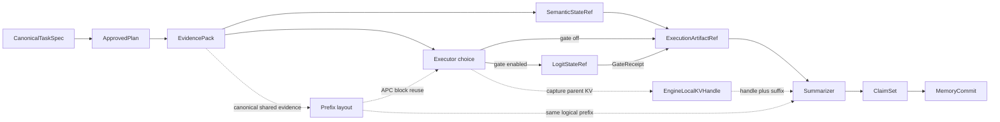

# 系统架构导航

这一组文档先划清 Runtime、角色进程和状态载体，再进入具体机制。总体分层解释职责，对象模型解释可信状态如何提升，进程拓扑解释对象实际放在哪里；模型侧状态页单独说明 Embedding、Logit、Prefix 与显式 KV，避免把正确性主链和推理加速混在一起。

| 文档 | 适合解决的问题 |
|:--|:--|
| [总体分层](architecture/overview.md) | Runtime、四 Agent、控制面、数据面与记忆面是什么关系 |
| [四 Agent 角色合同](roles/README.md) | 每个 Agent 看见什么、产出什么，以及哪些状态必须由 Runtime 提升 |
| [对象模型与可信状态](architecture/object-model.md) | TaskSpec、Plan、StateRef、ArtifactRef、ClaimSet、MemoryRef 如何依次流动 |
| [进程、模块与存储拓扑](architecture/process-and-storage.md) | 哪些代码在 Runtime，哪些工作进入 Worker，对象最终放在哪里 |
| [模型侧状态路径](runtime/model-state-paths.md) | Embedding、Logit、Prefix 与显式 KV 分别位于哪条边，是否改变业务语义 |

最短主链如下。这里的箭头表示对象通过 Runtime 校验后进入下一阶段，而不是 Agent 之间直接共享可写内存。

实线是任务正确性主链，虚线是模型侧选择或加速路径。当前正式控制面仍是 UDS + typed Protobuf；`SemanticStateRef`、`LogitStateRef`、`ExecutionArtifactRef` 与 `MemoryRef` 使用各自合同。Prefix 只调整 prompt 布局并观测 vLLM APC，显式 KV 已作为默认关闭的 Executor-to-Summarizer sideband 接入 Runtime，但 `EngineLocalKVHandle` 还不是正式 Ref，也不经过 Protobuf、Ref Registry 或 MemoryProxy。
