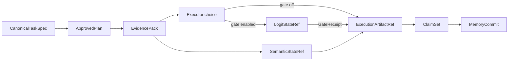

# 系统架构导航

这一组文档说明 StateBus 的整体形态。建议先读“总体分层”，再根据关注点进入对象模型或进程与存储拓扑。每篇只保留一个视角，避免把所有模块堆在同一张图里。

| 文档 | 适合解决的问题 |
|:--|:--|
| [总体分层](architecture/overview.md) | Runtime、四 Agent、控制面、数据面与记忆面是什么关系 |
| [四 Agent 角色合同](roles/README.md) | 每个 Agent 看见什么、产出什么，以及哪些状态必须由 Runtime 提升 |
| [对象模型与可信状态](architecture/object-model.md) | TaskSpec、Plan、StateRef、ArtifactRef、ClaimSet、MemoryRef 如何依次流动 |
| [进程、模块与存储拓扑](architecture/process-and-storage.md) | 哪些代码在 Runtime，哪些工作进入 Worker，对象最终放在哪里 |

最短主链如下。这里的箭头表示对象通过 Runtime 校验后进入下一阶段，而不是 Agent 之间直接共享可写内存。

当前 StateBus 的正式控制面是 UDS + typed Protobuf。检索用 `SemanticStateRef`、可选决策门使用的 `LogitStateRef`、文件型 `ExecutionArtifactRef` 与跨任务 `MemoryRef` 是不同合同；KV cache / hidden state handoff 不属于当前正式主链。
