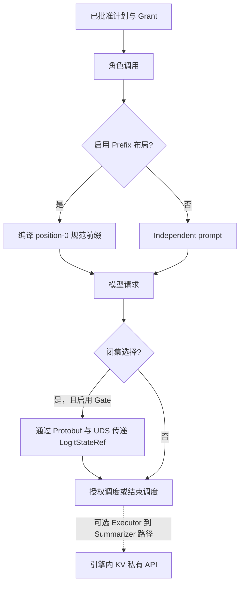

# Runtime 与控制面导航

控制链负责固定任务、批准计划、签发权限并收敛 Worker。模型侧优化包在角色调用外侧，
任务授权仍由同一条控制链完成。

| 文档 | 核心问题 |
|:--|:--|
| [任务编译与正式任务合同](runtime/task-compilation.md) | 自然语言请求如何变成可 hash 的 CanonicalTaskSpec，formal 为什么要求预编译 spec |
| [计划策略与能力授权](runtime/plan-policy-and-capability.md) | PlanProposal 如何批准，CapabilityGrant 如何限制 step 的权限 |
| [Protobuf 与 UDS 控制协议](runtime/protobuf-and-uds.md) | ExecRequest、ACK、heartbeat、result 和 GC 如何在线路中编码 |
| [Logit Retry Gate](runtime/logit-retry-gate.md) | Executor 候选概率如何让 Runtime 决定执行、重查或 fail closed |
| [Worker 生命周期与 attempt 隔离](runtime/worker-lifecycle.md) | Supervisor 状态机、timeout、晚到结果、取消与回收如何工作 |
| [模型侧状态路径](runtime/model-state-paths.md) | 哪些机制进入正式控制面，哪些只在模型服务一侧工作 |

控制链的最短表达是：

```text
CanonicalTaskSpec
  -> PlanProposal
  -> 计划策略报告 + 已批准计划
  -> CapabilityGrant
  -> Executor 闭集选择
  -> 可选 LogitStateRef / GateReceipt
  -> ExecRequest
  -> ACK / RUN_START / HEARTBEAT / RES_*
  -> Validator / 结算 / GC
```

Prefix 不增加控制帧：Runtime 在角色请求编译阶段生成共同前缀，vLLM 按 token block 自动复用。Logit Gate 进入正式控制面：Runtime 通过 `ExecRequest(operation="logit_gate_v1")` 把 `LogitStateRef` 交给独立 Worker。显式 KV 当前使用 loopback 私有 API 和 Worker-local registry，不写入正式 Protobuf。



Protobuf 负责消息解析；PlanPolicy、CapabilityGrant 与调度前复核负责授权；Ref 校验、
Validator 和 Commit Gate 负责业务结果。Prefix/KV 切换到普通路径时，任务语义继续由同一
TaskSpec、EvidencePack、Artifact 和质量门处理。
