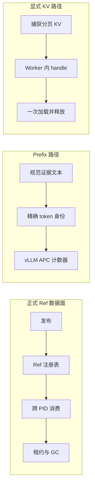

# 非文本状态与数据面导航

这一组文档解释“控制帧之外的数据放在哪里”。正式 Ref、prompt prefix 和 engine-local KV
handle 分别具有自己的身份、所有者与生命周期。

| 文档 | 核心问题 |
|:--|:--|
| [Ref 类型与职责](state/ref-boundaries.md) | SemanticStateRef、LogitStateRef、ExecutionArtifactRef、MemoryRef 如何分工 |
| [稠密语义状态](state/dense-semantic-state.md) | query/candidate 矩阵如何编码、发布、解析和返回选择回执 |
| [LogitState](state/logit-state.md) | 闭集候选概率如何编码、由独立 PID 消费并留下 GateReceipt |
| [Hydration 与证据扇入](state/hydration-and-evidence.md) | row index 如何回到 locator，角色为何只看到自己的证据切片 |
| [分层存储与生命周期](state/storage-and-lifecycle.md) | shared memory、mmap、CAS、workspace 如何选择，lease 和 GC 如何清理 |
| [模型侧状态路径](runtime/model-state-paths.md) | Prefix 与显式 KV handle 各自采用什么身份和运行范围 |

完整证据链从发布一直记录到释放：

```text
发布物理状态
  -> 在另一进程解析
  -> 选择行并恢复候选 ID
  -> 记录生产者与消费者回执
  -> 记录行为效果
  -> 释放物理对象
```



当前正式 Ref 主线传递 embedding 稠密矩阵与候选级概率状态。Prefix 形成 token identity 与
命中 observation；显式 KV 捕获和加载 paged KV，运行范围为同一模型、同一 engine
generation、同一 Worker 的短生命周期 sideband。
