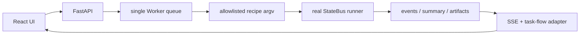

# StateBus Studio 实现导航

Studio 是运行事实的产品化视图，不是另写一套模拟数据。后端负责健康检查、白名单作业、单 Worker 队列和 SSE；前端负责固定证据、Agent 对象流与运行明细；task-flow 适配器把 Run 目录中的 summary、trace、program 和 receipt 重建成稳定 UI 模型。

| 文档 | 核心问题 |
|:--|:--|
| [FastAPI 与受控作业](studio/backend-jobs-and-api.md) | API、recipe、队列、进程组、健康检查和取消如何实现 |
| [React 前端与交互状态](studio/frontend-and-interaction.md) | Evidence/Live 两页、流程图、Agent inspector、新建运行如何工作 |
| [Run 事实重建与安全边界](studio/run-reconstruction-and-security.md) | JSONL/summary 怎样变成界面对象，浏览器为何不能执行任意命令 |

Evidence Center 读取固定快照；Live Studio 读取临时 Run。实时运行不会自动改写 PPT 和实验报告使用的正式数字。
