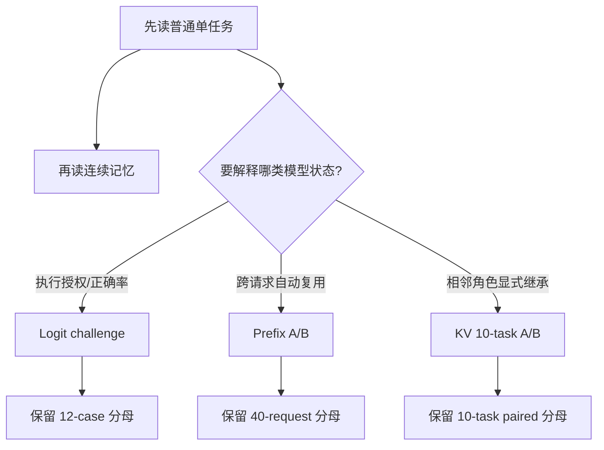

# 端到端任务走读导航

这部分沿任务读实现。前两篇覆盖普通业务主链和跨任务记忆；后三篇分别呈现 Logit、
Prefix、显式 KV 的机制实验及其任务分母。

| 文档 | 关注点 |
|:--|:--|
| [单任务全链路](walkthrough/single-task-iqr.md) | 四 Agent、语义状态、Python/DSL、Artifact 和质量门在一次 Run 中如何衔接 |
| [三轮财务记忆链](walkthrough/continuous-financial-memory.md) | verified 结果怎样进入下一轮，兼容门如何控制复用 |
| [Logit Retry Gate 挑战](walkthrough/logit-retry-challenge.md) | 简单、歧义与不可判定 case 如何验证重试和 fail-closed |
| [Prefix Reuse 实现与 A/B](runtime/engine-local-prefix-reuse.md) | 40 个请求怎样比较 position-0 shared prefix 与 independent prompt |
| [显式 KV 主链实验](runtime/engine-local-kv-continuation.md) | 10 个任务怎样比较 full replay 与 continuation，并核对双证明 |

走读省略 UUID、hash 和时间戳；实际值从 task-flow API、Telemetry、sidecar 或专项 audit
读取。Logit 的 `12/12`、Prefix 的 `20 + 20` 请求和 KV 的 10 对任务分别保留独立统计，
正式业务基线继续使用 E1、E2 与 E5。
