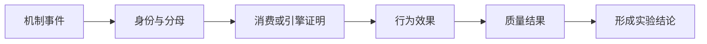

# 可观测性与恢复导航

StateBus 的运行事实分散在 Runtime Telemetry、对象 sidecar、模型侧 audit、专项 summary 和
Supervisor 终态中。每种机制使用自己的成功证据与统计分母。

| 文档 | 核心问题 |
|:--|:--|
| [Telemetry 与指标聚合](operations/telemetry-and-metrics.md) | 哪些事件是增量、哪些是快照，任务指标如何避免重复累加 |
| [失败恢复与资源结算](operations/failure-recovery.md) | ACK/heartbeat、策略拒绝、Validator 失败、取消与 GC 如何处理 |
| [Run 目录、sidecar 与 Ledger](operations/run-evidence-layout.md) | 一次结论如何回到 summary、event、Ref、Validator 和 replay decision |
| [模型侧状态路径](runtime/model-state-paths.md) | Embedding consumption、Logit Gate、Prefix hit 与 KV load 的分母如何区分 |

| 机制 | 起始信号 | 完整证据链 |
|:--|:--|:--|
| Embedding | `STATE_PUBLISHED` | 跨 PID resolve/consume、selected IDs、effect、release |
| Logit Gate | entropy 或 margin | Producer Receipt、GateReceipt、dispatch/fail-closed、tombstone |
| Prefix | 服务生命周期 hit-rate gauge | 同一任务窗口 counter delta、exact-token identity、engine/cache epoch |
| 显式 KV | 请求中出现 handle ID | capture/load/release、scheduler proof、Worker forward proof、fallback count |

机制事件是证据链起点。分析同步记录身份、分母、消费证明、行为变化和质量结果；详见
[Telemetry 与指标聚合](operations/telemetry-and-metrics.md)。
