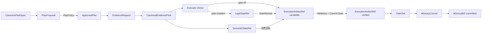

# StateBus v2 实现手册

这组文档面向需要阅读、维护或继续扩展 StateBus 的开发者。项目说明书回答的是“项目解决什么问题、为什么这样设计以及实验得到什么结果”，这里进一步回答“对象从哪里产生、经过哪些校验、由哪个模块保存、失败后如何收敛，以及界面看到的内容如何回到真实运行记录”。文档尽量沿源码中的类名、合同字段和事件名称展开，读者不需要先理解全部历史分支，也不必从实验报告反推实现。

## 从哪里开始读

如果只想先建立整体认识，可以依次阅读[系统架构](01-system-architecture.md)和[端到端任务走读](07-end-to-end-task-walkthrough.md)。前者给出模块边界，后者用一个运营指标异常分析任务把 Planner、Retriever、Executor、Summarizer、StateRef、CodeAct 和质量门串在一起。

准备修改 Runtime 或协议时，重点阅读[任务合同与控制面](02-task-contract-and-control-plane.md)、[语义状态与数据面](03-semantic-state-and-data-plane.md)以及[可观测性与恢复](08-observability-and-recovery.md)。这三篇说明计划为什么不能直接执行、Protobuf 帧中传递什么、重对象为什么只传 Ref，以及 step/attempt/lease 如何阻止晚到结果污染新尝试。

准备修改检索、记忆或 Executor 时，阅读[共享记忆复用](04-shared-memory-reuse.md)与[CodeAct、产物和质量门](05-codeact-artifact-and-quality.md)。前者把 candidate、compatible、consumed 和 behavioral effect 分开，后者说明模型生成代码为何仍只是候选，什么时候才能成为 verified artifact。

准备修改演示产品时，阅读[StateBus Studio](06-statebus-studio.md)。最后的[代码地图与扩展指南](09-code-map-and-extension-guide.md)按能力列出主要入口、相邻合同和测试位置，适合作为开发时的索引。

## 按问题直达

不需要从头顺序阅读。下面这些入口直接落到细分专题：

| 想了解的内容 | 直接阅读 |
|:--|:--|
| 为什么是 Runtime 主导而不是四个 Agent 互传文本 | [总体分层](architecture/overview.md)、[对象模型](architecture/object-model.md) |
| 四个 Agent 分别能看见、产出和禁止做什么 | [角色合同总览](roles/README.md)、[Planner](roles/planner.md)、[Retriever](roles/retriever.md)、[Executor](roles/executor.md)、[Summarizer](roles/summarizer.md) |
| formal task 为什么不能临场猜测 | [任务编译](runtime/task-compilation.md) |
| Planner 输出为什么不能直接执行 | [计划策略与能力授权](runtime/plan-policy-and-capability.md) |
| UDS 上到底发送了什么 | [Protobuf 与 UDS](runtime/protobuf-and-uds.md) |
| 重试为什么不会接收旧 Worker 的晚到结果 | [Worker 生命周期](runtime/worker-lifecycle.md) |
| embedding 如何保持 float32 跨进程传递 | [稠密语义状态](state/dense-semantic-state.md) |
| 模型候选概率如何决定执行、重查或拒绝 | [Logit Retry Gate](runtime/logit-retry-gate.md)、[LogitState](state/logit-state.md) |
| Logit Gate 的 12 个受控 case 得到了什么 | [受控挑战走读](walkthrough/logit-retry-challenge.md) |
| 向量行号怎样恢复成可引用证据 | [Hydration 与证据](state/hydration-and-evidence.md) |
| 记忆命中、实际使用和跳步有什么差别 | [兼容门与真实消费](memory/compatibility-and-consumption.md) |
| LLM 生成 Python 后有哪些安全门 | [受限 Python CodeAct](execution/bounded-python-codeact.md) |
| Python 与 DSL 的区别 | [Transform DSL](execution/transform-dsl.md)、[产物质量门](execution/artifact-and-quality-gate.md) |
| Studio 页面展示的是不是实际运行 | [Run 事实重建](studio/run-reconstruction-and-security.md) |
| 想沿一次真实任务完整看一遍 | [IQR 单任务走读](walkthrough/single-task-iqr.md) |
| 想看跨任务记忆怎样发生 | [三轮财务记忆链](walkthrough/continuous-financial-memory.md) |
| 出错后系统如何恢复和清理 | [失败恢复](operations/failure-recovery.md) |
| 准备新增任务或 capability | [扩展流程](extensions/extension-recipes.md)、[测试清单](extensions/testing-and-review.md) |

| 文档 | 解决的主要问题 |
|:--|:--|
| [01-system-architecture.md](01-system-architecture.md) | v2 的进程、模块、三层基础设施和对象总链路如何组合 |
| [02-task-contract-and-control-plane.md](02-task-contract-and-control-plane.md) | 任务如何编译、计划如何批准、能力如何授权、Worker 会话如何收敛 |
| [03-semantic-state-and-data-plane.md](03-semantic-state-and-data-plane.md) | float32 语义状态如何发布、跨进程选择、回执、释放与回溯 |
| [04-shared-memory-reuse.md](04-shared-memory-reuse.md) | 记忆如何混合召回、兼容判定、真实消费和安全写回 |
| [05-codeact-artifact-and-quality.md](05-codeact-artifact-and-quality.md) | Python/DSL 如何执行，workspace、Validator 和 Commit Gate 如何形成可信产物 |
| [06-statebus-studio.md](06-statebus-studio.md) | FastAPI、单 Worker 队列、SSE、React Flow 与固定证据页如何实现 |
| [07-end-to-end-task-walkthrough.md](07-end-to-end-task-walkthrough.md) | 一个真实任务在四 Agent 间具体传入、转换和传出什么 |
| [08-observability-and-recovery.md](08-observability-and-recovery.md) | Telemetry、Ledger、失败状态、重试隔离和资源回收如何协同 |
| [09-code-map-and-extension-guide.md](09-code-map-and-extension-guide.md) | 新任务族、新能力、新载体或新 Studio recipe 应改哪些位置 |

## 一条必须保持稳定的对象链

源码中对象很多，但业务主链可以压缩成下面这条关系。箭头不是简单的函数返回，而是“当前对象经过 Runtime 校验后，成为下一阶段可见输入”。

其中 `SemanticStateRef` 表示 embedding、query/candidate 稠密矩阵等检索状态；`LogitStateRef` 表示 Executor 闭集候选概率及 `other_mass`，只服务于执行前 Gate；`ExecutionArtifactRef` 表示 Python 或 DSL 执行后产生的文件型结果；`MemoryRef` 表示跨任务保存、可检索且带兼容条件的知识单元。状态“能读取”、程序“退出码为 0”、记忆“相似度较高”，都不足以自动把对象提升到下一状态。

## 文档中的实现事实与证据边界

本手册以源码为实现事实层，主要参考以下入口：

- [v2/runtime](../../v2/runtime/)：任务编译、计划策略、调度、执行、状态消费、重放、质量门与遥测。
- [v2/control](../../v2/control/)：typed Protobuf 消息、UDS 帧、进程间 Worker 会话。
- [v2/state](../../v2/state/)与 [v2/refs](../../v2/refs/)：物理状态、引用合同、manifest 和生命周期。
- [v2/memory](../../v2/memory/)：记忆合同、SQLite/FTS 索引、向量召回、RRF 与兼容判定。
- [v2/studio](../../v2/studio/)与 [studio-ui](../../studio-ui/)：演示后端、受控作业与前端视图。
- [tests/v2](../../tests/v2/)：合同、状态、记忆、Runtime、Studio 和 benchmark 的回归约束。

实验数字、PPT 口径和比赛结论不在这里重新计算。需要引用正式基线时，应回到[最终实验结果与 PPT 绘图数据](../reports/StateBus-v2-最终实验结果与PPT绘图数据-20260726.md)；Logit Gate 的独立挑战结果应单独引用[受控机制实验报告](../reports/StateBus-v2-LogitRetryGate受控机制实验-20260727.md)，不得把其中 `12/12` 合并进正式 `95/95`。需要正式叙述时参考[项目说明书正文](../reports/项目说明书-总-正文.md)。本手册会解释指标由哪些事件和对象形成，但不会把临时 Studio Run 自动当作固定实验基线。

## 阅读源码时的几个约定

`task_id` 标识业务任务，`step_id` 标识批准计划中的逻辑步骤，`attempt_id` 标识该步骤的一次具体执行。重试可以复用 `step_id`，但必须产生新的 `attempt_id`。`trace_id` 贯穿整条运行链，`session_id` 用于绑定一次 Runtime 会话和能力授权。

带 `Ref` 后缀的对象是受注册表管理的引用，而不是允许任意访问的文件路径。Ref 至少需要关联对象类型、存储类型、内容 hash、状态和 schema；调用方取得 Ref 并不意味着取得了所有权或写权限。`candidate`、`verified`、`committed`、`invalidated` 等词描述 Runtime 确认的生命周期状态，而不是 Agent 在自然语言中自述的结论。

文档中的 Mermaid 图用于表达调用和状态关系。若阅读器不支持 Mermaid，可以先看图下方的对象表和文字说明；图中的连线只省略实现细节，不改变合同边界。
