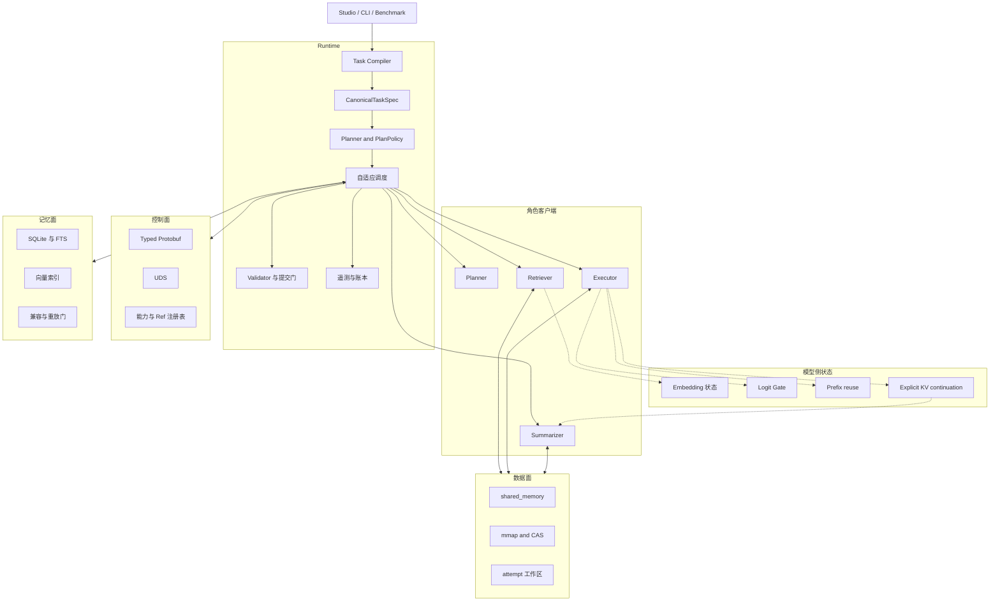
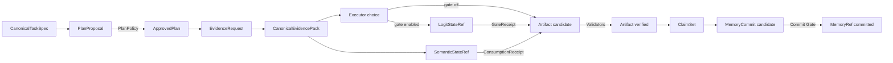

# StateBus 实现手册

本手册对应当前 `statebus/` 源码，说明对象、调用、存储、验证和恢复流程。实验总览回答
“结果是多少”，这里回答“请求经过哪些模块、状态如何取得下游资格、证据落在哪里”。

## 系统总图



Agent 生成候选，Runtime 负责批准、验证和状态提升。控制面传身份、授权和 Ref；重对象留在数据面；跨任务知识进入记忆面；模型侧状态路径分别作用于证据选择、执行授权和 Prefill 复用。

## 阅读顺序

| 顺序 | 主题 | 入口 | 读完应能回答 |
|--:|:--|:--|:--|
| 1 | 架构 | [系统架构](01-system-architecture.md) | Runtime、四角色、控制/数据/记忆面如何分工 |
| 2 | 任务与控制 | [Runtime 与控制面](02-task-contract-and-control-plane.md) | 任务怎样编译，计划怎样批准，Worker 如何收敛 |
| 3 | 状态与载体 | [非文本状态与数据面](03-semantic-state-and-data-plane.md) | Ref 如何解析、消费和释放 |
| 4 | 模型侧状态 | [模型侧状态路径](runtime/model-state-paths.md) | Embedding、Logit、Prefix、KV 分别处理什么 |
| 5 | 执行 | [CodeAct 与质量门](05-codeact-artifact-and-quality.md) | 模型代码怎样变成 verified artifact |
| 6 | 记忆 | [共享记忆复用](04-shared-memory-reuse.md) | 检索命中怎样经过兼容门并产生真实复用 |
| 7 | 任务走读 | [端到端任务](07-end-to-end-task-walkthrough.md) | 一次 Run 中对象和回执如何连接 |
| 8 | 运维与界面 | [可观测性与恢复](08-observability-and-recovery.md)、[Studio](06-statebus-studio.md) | 失败、证据、页面状态怎样回到运行事实 |
| 9 | 扩展 | [代码地图与扩展](09-code-map-and-extension-guide.md) | 新任务、能力、状态或页面应修改哪些位置 |

## 按工程问题定位

| 问题 | 文档 |
|:--|:--|
| Planner 结果怎样取得执行资格 | [计划策略与能力授权](runtime/plan-policy-and-capability.md) |
| formal task 如何避免临场猜测 | [任务编译](runtime/task-compilation.md) |
| UDS 帧中有什么 | [Protobuf 与 UDS](runtime/protobuf-and-uds.md) |
| timeout 后怎样隔离旧 attempt | [Worker 生命周期](runtime/worker-lifecycle.md) |
| embedding 如何跨 PID | [稠密语义状态](state/dense-semantic-state.md) |
| 候选概率如何控制 dispatch | [Logit Retry Gate](runtime/logit-retry-gate.md) |
| shared prefix 如何触发 vLLM cache | [Engine-Local Prefix Reuse](runtime/engine-local-prefix-reuse.md) |
| Executor 的 KV 如何交给 Summarizer | [显式 KV Continuation](runtime/engine-local-kv-continuation.md) |
| Prefix 和显式 KV 怎样配合 | [模型侧状态路径](runtime/model-state-paths.md) |
| 行号怎样恢复成证据 | [Hydration 与证据扇入](state/hydration-and-evidence.md) |
| Python 与 DSL 如何选择 | [受限 Python CodeAct](execution/bounded-python-codeact.md)、[Transform DSL](execution/transform-dsl.md) |
| Artifact 何时变成 verified | [产物与质量门](execution/artifact-and-quality-gate.md) |
| 相似记忆怎样判断复用资格 | [兼容门与真实消费](memory/compatibility-and-consumption.md) |
| Run 的原始证据在哪里 | [Run 目录与 Ledger](operations/run-evidence-layout.md) |
| 指标怎样避免重复累加 | [Telemetry 与指标聚合](operations/telemetry-and-metrics.md) |
| Studio 是否读取真实运行记录 | [Run 事实重建](studio/run-reconstruction-and-security.md) |
| 正式任务和数据集有哪些 | [基准任务与数据集目录](benchmark-task-and-dataset-catalog.md) |

## 可信对象主链



箭头表示 Runtime 校验后的可见性提升。`candidate`、`approved`、`active`、`consumed`、
`verified` 和 `committed` 都有明确的合同和回执。

Prefix 与显式 KV 是这条链上的支路：Prefix 改变请求中共同证据的位置，让 vLLM 自动命中；显式 KV 改变 Executor 与 Summarizer 之间共同 parent 的物理来源。两者都不替代 EvidencePack、Artifact 或 ClaimSet。

## 文档目录

```text
implementation/
  architecture/   分层、对象和进程拓扑
  runtime/        任务、授权、协议、Worker、Logit、Prefix、KV
  state/          Ref、稠密状态、Hydration、存储生命周期
  roles/          Planner、Retriever、Executor、Summarizer 合同
  execution/      Python、DSL、Workspace、Validator、Commit Gate
  memory/         混合检索、兼容、消费、提交与重放
  walkthrough/    单任务、连续任务和受控挑战
  operations/     Telemetry、Run 证据和失败恢复
  studio/         后端作业、前端交互和事实重建
  extensions/     代码地图、扩展步骤和测试清单
```

顶层 `01` 到 `09` 是稳定导航页，专题实现放在对应子目录。模型侧新增内容统一放在 `runtime/`，避免再创建一套按实验名称分组的平行目录。

## 四类 Ref 与一个 engine-local handle

| 对象 | 用途 | 载体 | 生命周期 |
|:--|:--|:--|:--|
| `SemanticStateRef` | embedding query/candidate matrix | shared memory、mmap | 单任务或单 step |
| `LogitStateRef` | 候选概率和 `other_mass` | shared memory | 单次 Gate attempt |
| `ExecutionArtifactRef` | Python/DSL 输出文件 | workspace、artifact root、CAS | candidate 到 verified |
| `MemoryRef` | 跨任务知识与产物关系 | SQLite/FTS、向量索引、sidecar | committed 后跨任务 |
| `EngineLocalKVHandle` | 同 Worker 的 paged KV continuation | Worker-local registry | one-shot、TTL、显式 release |

KV handle 由同一 vLLM Worker 的 registry 管理，运行范围为同一 engine generation、
one-shot 消费和显式释放。

## 实现与实验入口

实现事实以当前源码和测试为准：

- [`statebus/runtime`](../../statebus/runtime/)：编译、调度、Gate、执行、重放和遥测；
- [`statebus/control`](../../statebus/control/)：typed Protobuf、UDS 和 Worker transport；
- [`statebus/state`](../../statebus/state/) 与 [`statebus/refs`](../../statebus/refs/)：物理状态、Ref 和生命周期；
- [`statebus/integrations/vllm_kv`](../../statebus/integrations/vllm_kv/)：显式 KV sideband；
- [`statebus/memory`](../../statebus/memory/)：检索、兼容和提交；
- [`tests`](../../tests/)：合同和行为回归。

实验数字按各自任务和统计分母记录：

- 全部实验指标、逐任务数据和运行目录见[实验结果总览](../experiments/README.md)；
- 正式任务、专项机制任务、Gold 和 Validator 见[任务与数据集目录](benchmark-task-and-dataset-catalog.md)；
- Prefix 的 40 请求和显式 KV 的 10 任务数据也在各自实现页保留原始 run summary；
- Token、命中率和时延分别按对应实验的请求、任务或状态分母聚合。

## 标识与审阅约定

`task_id` 标识业务任务，`step_id` 标识批准计划中的逻辑步骤，`attempt_id` 标识一次执行尝试，`trace_id` 贯穿运行，`session_id` 绑定 Runtime 会话和能力授权。重试可复用 `step_id`，但必须创建新的 `attempt_id`。

带 `Ref` 后缀的对象经过 Registry、sidecar、hash、schema、状态和授权检查。Ref 解析与
对象所有权分别记录。新增状态类型时，文档和代码同步说明 producer、validator、consumer、
状态提升条件、异常处理和清理责任。
