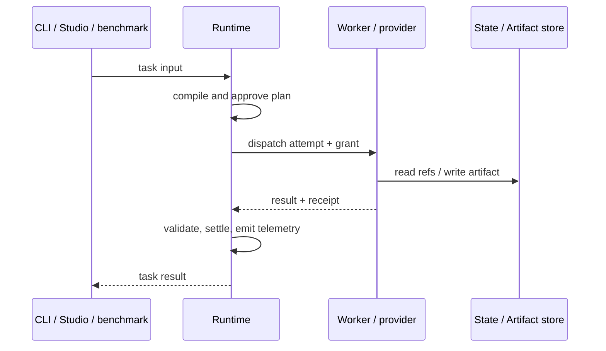

# 实现手册

本目录按当前 `src/statebus/` 的调用路径组织。页面描述源码可达行为；架构合同位于 `docs/architecture/` 与 `src/statebus/contracts/`，实验数字位于 `docs/experiments/`，raw run 位于 `runs/`。

## 一次任务

外部输入先由 `compiler.py` 和 taskpack 编译为 `CanonicalTaskSpec`。`PlanPolicy` 检查 Planner 产生的 `PlanProposal`，通过后 Runtime 为步骤创建 capability grant 和 attempt。Dispatcher 调用角色 provider，控制面传输 typed request/response，结果进入当前 attempt workspace 和 telemetry。Artifact verifier、quality gate 和 claim validator 通过后，Summarizer 生成当前 `ClaimSet`；Memory commit 只接收符合当前合同的提交候选。


```mermaid
sequenceDiagram
    participant I as CLI / Studio / benchmark
    participant R as Runtime
    participant W as Worker / provider
    participant S as State / Artifact store
    I->>R: task input
    R->>R: compile and approve plan
    R->>W: dispatch attempt + grant
    W->>S: read refs / write artifact
    W-->>R: result + receipt
    R->>R: validate, settle, emit telemetry
    R-->>I: task result
```

## 页面索引

| 主题 | 入口 |
| --- | --- |
| 系统分层 | [`01-system-architecture.md`](01-system-architecture.md) |
| Task、Plan 和 control plane | [`02-task-contract-and-control-plane.md`](02-task-contract-and-control-plane.md) |
| Semantic State 和 data plane | [`03-semantic-state-and-data-plane.md`](03-semantic-state-and-data-plane.md) |
| Memory lookup、consumption、replay | [`04-shared-memory-reuse.md`](04-shared-memory-reuse.md) |
| CodeAct、Artifact 和 quality gate | [`05-codeact-artifact-and-quality.md`](05-codeact-artifact-and-quality.md) |
| Studio backend/frontend | [`06-statebus-studio.md`](06-statebus-studio.md) |
| 端到端对象走读 | [`07-end-to-end-task-walkthrough.md`](07-end-to-end-task-walkthrough.md) |
| telemetry、ledger 和 recovery | [`08-observability-and-recovery.md`](08-observability-and-recovery.md) |
| 扩展和代码地图 | [`09-code-map-and-extension-guide.md`](09-code-map-and-extension-guide.md) |

### Runtime 专题

- [`runtime/task-compilation.md`](runtime/task-compilation.md)：Task 编译和输入摘要。
- [`runtime/plan-policy-and-capability.md`](runtime/plan-policy-and-capability.md)：计划批准和 grant。
- [`runtime/worker-lifecycle.md`](runtime/worker-lifecycle.md)：attempt、timeout、late result。
- [`runtime/protobuf-and-uds.md`](runtime/protobuf-and-uds.md)：typed control message 和 transport。
- [`runtime/model-state-paths.md`](runtime/model-state-paths.md)：Embedding、Logit、APC、KV 的接入位置。

### State、Memory 和执行

- [`state/ref-boundaries.md`](state/ref-boundaries.md)、[`state/storage-and-lifecycle.md`](state/storage-and-lifecycle.md)：Ref、pin、release 和 reclaim。
- [`state/hydration-and-evidence.md`](state/hydration-and-evidence.md)：locator、hydration 和 evidence lineage。
- [`memory/compatibility-and-consumption.md`](memory/compatibility-and-consumption.md)、[`memory/commit-and-replay.md`](memory/commit-and-replay.md)：candidate、actual consumption、validated replay 和 commit。
- [`execution/bounded-python-codeact.md`](execution/bounded-python-codeact.md)、[`execution/transform-dsl.md`](execution/transform-dsl.md)：受限执行路径。

## 代码入口

```text
src/statebus/runtime/driver.py                  Runtime driver
src/statebus/runtime/adaptive_mainline.py      主链编排
src/statebus/runtime/adaptive_runtime.py       authority、attempt、state、artifact
src/statebus/runtime/adaptive_dispatcher.py    provider dispatch
src/statebus/runtime/telemetry.py              运行事件和指标
src/statebus/state/store.py                    State ownership / release
src/statebus/memory/store.py                   Memory index / commit
src/statebus/studio/app.py                     Studio API
src/studio-ui/src/                            Studio frontend
```

## 运行和测试

```bash
source deploy/activate_statebus_host.sh
PYTHONDONTWRITEBYTECODE=1 python -m pytest -q tests/unit tests/integration tests/benchmarks
tests/benchmarks/run_statebus.sh mainline-24 --dry-run
```

实时 runner 的模型、GPU、容器和输出目录要求以 `scripts/README.md`、`tests/benchmarks/README.md` 和 `AGENTS.md` 为准。
