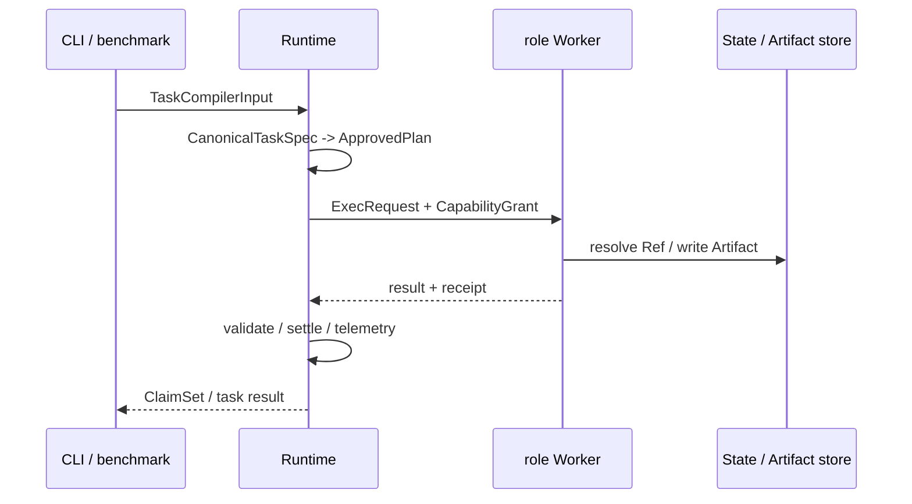

# 实现手册

本目录按当前 `src/statebus/` 的调用路径组织。架构关系见 [架构索引](../architecture/README.md)，实验结果见 [实验入口](../experiments/README.md)，部署和启动命令见 [仓库首页](../../README.md)。原始运行材料位于 `runs/`。

## 一次任务

`TaskCompiler` 将输入整理为 `CanonicalTaskSpec`。Planner 生成 `PlanProposal`，`PlanPolicyValidator` 检查后生成 `ApprovedPlan`。Runtime 为每个 step/attempt 创建 `CapabilityGrant`，Dispatcher 通过 UDS + Protobuf 调用角色 Worker。Worker 读取授权 Ref、写入 Artifact 或返回消费回执。Runtime 校验引用、产物和质量报告，生成 `ClaimSet`，再按记忆写入条件构造 `MemoryCommit`。


```mermaid
sequenceDiagram
    participant I as CLI / benchmark
    participant R as Runtime
    participant W as role Worker
    participant S as State / Artifact store
    I->>R: TaskCompilerInput
    R->>R: CanonicalTaskSpec -> ApprovedPlan
    R->>W: ExecRequest + CapabilityGrant
    W->>S: resolve Ref / write Artifact
    W-->>R: result + receipt
    R->>R: validate / settle / telemetry
    R-->>I: ClaimSet / task result
```

## 页面索引

| 主题 | 入口 | 内容 |
| --- | --- | --- |
| Runtime、协议与模型路径 | [runtime.md](runtime.md) | Task 编译、PlanPolicy、CapabilityGrant、Protobuf/UDS、Worker 生命周期、Embedding、APC、显式 KV、Logit |
| State、Ref 与存储 | [state.md](state.md) | Ref 类型、dense state、Hydration、Logit state、lease、storage backend 和 release |
| Memory 检索、消费与 Replay | [memory.md](memory.md) | hybrid lookup、兼容性判断、实际消费、validated replay、commit 和 ledger |
| 执行、Artifact 与质量检查 | [execution.md](execution.md) | bounded Python CodeAct、Transform DSL、workspace、Artifact 验证和提交条件 |
| 运行记录、指标与恢复 | [operations.md](operations.md) | Telemetry、Ledger、指标聚合、失败恢复、run/evidence 文件布局 |
| 角色 Worker | [roles.md](roles.md) | Planner、Retriever、Executor、Summarizer 的输入、输出和实现入口 |
| 任务走读与实验流程 | [walkthroughs.md](walkthroughs.md) | 单任务、连续金融任务、Logit challenge 和端到端对象走读 |
| 扩展、任务样本与验证 | [extensions.md](extensions.md) | 代码地图、新 task/capability/state/指标接入、样本目录、回归命令和环境 |

## 主要代码入口

```text
src/statebus/runtime/compiler.py             TaskCompiler
src/statebus/runtime/plan_policy.py         PlanPolicyValidator
src/statebus/runtime/adaptive_runtime.py    authority、attempt、state、artifact
src/statebus/runtime/adaptive_dispatcher.py role dispatch
src/statebus/runtime/supervisor.py          timeout、late result、GC
src/statebus/runtime/telemetry.py           event 和指标
src/statebus/state/store.py                 State ownership / release
src/statebus/memory/store.py                Memory index / commit
src/statebus/control/transport.py           UDS framing
```

## 本地检查

```bash
cd /home/qcrs/statebus/os
source ./deploy/activate_statebus_host.sh
PYTHONDONTWRITEBYTECODE=1 python -m pytest -q tests/unit tests/integration tests/benchmarks
tests/benchmarks/run_statebus.sh mainline-24 --dry-run
```

Studio：

```bash
scripts/run_statebus_studio.sh
# 另一个终端：scripts/run_statebus_studio_ui.sh
```

实时 runner 的模型服务、GPU、容器和输出目录要求见 [`docker/README.md`](../docker/README.md)；实验结果字段见 [`../experiments/results.md`](../experiments/results.md)。
