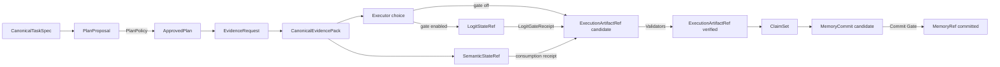
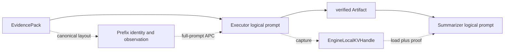

# 对象模型与可信状态

StateBus 用类型化对象连接四个角色。Runtime 通过对象识别一份内容的身份、来源、生命周期
和可见范围；Agent 负责产生候选，策略与 Validator 负责完成可信状态提升。

Prefix 与显式 KV 位于可信对象主链旁路。Prefix 生成 canonical layout、exact-token identity
和 counter observation；显式 KV 生成 `EngineLocalKVHandle` 与 `KVForwardProof`。Summarizer
与记忆写回继续以 verified Artifact 为输入。

`CanonicalTaskSpec` 是任务事实面，记录 task family、intent、目标实体、期间、输出和工具要求。它的 hash 会进入计划、Replay 与 Ledger，使一次历史结果能够回到当时的任务定义。

`PlanProposal` 是 Planner 生成的候选 DAG。PlanPolicy 校验能力 owner、角色基数、依赖、预算、输入 Ref、输出合同和 Validator 后，才产生 `ApprovedPlan`。批准计划同时固定 policy report hash 和 capability registry digest，因此它代表的是 Runtime 接受的执行图，而不是 Planner 原始文本。

`CanonicalEvidencePack` 保存可回溯证据，内部按 hard facts、structured evidence、semantic
contexts、lexical hints 和 conflicts 分桶。证据项带 source locator，pack 带源文档 hash 和
自身 hash。`SemanticStateRef` 与 EvidencePack 配套保存 query/candidate embedding 的数值选择面，
来源事实继续由 EvidencePack 承载。

`LogitStateRef` 保存 Executor 闭集候选的概率投影和 `other_mass`。独立 PID 的 Gate 计算
top-1 与 margin，并把 action 设为执行、受限重查或 fail closed。计划、能力和业务事实仍由
PlanPolicy、CapabilityGrant 与 Validator 分别处理。

`ExecutionArtifactRef` 表示 Executor 产生的文件型结果。创建时通常为 `candidate`，只有 output schema、业务事实、来源链和质量门通过才变为 `verified`。程序退出码为 0 只是验证条件之一，不是可信状态本身。

`ClaimSet` 是 Summarizer 输出的结构化结论集合。每条结论绑定已验证 Artifact 或 Evidence
locator。通过最终质量门后，适合跨任务保存的摘要、策略和产物关系形成 `MemoryCommit`，
并在提交成功后成为 `MemoryRef`。

| 状态词 | 真实含义 | 典型对象 |
|:--|:--|:--|
| proposed / candidate | 对象已生成，但尚未获得下游消费资格 | PlanProposal、Artifact candidate、MemoryCommit candidate |
| approved | 计划、能力或操作经过确定性策略批准 | ApprovedPlan、CapabilityGrant |
| active | Ref 已发布且在 lease/Registry 中有效 | SemanticStateRef、LogitStateRef、可读输入 Ref |
| consumed | 具体角色在具体 step/attempt 中读取了对象并留下回执 | StateConsumptionRecord、MemoryConsumption |
| verified | Validator 与质量条件通过，可交给下游 | ExecutionArtifactRef |
| committed | 通过写回条件，可进入跨任务索引 | MemoryRef |
| invalidated | 对象保留诊断信息，但关闭下游可见性 | 失败产物、失效记忆 |

对象之间通过 hash 连接，而不是依赖文件名相似。Plan 保存 spec/registry/report 摘要，Grant 保存 ApprovedPlan hash，Artifact 保存 blob/manifest hash，Memory 保存输入输出合同和 Runtime signature，Replay Ledger 再把这些摘要组合成可审计记录。

对象链采用“生成权与批准权分离”：Planner 生成计划、PlanPolicy 批准计划；Executor 生成
业务结果、Validator 验证结果；Retriever 发现相似记忆、Compatibility Gate 判定兼容；
Summarizer 读取 verified 对象。每种对象均记录 producer、validator、consumer、状态提升条件
和清理责任。

`EngineLocalKVHandle` 具有 `PREPARING -> READY -> CONSUMING -> CONSUMED -> RELEASED`
生命周期，由 vLLM Worker-local registry 管理。其对象关系见[Ref 类型职责](../state/ref-boundaries.md)
和[显式 KV Continuation](../runtime/engine-local-kv-continuation.md)。

主要类型位于 [`statebus/contracts/models.py`](../../../statebus/contracts/models.py)、[`statebus/contracts/adaptive.py`](../../../statebus/contracts/adaptive.py)、[`statebus/refs/models.py`](../../../statebus/refs/models.py) 和 [`statebus/memory/models.py`](../../../statebus/memory/models.py)。
