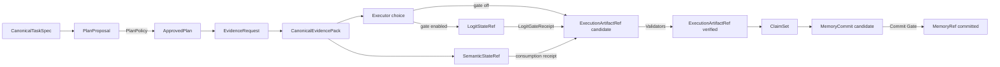

# 对象模型与可信状态

StateBus 用类型化对象连接四个角色。对象不是为了替代自然语言内容，而是为了让 Runtime 知道一份内容的身份、来源、生命周期和可见范围。一个 Agent 可以提出对象，却不能仅凭自述把对象提升为可信状态。

`CanonicalTaskSpec` 是任务事实面，记录 task family、intent、目标实体、期间、输出和工具要求。它的 hash 会进入计划、Replay 与 Ledger，使一次历史结果能够回到当时的任务定义。

`PlanProposal` 是 Planner 生成的候选 DAG。PlanPolicy 校验能力 owner、角色基数、依赖、预算、输入 Ref、输出合同和 Validator 后，才产生 `ApprovedPlan`。批准计划同时固定 policy report hash 和 capability registry digest，因此它代表的是 Runtime 接受的执行图，而不是 Planner 原始文本。

`CanonicalEvidencePack` 保存可回溯证据，内部按 hard facts、structured evidence、semantic contexts、lexical hints 和 conflicts 分桶。证据项带 source locator，pack 带源文档 hash 和自身 hash。`SemanticStateRef` 可以与 EvidencePack 配套，保存 query/candidate embedding 的数值选择面；它不能替代来源证据。

`LogitStateRef` 保存 Executor 闭集候选的概率投影和 `other_mass`。它通过独立 PID 的 Gate 计算 top-1 与 margin，只能决定候选是否进入执行、是否进行一次受限重查，或者是否 fail closed。它不保存完整 logits，也不能替代 PlanPolicy、CapabilityGrant 或业务 Validator。

`ExecutionArtifactRef` 表示 Executor 产生的文件型结果。创建时通常为 `candidate`，只有 output schema、业务事实、来源链和质量门通过才变为 `verified`。程序退出码为 0 只是验证条件之一，不是可信状态本身。

`ClaimSet` 是 Summarizer 输出的结构化结论集合。每条结论应能回到已验证 Artifact 或 Evidence locator，不能把模型流畅的叙述当成独立事实源。通过最终质量门后，适合跨任务保存的摘要、策略和产物关系才形成 `MemoryCommit`，并在提交成功后成为 `MemoryRef`。

| 状态词 | 真实含义 | 典型对象 |
|:--|:--|:--|
| proposed / candidate | 对象已生成，但尚未获得下游消费资格 | PlanProposal、Artifact candidate、MemoryCommit candidate |
| approved | 计划、能力或操作经过确定性策略批准 | ApprovedPlan、CapabilityGrant |
| active | Ref 已发布且在 lease/Registry 中有效 | SemanticStateRef、LogitStateRef、可读输入 Ref |
| consumed | 具体角色在具体 step/attempt 中读取了对象并留下回执 | StateConsumptionRecord、MemoryConsumption |
| verified | Validator 与质量条件通过，可交给下游 | ExecutionArtifactRef |
| committed | 通过写回条件，可进入跨任务索引 | MemoryRef |
| invalidated | 对象保留诊断信息，但关闭下游可见性 | 失败产物、失效记忆 |

对象之间通过 hash 连接，而不是依赖文件名相似。Plan 保存 spec/registry/report 摘要，Grant 保存 ApprovedPlan hash，Artifact 保存 blob/manifest hash，Memory 保存输入输出合同和 Runtime signature，Replay Ledger 再把这些摘要组合成可审计记录。

贯穿对象链的核心原则是“生成权与批准权分离”。Planner 不批准自己的计划，Executor 不验证自己的业务结果，Retriever 不宣布相似记忆兼容，Summarizer 不读取失败 attempt 的 candidate。新增对象类型时也应明确 producer、validator、consumer、状态提升条件和清理责任。

主要类型位于 [`v2/contracts/models.py`](../../../v2/contracts/models.py)、[`v2/contracts/adaptive.py`](../../../v2/contracts/adaptive.py)、[`v2/refs/models.py`](../../../v2/refs/models.py) 和 [`v2/memory/models.py`](../../../v2/memory/models.py)。
