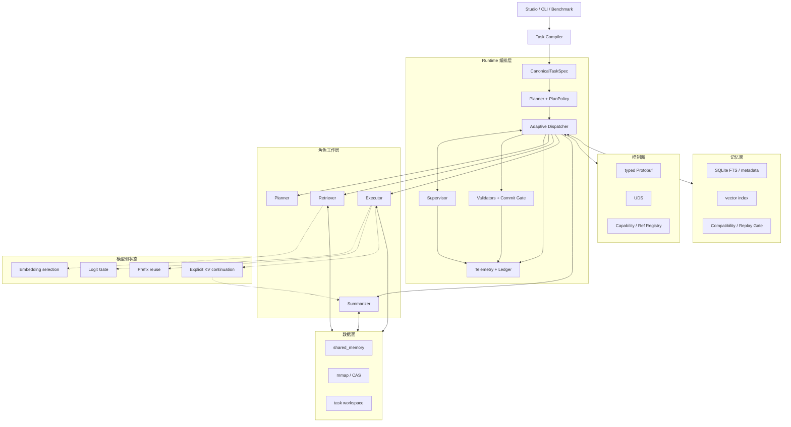

# 总体分层

StateBus 以 Runtime 为编排核心。Planner、Retriever、Executor 与 Summarizer 分别负责语言理解、
检索判断、程序生成和结论组织；Runtime 负责批准计划、签发能力、管理 Worker 会话、登记引用、
验证产物和收敛异常。Agent 产生候选，Runtime 完成下游可见性提升。

传统文本工作流通常让上游把中间结果写成一段自然语言，再由下游重新解析。这样虽然容易搭建，却把控制指令、业务证据、数值状态、执行文件和历史经验混在同一载体中。StateBus 把它们拆到控制面、数据面和记忆面，并用 task、step、attempt、Ref、hash 和 schema 保持关联。

控制面回答“谁在什么授权下做什么”。线路上主要传 task/step/attempt、目标角色、operation、超时、能力授权 hash 和按类型分离的 Ref。完整证据、embedding 矩阵、候选概率向量与执行文件不随控制帧重复传输。

数据面回答“真实对象放在哪里”。短生命周期稠密状态优先进入 shared memory，回放对象和 manifest 进入 mmap/CAS，执行输出进入 attempt 隔离的 workspace。消费方必须根据 Ref Registry 解析载体，并重新核对对象类型、状态、hash、schema 和授权范围。

记忆面回答“历史对象是否适合当前任务”。关键词、标签和向量索引先给出候选；任务意图、I/O schema、数据 manifest、lineage、Runtime signature 和角色视图再决定兼容性。召回只是候选发现，不等于实际复用。

模型侧状态回答“同一份证据如何影响选择或减少重复推理”。Embedding 和 Logit 分别进入证据选择与执行授权；Prefix 依赖 vLLM Automatic Prefix Caching，仍发送完整 prompt；显式 KV 以 Worker-local handle 让 Summarizer 继承 Executor 已计算的 parent。后两者只改变 prefill 的物理来源，不替代 EvidencePack、Artifact 或质量门。

四角色在业务上形成顺序，但实现上并不互相写入同一个共享字典。每个角色只得到 Runtime 投影出的输入视图，输出先进入候选状态。Planner 的计划需要批准，Retriever 的状态需要消费验证，Executor 的文件需要质量门，Summarizer 只能读取 verified 产物。

这套分层允许控制表示、物理载体和业务能力独立演进。例如 dense state 可在保持
`SemanticStateRef` 语义一致的情况下从 shared memory 切换到 mmap；Executor 新增 DSL 操作时，
CapabilityGrant 和 Artifact Validator 继续执行原有职责。

相关源码入口：[`statebus/runtime`](../../../statebus/runtime/)、[`statebus/control`](../../../statebus/control/)、[`statebus/state`](../../../statebus/state/)、[`statebus/memory`](../../../statebus/memory/) 和 [`statebus/integrations/vllm_kv`](../../../statebus/integrations/vllm_kv/)。模型侧四条路径的职责见[模型侧状态路径](../runtime/model-state-paths.md)。
