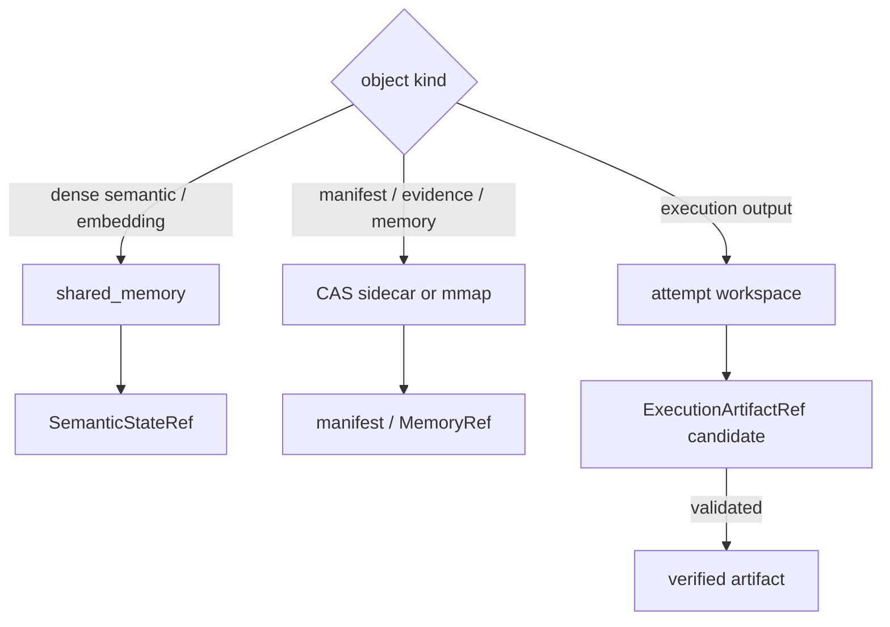

# 进程、模块与存储拓扑

正式 v2 的目标运行形态是单个 Docker + openEuler 容器，但“单容器”不等于“单进程”。Runtime 驱动角色 Worker，二者通过 UDS 交换控制消息；数值状态通过 shared memory 或 mmap 交接；执行输出落入独立 workspace；Telemetry 和 sidecar 则进入当前 Run 根目录。进程边界使跨 PID 状态消费、Worker 租约和失败隔离成为可观察事实。

```text
┌────────────────────── Runtime process ─────────────────────────────┐
│ Compiler  PlanPolicy  Dispatcher  Supervisor  Registry  Telemetry │
└───────────────┬──────────────────────────┬─────────────────────────┘
                │ typed Protobuf / UDS     │ JSONL + sidecars
                ▼                          ▼
       ┌──────── Agent worker ───────┐    run root
       │ ACK / START / HEARTBEAT     │
       │ resolve refs               │
       │ execute capability         │
       │ return refs + receipts     │
       └────────────┬────────────────┘
                    │ bounded read/write
                    ▼
        shared_memory | mmap/CAS | task workspace
        semantic state  manifests   execution artifacts
```

| 模块 | 主要实现 | 进程内责任 |
|:--|:--|:--|
| 任务编译 | [`compiler.py`](../../../v2/runtime/compiler.py) | 规范化任务并拒绝不合格 formal 输入 |
| 计划与调度 | [`plan_policy.py`](../../../v2/runtime/plan_policy.py)、[`adaptive_dispatcher.py`](../../../v2/runtime/adaptive_dispatcher.py) | 批准计划、路由 capability、构造角色输入 |
| Worker 会话 | [`driver.py`](../../../v2/runtime/driver.py)、[`supervisor.py`](../../../v2/runtime/supervisor.py) | 管理 step/attempt、超时、终态和 GC |
| 控制传输 | [`messages.py`](../../../v2/control/messages.py)、[`transport.py`](../../../v2/control/transport.py) | Protobuf 编解码、长度帧、UDS 收发 |
| 状态存储 | [`store.py`](../../../v2/state/store.py)、[`semantic_state.py`](../../../v2/state/semantic_state.py) | 选择载体、发布/解析数值状态、管理 lease |
| 产物工作区 | [`workspace.py`](../../../v2/runtime/workspace.py) | attempt 隔离目录、候选产物和生命周期 |
| 记忆索引 | [`v2/memory`](../../../v2/memory/) | metadata/FTS、向量、兼容与提交 |
| 事实记录 | [`telemetry.py`](../../../v2/runtime/telemetry.py)、[`ledger.py`](../../../v2/runtime/ledger.py) | 事件、指标、Replay 决策与关联摘要 |

数据载体按对象生命周期选择。`DENSE_SEMANTIC_STATE` 和 `EMBEDDING_STATE` 默认偏向 shared memory，适合短期同机跨进程读取；EvidencePack、HydrateManifest、MemoryMatch 和 MemoryCommit 偏向 CAS sidecar/mmap，便于 hash 与回放；ExecutionArtifact 进入 workspace root，只有验证后才可能复制或登记为长期对象。



Ref 是逻辑身份，物理载体是实现选择。控制面只传 Ref；消费方读取 Registry 和 metadata sidecar 后才能打开物理对象。路径必须落在登记的 root 内，shared memory 名称、mmap path、workspace relpath 和内容 hash 需要交叉验证。

Runtime、Worker 与存储都使用 task/step/attempt 关联对象。重试产生新的 attempt 和 workspace，旧 Worker 的晚到结果不能覆盖新尝试。上游 verified Ref 可以按新 Grant 重新授权，旧 candidate 只能保留为诊断材料。

当前目标部署路径是单容器 Docker + openEuler，宿主机也保留开发和测试入口。环境是否已经验证应以对应 Run 和部署记录为准；源码存在某个后端或启动脚本，不自动等同于完成所有环境兼容验证。
