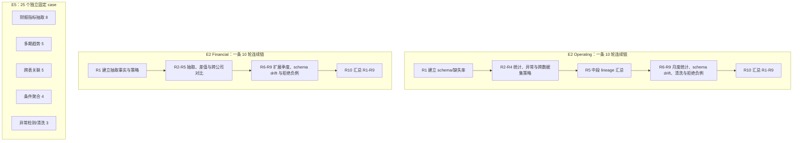

# StateBus 正式基准任务与数据集目录

本文集中说明 StateBus 正式实验中最容易混淆的两套任务：E2 的两组连续任务和 E5 的五类 25 个固定 case。重点是任务本身，即输入是什么、要求完成什么分析、是否依赖前序轮次、需要产出什么，以及 Gold/Validator 如何判断结果正确。性能数字和汇总结论不在本文重复展开，应回到[最终实验结果与绘图数据](../reports/StateBus-最终实验结果与绘图数据-20260726.md)。

## 1. 先回答“这些任务到底是什么”

“两组各 10 轮”表示两条不同的连续任务链，每条链包含 10 个依次执行的任务，共 20 个任务；不是 20 组任务，也不是把同一个问题重复 10 次。

“五类 25 个 case”表示一个固定任务注册表中共有 25 个相互独立的 case，按任务能力分为 `8 + 5 + 5 + 4 + 3` 五类；不是五组各 25 个任务。

| 任务系统 | 数量与关系 | 主要输入 | 任务内容 | 主要验证目的 |
|:--|:--|:--|:--|:--|
| E2 Operating 连续链 | 10 轮，R2-R10 显式依赖前序轮次 | 两份 CSV + 1 份 schema-drift CSV | 表结构分析、缺失率、聚合、极值、IQR 异常、按月统计、清洗和 lineage 汇总 | 连续运行、跨数据集策略复用、schema drift、不兼容记忆拒绝和长程依赖 |
| E2 Financial 连续链 | 10 轮，R2-R10 显式依赖前序轮次 | 1 份紧凑合成 Markdown + 1 份 schema-drift Markdown | 单指标抽取、季度差值、跨公司对比、趋势和 lineage 汇总 | 连续检索、已验证结果/策略复用、schema drift、不兼容记忆拒绝和长程聚合 |
| E5 固定注册表 | 25 个独立 case，无跨 case 的 `depends_on_rounds` | 离线财务 corpus、Markdown、两份 CSV | 财报抽取、多期趋势、跨表关联、条件聚合、异常检测与清洗 | 五类任务覆盖、受限执行、结构化产物和确定性质量验证 |

按物理输入形态统计，E5 的 25 个 case 可写成：

- 8 个 case 读取代码内的离线财务 corpus；
- 10 个 case 读取紧凑的跨期财报 Markdown；
- 7 个 case 读取疾病或天气 CSV；
- 合计 `8 + 10 + 7 = 25`。

因此，不能把全部任务统称为“长文档问答”。只有 Financial 连续链以及 E5 的趋势/跨表任务走财报 Markdown 路径；Operating 连续链和 E5 的聚合/异常任务是表格分析，E5 的 8 个单指标抽取任务则使用代码内离线 corpus。



## 2. 数据资产、形态与实际规模

### 2.1 数据集总表

| 数据资产 | 物理形态与规模 | 主要字段/实体 | 被哪些任务使用 | 应如何描述 |
|:--|:--|:--|:--|:--|
| [`estimated_numbers.csv`](../../datasets/operating_metrics/estimated_numbers.csv) | CSV，856 个数据行、11 列、66,590 B | 国家、年份、病例数、死亡数、上下界、WHO 区域 | E2 Operating R1-R3；E5 聚合与异常 case | 疾病统计表，不是长文档 |
| [`baro_2015.csv`](../../datasets/operating_metrics/baro_2015.csv) | CSV，8,736 个数据行、8 列、382,752 B | 时间、风速、风向、阵风、温度、气压、湿度、能见度 | E2 Operating R4、R6-R7、R9-R10；E5 聚合与异常 case | 小型逐小时天气表，不是长文档 |
| [`baro_2015_schema_drift.csv`](../../statebus/benchmark/samples/continuous_task_families/formal_operating_metrics/baro_2015_schema_drift.csv) | CSV fixture，12 个数据行、4 列、515 B | `STATION_NOTE`、`BARO`、`WIND_SPEED_MPS`、`DATE_TIME` | E2 Operating R8 | 专门测试字段别名，不代表真实数据规模 |
| [`cross_period_financial_report.md`](../../statebus/benchmark/samples/continuous_task_families/cross_period_financial/cross_period_financial_report.md) | Markdown，31 行、1,250 B | ACME/BETA、2025Q3-2026Q1、revenue | E2 Financial；E5 趋势与跨表 case | 走 `markdown_long_doc` 检索路径，但物理上是紧凑合成文档 |
| [`cross_period_financial_report_schema_drift.md`](../../statebus/benchmark/samples/continuous_task_families/cross_period_financial/cross_period_financial_report_schema_drift.md) | Markdown，27 行、870 B | `period`、`revenue_usd_millions` 等别名 | E2 Financial R8 | schema-drift fixture，不应描述成真实长篇财报 |
| [`OfflineFinancialReportCorpus`](../../statebus/retrieval/corpus.py) | Python 内定义的离线 corpus：5 份合成报告、20 个文本 fragment、15 个表格行 | ACME/BETA 的 revenue、gross margin、operating income | E5 的 8 个财报指标抽取 case | repo-local 检索 corpus，不是 Markdown 文件 |

CSV 的完整列为：

- 疾病表：`Country`、`Year`、`No. of cases`、`No. of deaths`、`No. of cases_median`、`No. of cases_min`、`No. of cases_max`、`No. of deaths_median`、`No. of deaths_min`、`No. of deaths_max`、`WHO Region`。
- 天气表：`DATE TIME`、`WINDSPEED`、`DIR`、`GUSTS`、`AT`、`BARO`、`RELHUM`、`VIS`。
- 天气 schema-drift 表通过 `DATE_TIME -> DATE TIME`、`WIND_SPEED_MPS -> WINDSPEED` 测试公开字段别名解析。

### 2.2 两种财务数据不是同一个输入对象

E2 Financial 和 E5 趋势/跨表 case 使用跨期 Markdown，其中直接给出 ACME 与 BETA 在三个季度的 revenue：

| 公司 | 2025Q3 | 2025Q4 | 2026Q1 |
|:--|--:|--:|--:|
| ACME | 98 | 109 | 120 |
| BETA | 72 | 79 | 87 |

E5 的 8 个单指标抽取 case 使用 `OfflineFinancialReportCorpus`。该 corpus 包含：

| 文档 | 表格指标 |
|:--|:--|
| ACME 2025Q4 | revenue 109、gross margin 36、operating income 15 |
| ACME 2026Q1 | revenue 120、gross margin 38、operating income 19 |
| ACME 2026Q2 | revenue 132、gross margin 39、operating income 23 |
| ACME 2026Q3 | revenue 145、gross margin 41、operating income 27 |
| BETA 2026Q1 | revenue 87、gross margin 31、operating income 11 |

两者有部分相同业务事实，例如 ACME 2026Q1 revenue 为 120，但来源表示不同：一个是 Markdown 中的跨期表，另一个是带文本 fragment、表格行和 locator 的 repo-local corpus。引用实验时必须同时写清 task ID 和数据来源，不能只凭数值相同就把两次任务当成同一个 case。

## 3. E2：两组各 10 轮的连续任务

### 3.1 连续任务如何构成

E2 使用两个 continuous-task-family manifest 的 `long_horizon` 视图：

- [`formal_operating_metrics/manifest.json`](../../statebus/benchmark/samples/continuous_task_families/formal_operating_metrics/manifest.json)
- [`formal_financial_reports/manifest.json`](../../statebus/benchmark/samples/continuous_task_families/formal_financial_reports/manifest.json)

每个 manifest 都定义 10 个 `rounds`。连续性的合同证据不是任务名称相似，而是以下字段：

| 字段 | 含义 |
|:--|:--|
| `depends_on_rounds` | 当前轮依赖哪些前序轮次 |
| `reuse_contract.produces` | 当前轮写入哪些事实、策略或 artifact |
| `reuse_contract.consumes` | 当前轮允许消费哪些已验证对象 |
| `minimum_reuse_class` | 当前轮最低预期是无复用、assist，还是 validated replay |
| `expected_facts` | 当前输入对应的确定性 Gold |
| `quality_checks` | exact、numeric tolerance、字段存在或 artifact 存在等检查 |

R1-R5 同时构成 manifest 中的 `causal_core` 视图，R1-R10 构成 `long_horizon` 视图。E2 运行后者。前五轮的 canonical task 与 E1 的匹配任务语义重合，但 E1 和 E2 是独立 run，不能把 E2 的前五轮再算成 E1 的额外样本。

### 3.2 Operating 连续链：10 轮表格分析

这条链先分析疾病 CSV，再把已验证的表格分析策略迁移到天气 CSV，随后加入字段漂移、数据清洗、不兼容记忆负例和长程 lineage 汇总。它测试的是连续表格任务，不是长文档问答。

| 轮次 / task ID | 当前输入与具体任务 | 前序依赖与允许复用 | 必须产出 | Gold 与 Validator 目标 |
|:--|:--|:--|:--|:--|
| R1 `formal-ops-001` | `estimated_numbers.csv`；推断列类型、统计行数，并计算 `No. of cases_min` 与 `No. of deaths_max` 的缺失率 | 无前序依赖；建立疾病 schema 与 missingness 策略 | `schema_profile_ref`、`missingness_summary`、摘要 | 缺失率 36.45%、38.79%；误差不超过 0.01；schema artifact 必须存在 |
| R2 `formal-ops-002` | 同一疾病表；计算平均病例数，并定位死亡数最大值所在国家和年份 | 依赖 R1；消费疾病 schema profile | `stats_artifact_ref`、`mean_cases`、国家、年份 | 平均病例数 2,081,990；Nigeria；2010；三个字段 exact |
| R3 `formal-ops-003` | 同一疾病表；使用阈值 3 的 IQR 方法处理 `No. of deaths_max`，比较移除异常前后的均值 | 依赖 R1、R2；消费 schema 与统计 artifact | `outlier_artifact_ref`、清理前/后均值 | 10,149.43、5,949.08；误差不超过 0.01 |
| R4 `formal-ops-004` | `baro_2015.csv`；建立天气表 profile 并计算平均风速，把表结构/均值策略迁移到新数据集 | 依赖 R1、R2；消费 missingness/profile 策略和疾病统计 artifact | 天气 `schema_profile_ref`、`mean_windspeed` | 平均风速 5.979；误差不超过 0.001；schema artifact 必须存在 |
| R5 `formal-ops-005` | 汇总 R1-R4 声明的疾病/天气 schema、统计、异常 artifact、复用策略和 lineage | 依赖 R1-R4；fan-in 前四轮对象 | `reuse_report_ref`、摘要、复用 artifact/strategy 计数 | artifact 至少 5 个、strategy 至少 2 个；报告 artifact 必须存在 |
| R6 `formal-ops-006` | `baro_2015.csv`；按 `DATE TIME` 的月份对 `WINDSPEED` 求平均 | 依赖 R4；复用天气 schema 与平均风速统计，但按当前行重新聚合 | `monthly_avg_windspeed`、`groupby_artifact_ref` | 1 月 7.17、12 月 5.52；误差不超过 0.01；groupby artifact 必须存在 |
| R7 `formal-ops-007` | `baro_2015.csv`；使用阈值 3 的 IQR 方法统计 `BARO` 异常点 | 依赖 R3、R4；复用 IQR 策略和天气 schema，针对当前行重算 | `baro_outlier_count`、`outlier_artifact_ref` | 异常数 111，exact；artifact 必须存在 |
| R8 `formal-ops-008` | `baro_2015_schema_drift.csv`；解析 `DATE_TIME`、`WIND_SPEED_MPS` 公共别名，建立 profile 并计算风速均值 | 依赖 R4、R6；允许复用原天气 schema 与月度聚合策略，但必须保留别名/来源 lineage | schema、alias-resolution 和统计 artifact；`mean_windspeed` | 均值 7.500；误差不超过 0.001；schema artifact 必须存在 |
| R9 `formal-ops-009` | `baro_2015.csv`；用阈值 3 的 IQR 识别风速异常，以替换前的非缺失均值替换异常值，并对 `AT` 均值填充 | 依赖 R4、R7；消费 schema、IQR 策略和气压异常 artifact；同时注入 legacy 不兼容候选，要求拒绝后基于当前输入计算 | `cleaned_table_ref`、清洗后风速/温度均值、拒绝记录 | 风速均值 5.76、温度均值 52.47；误差不超过 0.01；清洗表必须存在 |
| R10 `formal-ops-010` | 汇总 R1-R9 的 schema、统计、异常、月度聚合、清洗表、别名解析和兼容拒绝 lineage | 依赖 R1-R9；长程 fan-in | `reuse_report_ref`、摘要、复用 artifact/strategy 计数 | artifact 至少 8 个、strategy 至少 3 个；报告 artifact 必须存在 |

按任务阶段理解，这 10 轮分别承担：

1. R1 建立可复用 schema 基线。
2. R2-R4 在同一数据集内复用，并把策略迁移到第二份 CSV。
3. R5 检查中段多来源 fan-in。
4. R6-R7 扩展为按组聚合和另一列的异常检测。
5. R8 检查 schema alias，而不是直接相信旧字段名。
6. R9 检查物化清洗产物，并要求拒绝不兼容 legacy 候选。
7. R10 检查跨 9 个前序轮次的完整 lineage。

### 3.3 Financial 连续链：10 轮跨期财报分析

这条链使用紧凑合成 Markdown。manifest 将其标记为 `markdown_long_doc`，表示它经过长文档检索/证据定位路径；物理文件只有 31 行，不能对外描述为真实百页财报。

| 轮次 / task ID | 当前输入与具体任务 | 前序依赖与允许复用 | 必须产出 | Gold 与 Validator 目标 |
|:--|:--|:--|:--|:--|
| R1 `formal-financial-001` | 标准跨期 Markdown；抽取 ACME 2026Q1 revenue | 无前序依赖；建立指标事实和 `compare_metric` 抽取策略 | `revenue_value`、摘要 | revenue 120，exact |
| R2 `formal-financial-002` | 同一 Markdown；抽取 ACME 2025Q4 revenue | 依赖 R1；消费已验证抽取策略；合同目标为 validated replay | `revenue_value`、摘要 | revenue 109，exact |
| R3 `formal-financial-003` | 计算 ACME 2025Q4 到 2026Q1 的 revenue 绝对差和百分比 | 依赖 R1、R2；优先使用两个已验证季度事实，不兼容时回源重算 | `delta_value`、`delta_pct`、摘要 | 绝对差 11，exact |
| R4 `formal-financial-004` | 抽取 BETA 2026Q1 revenue | 依赖 R1；复用已验证抽取策略；合同目标为 validated replay | `revenue_value`、摘要 | revenue 87，exact |
| R5 `formal-financial-005` | 比较 ACME/BETA 2026Q1 revenue 并计算差额 | 依赖 R1、R4；消费两个公司当前季度事实 | 两个 revenue、`gap_value`、摘要 | 差额 33，exact |
| R6 `formal-financial-006` | 抽取 BETA 2025Q4 revenue | 依赖 R1、R4；允许复用抽取策略，不兼容时回源 | `revenue_value`、摘要 | revenue 79，exact |
| R7 `formal-financial-007` | 计算 BETA 2025Q4 到 2026Q1 的 revenue 差值 | 依赖 R4、R6；消费两个季度事实 | `delta_value`、`delta_pct`、摘要 | 绝对差 8，exact |
| R8 `formal-financial-008` | schema-drift Markdown；解析 `period`、`revenue_usd_millions` 别名，抽取 BETA 2025Q3 revenue 并保留 source locator | 依赖 R4、R6；可复用策略和 BETA 2025Q4 事实，但不得把旧 schema 当作当前 schema | revenue、摘要、alias-resolution 记录 | revenue 72，exact |
| R9 `formal-financial-009` | 回到标准 Markdown；抽取 ACME 2025Q3 revenue 并保留证据定位 | 依赖 R8；注入 runtime-signature 不兼容的 legacy 候选，要求拒绝后从当前来源计算 | revenue、摘要、兼容拒绝记录 | revenue 98，exact |
| R10 `formal-financial-010` | 生成 ACME/BETA 三季度 revenue 趋势，并汇总前九轮事实、差值、拒绝记录和完整 lineage | 依赖 R1-R9；长程 fan-in | 两组趋势值、两组方向、`consumed_artifact_refs`、摘要 | 两家公司方向均为 `increasing`，exact；消费引用字段必须存在 |

这条链的结构不是“连续问 10 个互不相关的问题”：

- R2 与 R4 是明确的 validated-replay 目标，用于验证已批准的抽取 recipe 能否减少重复步骤。
- R3、R5、R7 需要组合前序轮次产生的已验证事实。
- R8 使用 schema-drift 文档，要求先解析字段别名。
- R9 专门放入不兼容记忆负例，正确行为是拒绝后重算，而不是强行复用。
- R10 同时依赖 R1-R9，用于验证长程 fan-in 和来源链完整性。

## 4. E5：五类 25 个固定 case

### 4.1 注册表与 case 关系

E5 的注册入口是 [`statebus/benchmark/task_registry.py`](../../statebus/benchmark/task_registry.py)。五类 case 的组成如下：

| 任务族 | 数量 | 输入表示 | 核心操作 | 每个 case 是否依赖其他 case |
|:--|--:|:--|:--|:--|
| `financial_report_analysis_v1` | 8 | `OfflineFinancialReportCorpus` | 单公司、单季度、单指标定位与抽取 | 否 |
| `multi_period_trend_analysis_v1` | 5 | 跨期财报 Markdown | 多季度序列、方向和首尾差值 | 否 |
| `cross_table_join_analysis_v1` | 5 | 跨期财报 Markdown | 公司/季度对齐、差额与并行趋势 | 否 |
| `conditional_aggregation_v1` | 4 | 疾病/天气 CSV | 缺失率、均值、极值、分组聚合 | 否 |
| `anomaly_detection_v1` | 3 | 疾病/天气 CSV | IQR 异常检测、替换和缺失填充 | 否 |
| 合计 | 25 | corpus + Markdown + CSV | 五类离线数据分析 | - |

sample JSON 只定义业务任务、参数、产物 schema 和 Gold，并不把 Python CodeAct 或 DSL 固化为任务属性。正式 E5 adaptive run 中观察到的执行表示为：

- `benchmark-sample-1` 选择 `execute_bounded_python_v2`；
- `benchmark-sample-2..8` 选择 `execute_analysis_dsl_v2`；
- 其余 17 个 case 选择 `execute_bounded_python_v2`；
- 因而该次运行共 18 个受限 Python CodeAct、7 个 DSL。

上述观测路径来自 run `e5_adaptive_final_20260720_190107` 的 `summary.json`，而不是从 sample 文件名推断。

这里的“18/7”是一次正式 adaptive run 的实际路由结果，不是任务注册表先验，也不是 CodeAct OFF/ON 准确率消融。尤其不能把 7 个 DSL case 写成“未加 CodeAct 只做对 7/25”。

### 4.2 财报指标抽取：8 个 case

sample 来源：[`statebus/benchmark/samples/formal_financial_family`](../../statebus/benchmark/samples/formal_financial_family/)。物理数据来自 `OfflineFinancialReportCorpus`。Retriever 需要按 ticker、quarter、metric 找到正确文档和表格行，并保留 `selected_doc_hashes`；产物类型为 JSON。

| task ID | 具体请求 | corpus 文档与目标行 | Gold/Validator 目标 | 正式 run 的执行表示 |
|:--|:--|:--|:--|:--|
| `benchmark-sample-1` | 查询 ACME 2026Q1 revenue 并生成摘要 | `sha256:doc-acme-2026q1`，revenue 行 | `metric_name=revenue`、`metric_value=120`、`revenue_value=120`、文档 hash exact | 受限 Python CodeAct |
| `benchmark-sample-2` | 查询 ACME 2026Q2 revenue 并生成摘要 | `sha256:doc-acme-2026q2`，revenue 行 | revenue 132，metric 名与文档 hash exact | DSL |
| `benchmark-sample-3` | 查询 ACME 2026Q3 revenue 并生成摘要 | `sha256:doc-acme-2026q3`，revenue 行 | revenue 145，metric 名与文档 hash exact | DSL |
| `benchmark-sample-4` | 查询 ACME 2025Q4 revenue 并生成摘要 | `sha256:doc-acme-2025q4`，revenue 行 | revenue 109，metric 名与文档 hash exact | DSL |
| `benchmark-sample-5` | 查询 BETA 2026Q1 revenue 并生成摘要 | `sha256:doc-beta-2026q1`，revenue 行 | revenue 87，metric 名与文档 hash exact | DSL |
| `benchmark-sample-6` | 查询 ACME 2026Q2 gross margin 并生成摘要 | `sha256:doc-acme-2026q2`，gross-margin 行 | `metric_name=gross_margin`、值 39、文档 hash exact | DSL |
| `benchmark-sample-7` | 查询 ACME 2026Q1 operating income 并生成摘要 | `sha256:doc-acme-2026q1`，operating-income 行 | `metric_name=operating_income`、值 19、文档 hash exact | DSL |
| `benchmark-sample-8` | 查询 BETA 2026Q1 gross margin 并生成摘要 | `sha256:doc-beta-2026q1`，gross-margin 行 | `metric_name=gross_margin`、值 31、文档 hash exact | DSL |

这 8 个 case 测的是不同 ticker、quarter 和 metric 组合下的证据定位与结构化抽取，不涉及跨 case 的趋势计算。`expected_route=compare_metric` 是业务路由名称，不等于执行器必须使用 DSL 或 Python。

### 4.3 多期趋势：5 个 case

sample 来源：[`tasks/formal/multi_period_trend_analysis_v1/samples`](../../tasks/formal/multi_period_trend_analysis_v1/samples/)。输入为跨期财报 Markdown，产物类型为 JSON；该次正式 run 的 5 个 case 均选择受限 Python CodeAct。

| task ID | 具体请求 | 输入切片与计算 | 必须产出 | Gold/Validator 目标 |
|:--|:--|:--|:--|:--|
| `formal-trend-001` | 计算 ACME 2025Q3、2025Q4、2026Q1 三季度趋势 | `98 -> 109 -> 120`，逐相邻季度判断方向 | `trend_values`、`trend_direction`、摘要 | 方向 `increasing`，exact |
| `formal-trend-002` | 计算 BETA 同期三季度趋势 | `72 -> 79 -> 87` | `trend_values`、`trend_direction`、摘要 | 方向 `increasing`，exact |
| `formal-trend-003` | 计算 ACME 2025Q3 到 2026Q1 的 revenue delta | `120 - 98`，同时生成百分比字段 | `delta_value`、`delta_pct`、摘要 | 绝对差 22，exact |
| `formal-trend-004` | 计算 BETA 2025Q3 到 2026Q1 的 revenue delta | `87 - 72`，同时生成百分比字段 | `delta_value`、`delta_pct`、摘要 | 绝对差 15，exact |
| `formal-trend-005` | 并行比较 ACME/BETA 三季度趋势 | 对两家公司各输出三行季度值和方向 | 两组趋势值、两组方向、摘要 | 两家公司方向均为 `increasing`，exact |

方向的 canonical 规则写在请求中：全部相邻值上升为 `increasing`，全部下降为 `decreasing`，全部相等为 `flat`，其他情况为 `mixed`。Validator 不接受自由改写的近义词。

### 4.4 跨表关联：5 个 case

sample 来源：[`tasks/formal/cross_table_join_analysis_v1/samples`](../../tasks/formal/cross_table_join_analysis_v1/samples/)。输入仍是跨期财报 Markdown，但任务要求先按公司和季度对齐两张表，再计算差额或趋势；该次正式 run 的 5 个 case 均选择受限 Python CodeAct。

| task ID | 具体请求 | 对齐/计算内容 | 必须产出 | Gold/Validator 目标 |
|:--|:--|:--|:--|:--|
| `formal-join-001` | 计算 2026Q1 ACME/BETA revenue gap | 对齐 ACME 120 与 BETA 87 | 两个 revenue、`gap_value`、摘要 | ACME 120、BETA 87、gap 33，exact |
| `formal-join-002` | 计算 2025Q4 revenue gap | 对齐 ACME 109 与 BETA 79 | 两个 revenue、gap、摘要 | gap 30，exact |
| `formal-join-003` | 计算 2025Q3 revenue gap | 对齐 ACME 98 与 BETA 72 | 两个 revenue、gap、摘要 | gap 26，exact |
| `formal-join-004` | 联结两家公司三季度表并判断各自方向 | 每家公司输出 2025Q3、2025Q4、2026Q1 三行 | 两组趋势值、两组方向、摘要 | 两家公司方向均为 `increasing`，exact |
| `formal-join-005` | 返回对齐后的 2026Q1 成对数值 | 返回 ACME/BETA 两个值；schema 同时要求 gap 字段 | 两个 revenue、gap、摘要 | ACME 120、BETA 87，exact |

`formal-join-005` 的产物 schema 要求 `gap_value` 存在，但该 sample 的 Gold 只对两个公司值作 exact 断言；这是“schema 完整性”和“事实 Gold”两个不同层次。

### 4.5 条件聚合：4 个 case

sample 来源：[`tasks/formal/conditional_aggregation_v1/samples`](../../tasks/formal/conditional_aggregation_v1/samples/)。输入为两份 CSV，产物类型为 JSON；该次正式 run 的 4 个 case 均选择受限 Python CodeAct。

| task ID | 输入与具体请求 | 必须产出 | Gold/Validator 目标 |
|:--|:--|:--|:--|
| `formal-agg-001` | 疾病 CSV；计算 `No. of cases_min` 与 `No. of deaths_max` 的缺失率并建立 profile | `schema_profile_ref`、缺失率摘要、文本摘要 | 36.45%、38.79%，误差不超过 0.01；profile artifact 必须存在 |
| `formal-agg-002` | 疾病 CSV；平均病例数四舍五入为整数，并定位死亡数最大值国家/年份 | stats artifact、均值、国家、年份 | 2,081,990、Nigeria、2010，exact |
| `formal-agg-003` | 天气 CSV；建立 profile 并计算 `WINDSPEED` 均值 | `schema_profile_ref`、`mean_windspeed` | 5.979，误差不超过 0.001；profile artifact 必须存在 |
| `formal-agg-004` | 天气 CSV；按 `DATE TIME` 的月份分组，对 `WINDSPEED` 求平均 | 12 个月均值映射、groupby artifact | 1 月 7.17、12 月 5.52，误差不超过 0.01 |

这四个 case 是独立 case。它们与 E2 Operating R1、R2、R4、R6 有相似业务动作，但没有 E2 的跨轮依赖合同，不能当作 E2 的后续轮次。

### 4.6 异常检测与清洗：3 个 case

sample 来源：[`tasks/formal/anomaly_detection_v1/samples`](../../tasks/formal/anomaly_detection_v1/samples/)。输入为两份 CSV，产物类型为 JSON；该次正式 run 的 3 个 case 均选择受限 Python CodeAct。

| task ID | 输入与具体请求 | 必须产出 | Gold/Validator 目标 |
|:--|:--|:--|:--|
| `formal-anomaly-001` | 疾病 CSV；采用 inclusive linear-interpolation quartile 和 `1.5 x IQR` fence 检测 `No. of deaths_max` 异常，比较清理前后均值 | outlier artifact、清理前/后均值 | 10,149.43、5,949.08，误差不超过 0.01 |
| `formal-anomaly-002` | 天气 CSV；采用同一 quartile 规则和 `1.5 x IQR` fence 统计 `BARO` 异常 | 异常数、outlier artifact | 111，exact |
| `formal-anomaly-003` | 天气 CSV；对 `WINDSPEED` 使用 `1.5 x IQR`，以替换前非缺失均值替换异常；对 `AT` 均值填充，并保留全部输入行 | `cleaned_table_ref`、清洗后风速/温度均值 | 5.76、52.47，误差不超过 0.01；清洗表必须存在 |

这里必须保留算法口径。E5 的异常 case 使用 `1.5 x IQR`，而 E2 Operating R3、R7、R9 的 manifest 使用阈值 3。即使部分 Gold 数值相同，也不能把两组任务描述成完全相同的 case。

## 5. Gold、Validator 与“通过”分别检查什么

### 5.1 四层检查

| 层次 | 检查对象 | 典型例子 |
|:--|:--|:--|
| 任务合同 | `CanonicalTaskSpec` 是否包含 task family、operation、参数、所需输出和批准工具 | `compute_delta` 必须声明起止季度；清洗任务必须声明目标列和阈值 |
| 产物 schema | Executor 候选是否产生规定类型和字段 | `cleaned_table_ref`、`trend_values`、`gap_value` 是否存在，JSON 是否可解析 |
| 确定性事实 Gold | 当前输入重算结果是否与 expected facts 一致 | revenue 120 exact；风速 5.979 在 0.001 容差内 |
| 来源与生命周期 | artifact/source locator 是否存在且可追溯 | `selected_doc_hashes`、schema profile、groupby/cleaned-table artifact 和 consumed refs |

E2 manifest 的 `quality_floor` 明确以确定性 validator 为主。Operating 检查字段存在、数值容差和 artifact manifest；Financial 检查字段、artifact 和数值，其中 LLM judge 不参与或仅用于解释文本。E5 同样以 artifact/schema/expected-facts 为正式判定，不以“回答看起来合理”代替 Gold。

### 5.2 exact、tolerance 和 artifact 检查的区别

- `exact:<field>`：规范化后的字段必须与 Gold 完全一致，例如 `Nigeria`、`2010`、`increasing`。
- `numeric_tolerance:<field>:<epsilon>`：允许明确数值误差，例如风速均值 5.979 的容差为 0.001。
- `field_present:<field>`：字段必须存在，但不等价于其每个内容都由同一条 Gold 断言覆盖。
- `field_gte:<field>:<n>`：汇总任务需要达到最低 artifact/strategy 数量。
- `artifact_exists:<ref>`：不仅要给出数值，还必须提交可解析、可追溯的产物引用。

## 6. E2 与 E5 的对应关系及不可合并项

| 看起来相似的内容 | 实际区别 | 正确引用方式 |
|:--|:--|:--|
| E2 Operating R1-R4 与 E5 aggregation | 业务动作相似，但 E2 有 `depends_on_rounds` 和 reuse contract；E5 case 独立 | 分别写 task ID，不把样本数相加 |
| E2 Operating R3/R7/R9 与 E5 anomaly | E2 IQR 阈值为 3；E5 为 1.5，task contract 不同 | 标注算法阈值，不只引用结果值 |
| E2 Financial 与 E5 trend/join | 都用跨期 Markdown，但 E2 是连续链，E5 是独立能力 case | E2 用 round/task ID，E5 用 registry case ID |
| E2 Financial 抽取与 E5 benchmark sample | E2 从 Markdown 抽取；E5 的前 8 个 case 从 `OfflineFinancialReportCorpus` 抽取 | 同时写数据来源和 task ID |
| E5 的 Python/DSL 数量 | 这是 adaptive run 的实际路由，不是 sample 固有标签 | 写“该次正式 run 选择 18 Python + 7 DSL” |
| “7/25 -> 25/25” | 本地没有同一 25-case registry 的 CodeAct-OFF 匹配 lane；7 是 DSL case 数 | 不作为 CodeAct 准确率消融结论 |
| `markdown_long_doc` | 是检索路径标签；文件实际为 31 行/1,250 B 的合成 fixture | 写“紧凑合成 Markdown，走长文档路径” |

## 7. 源码索引与复现检查

### 7.1 定义来源

| 内容 | 源码入口 |
|:--|:--|
| E2 Operating 10 轮 | [`formal_operating_metrics/manifest.json`](../../statebus/benchmark/samples/continuous_task_families/formal_operating_metrics/manifest.json) |
| E2 Financial 10 轮 | [`formal_financial_reports/manifest.json`](../../statebus/benchmark/samples/continuous_task_families/formal_financial_reports/manifest.json) |
| E5 五类注册表 | [`task_registry.py`](../../statebus/benchmark/task_registry.py) |
| E5 财报抽取 samples | [`formal_financial_family`](../../statebus/benchmark/samples/formal_financial_family/) |
| E5 趋势 samples | [`multi_period_trend_analysis_v1`](../../tasks/formal/multi_period_trend_analysis_v1/samples/) |
| E5 跨表 samples | [`cross_table_join_analysis_v1`](../../tasks/formal/cross_table_join_analysis_v1/samples/) |
| E5 聚合 samples | [`conditional_aggregation_v1`](../../tasks/formal/conditional_aggregation_v1/samples/) |
| E5 异常 samples | [`anomaly_detection_v1`](../../tasks/formal/anomaly_detection_v1/samples/) |
| 离线财务 corpus | [`statebus/retrieval/corpus.py`](../../statebus/retrieval/corpus.py) |
| adaptive 适配与执行 | [`adaptive_formal.py`](../../statebus/benchmark/adaptive_formal.py)、[`adaptive_formal_mainline.py`](../../statebus/benchmark/adaptive_formal_mainline.py) |
| E5 观测执行路径 | `/home/qcrs/statebus/runs/contest_evidence_closure_20260720/e5_adaptive_final_20260720_190107/summary.json` |

### 7.2 最小一致性检查

检查两个连续 manifest 均为 10 轮：

```bash
jq -e '.round_count == 10 and (.rounds | length) == 10' \
  statebus/benchmark/samples/continuous_task_families/formal_operating_metrics/manifest.json \
  statebus/benchmark/samples/continuous_task_families/formal_financial_reports/manifest.json
```

检查 E5 注册表为五类 25 个 case：

```bash
python - <<'PY'
from collections import Counter

from statebus.benchmark.task_registry import load_registered_formal_samples

samples = load_registered_formal_samples()
counts = Counter(sample.task_family for sample in samples)
assert len(samples) == 25, len(samples)
assert sorted(counts.values()) == [3, 4, 5, 5, 8], counts
print(counts)
PY
```

相关回归测试：

```bash
python -m pytest -q \
  tests/test_adaptive_formal_compare.py::test_all_25_registered_formal_cases_have_real_adaptive_adapters
```

## 8. 技术文档中的推荐表述

可以直接采用以下任务说明：

> 连续任务部分包含 Operating 与 Financial 两条各 10 轮的顺序任务链。Operating 链基于疾病和天气 CSV，覆盖 schema/缺失率、聚合、极值、IQR 异常、跨数据集策略迁移、schema drift、清洗产物和长程 lineage；Financial 链基于紧凑合成的跨期财报 Markdown，覆盖单指标抽取、季度差值、跨公司对比、字段别名、不兼容记忆拒绝和三季度趋势汇总。后续轮次通过 `depends_on_rounds` 与 reuse contract 显式依赖前序已验证事实、策略和 artifact，因此它们是两条连续工作流，而不是 20 个互不相关的问题。

> 能力覆盖部分使用五类共 25 个固定 case：财报指标抽取 8 个、多期趋势 5 个、跨表关联 5 个、条件聚合 4 个、异常检测与清洗 3 个。输入由 repo-local 离线财务 corpus、跨期财报 Markdown、疾病 CSV 和天气 CSV 构成。每个 case 都有固定 `CanonicalTaskSpec`、JSON 产物 schema、expected facts 和确定性 Validator；case 之间不编码跨轮依赖。正式 adaptive run 实际选择 18 次受限 Python CodeAct 和 7 次 DSL，但执行表示是 Runtime 的观测路由，不是任务注册表的固有标签。
