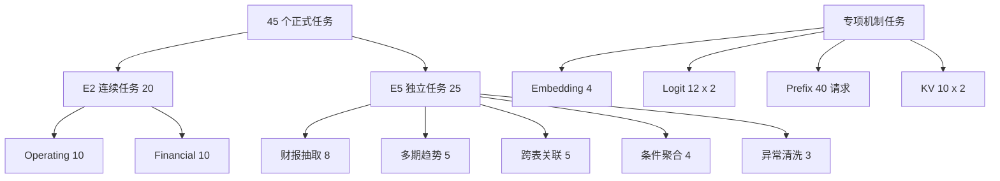

# StateBus 基准任务与数据集目录

本文列出正式实验使用的任务、物理数据、Gold、Validator 和代码入口。实验数字集中在
[实验结果总览](../experiments/README.md)，本文负责回答任务输入是什么、要完成什么分析、
结果怎样判定以及样例位于哪里。

## 1. 任务入口总览

| 任务组 | 数量与执行关系 | 任务定义 | 数据位置 |
|:--|:--|:--|:--|
| E2 Operating | 10 轮连续链 | `statebus/benchmark/samples/continuous_task_families/formal_operating_metrics/manifest.json` | `datasets/operating_metrics/` 与 manifest 同目录的 drift fixture |
| E2 Financial | 10 轮连续链 | `statebus/benchmark/samples/continuous_task_families/formal_financial_reports/manifest.json` | `statebus/benchmark/samples/continuous_task_families/cross_period_financial/` |
| E5 五类能力 | 25 个独立 case | `statebus/benchmark/task_registry.py` | `statebus/benchmark/samples/formal_financial_family/` 与 `tasks/formal/*/samples/` |
| E4 Embedding holdout | 4 个独立 case | `statebus/benchmark/samples/semantic_holdout/manifest.json` | `statebus/benchmark/samples/semantic_holdout/` |
| Logit Gate | 12 个 case，各执行 `off` 与 `retry_once` | `statebus/benchmark/samples/logit_retry_challenge/manifest.json` | 同目录的 `gold.json` |
| Prefix | 4 个交替 pair，40 个请求 | `statebus/benchmark/samples/continuous_task_families/kv_prefix_reuse/manifest.json` | 同目录的 Nova/Orion 报告 |
| 显式 KV 探针 | 2k、4k、6k 三个 case | `statebus/benchmark/samples/engine_local_kv_continuation/manifest.json` | 同目录的报告与 `compiled_parents/` |
| 显式 KV 主链 | 10 个 4k 任务，各执行两条路径 | `statebus/benchmark/samples/engine_local_kv_mainline_10round/suite_manifest.json` | 该目录与 `engine_local_kv_continuation/` 的编译 parent |

45 个正式任务实例为 E2 的 20 个连续任务与 E5 的 25 个独立 case。E1 取 E2
两条链的前五轮做四路径匹配消融；Embedding、Logit、Prefix 和显式 KV 另设专项机制任务。



## 2. 物理数据集

| 数据资产 | 形态与规模 | 主要字段或实体 | 使用位置 |
|:--|:--|:--|:--|
| `datasets/operating_metrics/estimated_numbers.csv` | CSV，856 行数据、11 列、66,590 B | 国家、年份、病例数、死亡数、上下界、WHO 区域 | E1/E2 Operating；E5 聚合与异常 |
| `datasets/operating_metrics/baro_2015.csv` | CSV，8,736 行数据、8 列、382,752 B | 时间、风速、风向、阵风、温度、气压、湿度、能见度 | E1/E2 Operating；E5 聚合与异常 |
| `formal_operating_metrics/baro_2015_schema_drift.csv` | CSV fixture，12 行、4 列、515 B | `DATE_TIME`、`WIND_SPEED_MPS` 等别名 | E2 Operating R8 |
| `cross_period_financial_report.md` | Markdown，31 行、1,250 B | ACME/BETA 在 2025Q3 至 2026Q1 的 revenue | E1/E2 Financial；E5 趋势与关联 |
| `cross_period_financial_report_schema_drift.md` | Markdown，27 行、870 B | `period`、`revenue_usd_millions` 等别名 | E2 Financial R8 |
| `OfflineFinancialReportCorpus` | 代码内离线 corpus，5 份报告、20 个文本 fragment、15 个表格行 | revenue、gross margin、operating income | E3；E5 财报抽取 |
| `semantic_holdout/` | 2 份 Markdown + 1 份 CSV | 叙述证据、表格对照、混合输入 | E4 Embedding |
| `kv_prefix_reuse/` | Nova/Orion 两份离线运营报告 | revenue、margin、expense、churn、delivery | Prefix 调度与布局 |
| `engine_local_kv_continuation/` | 两份运营报告与 2k/4k/6k 编译 parent | 跨季度指标与跨公司对比 | 显式 KV 探针与 10 任务主链 |

`OfflineFinancialReportCorpus` 定义在 `statebus/retrieval/corpus.py`。跨期 Markdown 与该 corpus
是两个独立输入对象；即使局部数值相同，任务仍按各自 source locator、文档 hash 和 task ID
进行验证。

## 3. E2：两条 10 轮连续任务链

连续任务由以下字段建立轮次关系：

| 字段 | 作用 |
|:--|:--|
| `depends_on_rounds` | 声明当前轮使用的前序轮次 |
| `reuse_contract.produces` | 声明本轮产生的事实、策略和 Artifact |
| `reuse_contract.consumes` | 声明本轮可消费的已验证对象 |
| `minimum_reuse_class` | 声明 assist、validated replay 等复用级别 |
| `expected_facts` | 保存当前输入的确定性 Gold |
| `quality_checks` | 保存 exact、容差、字段和 Artifact 检查 |

R1-R5 构成 `causal_core`，用于 E1 四路径匹配消融；R1-R10 构成 `long_horizon`，用于 E2
完整连续链。

### 3.1 Operating 10 轮

| 轮次 / task ID | 输入与任务 | 前序关系 | Gold 与产物检查 |
|:--|:--|:--|:--|
| R1 `formal-ops-001` | 疾病 CSV：schema、行数、病例/死亡边界列缺失率 | 建立 schema 基线 | 缺失率 36.45%、38.79%；schema profile 存在 |
| R2 `formal-ops-002` | 疾病 CSV：平均病例数、最大死亡数国家与年份 | 使用 R1 schema | 2,081,990；Nigeria；2010；stats Artifact 存在 |
| R3 `formal-ops-003` | 疾病 CSV：IQR 异常与清理前后均值 | 使用 R1 schema 与统计策略 | 10,149.43、5,949.08；outlier Artifact 存在 |
| R4 `formal-ops-004` | 天气 CSV：profile 与平均风速 | 将表格策略迁移到第二份 CSV | 风速均值 5.979；schema profile 存在 |
| R5 `formal-ops-005` | 汇总 R1-R4 的 schema、统计、异常、策略和 lineage | fan-in R1-R4 | Artifact 数不少于 5，策略数不少于 2 |
| R6 `formal-ops-006` | 天气 CSV：按月份计算平均风速 | 使用 R4 schema | 1 月 7.17，12 月 5.52；groupby Artifact 存在 |
| R7 `formal-ops-007` | 天气 CSV：阈值 3 的 IQR 气压异常 | 使用 R3 IQR 策略与 R4 schema | 异常数 111；outlier Artifact 存在 |
| R8 `formal-ops-008` | drift CSV：解析时间与风速字段别名并计算均值 | 使用 R4、R6 | 平均风速 7.500；alias 与 schema Artifact 存在 |
| R9 `formal-ops-009` | 天气 CSV：风速异常替换、温度缺失填充 | 使用 R4、R7 | 清洗后风速 5.76、温度 52.47；cleaned table 存在 |
| R10 `formal-ops-010` | 汇总 R1-R9 的 schema、统计、别名、清洗和 lineage | fan-in R1-R9 | Artifact 数不少于 8，策略数不少于 3 |

### 3.2 Financial 10 轮

| 轮次 / task ID | 输入与任务 | 前序关系 | Gold 与产物检查 |
|:--|:--|:--|:--|
| R1 `formal-financial-001` | 抽取 ACME 2026Q1 revenue | 建立抽取事实与策略 | 120 |
| R2 `formal-financial-002` | 抽取 ACME 2025Q4 revenue | 使用 R1 抽取策略 | 109 |
| R3 `formal-financial-003` | 计算 ACME 2025Q4 到 2026Q1 的差值 | 组合 R1、R2 | 绝对差 11 |
| R4 `formal-financial-004` | 抽取 BETA 2026Q1 revenue | 使用 R1 抽取策略 | 87 |
| R5 `formal-financial-005` | 比较 ACME/BETA 2026Q1 revenue | 组合 R1、R4 | 差额 33 |
| R6 `formal-financial-006` | 抽取 BETA 2025Q4 revenue | 使用 R1、R4 | 79 |
| R7 `formal-financial-007` | 计算 BETA 2025Q4 到 2026Q1 的差值 | 组合 R4、R6 | 绝对差 8 |
| R8 `formal-financial-008` | drift Markdown：解析别名并抽取 BETA 2025Q3 revenue | 使用 R4、R6 | 72；保留 alias 与 source locator |
| R9 `formal-financial-009` | 标准 Markdown：抽取 ACME 2025Q3 revenue | 使用 R8 的定位策略 | 98；记录运行签名不兼容候选的处理 |
| R10 `formal-financial-010` | 汇总两家公司三季度 revenue 趋势与 R1-R9 lineage | fan-in R1-R9 | 两家公司方向均为 `increasing`；consumed refs 存在 |

## 4. E5：五类 25 个独立任务

E5 注册入口为 `statebus/benchmark/task_registry.py`。每个 sample 独立执行，Gold 不依赖其他
case 的运行结果。

### 4.1 财报指标抽取，8 个

任务位于 `statebus/benchmark/samples/formal_financial_family/`，数据来自
`OfflineFinancialReportCorpus`。

| task ID | 查询 | Gold |
|:--|:--|:--|
| `benchmark-sample-1` | ACME 2026Q1 revenue | 120，文档 `doc-acme-2026q1` |
| `benchmark-sample-2` | ACME 2026Q2 revenue | 132，文档 `doc-acme-2026q2` |
| `benchmark-sample-3` | ACME 2026Q3 revenue | 145，文档 `doc-acme-2026q3` |
| `benchmark-sample-4` | ACME 2025Q4 revenue | 109，文档 `doc-acme-2025q4` |
| `benchmark-sample-5` | BETA 2026Q1 revenue | 87，文档 `doc-beta-2026q1` |
| `benchmark-sample-6` | ACME 2026Q2 gross margin | 39 |
| `benchmark-sample-7` | ACME 2026Q1 operating income | 19 |
| `benchmark-sample-8` | BETA 2026Q1 gross margin | 31 |

### 4.2 多期趋势，5 个

任务位于 `tasks/formal/multi_period_trend_analysis_v1/samples/`，数据来自跨期财报 Markdown。

| task ID | 计算 | Gold |
|:--|:--|:--|
| `formal-trend-001` | ACME `98 -> 109 -> 120` | `increasing` |
| `formal-trend-002` | BETA `72 -> 79 -> 87` | `increasing` |
| `formal-trend-003` | ACME 2025Q3 到 2026Q1 | 差值 22 |
| `formal-trend-004` | BETA 2025Q3 到 2026Q1 | 差值 15 |
| `formal-trend-005` | ACME/BETA 并行趋势 | 两家公司均为 `increasing` |

### 4.3 跨表关联，5 个

任务位于 `tasks/formal/cross_table_join_analysis_v1/samples/`。

| task ID | 计算 | Gold |
|:--|:--|:--|
| `formal-join-001` | 2026Q1 ACME/BETA revenue gap | 120、87、gap 33 |
| `formal-join-002` | 2025Q4 revenue gap | 109、79、gap 30 |
| `formal-join-003` | 2025Q3 revenue gap | 98、72、gap 26 |
| `formal-join-004` | 两家公司三季度方向 | 两家公司均为 `increasing` |
| `formal-join-005` | 2026Q1 成对值 | ACME 120、BETA 87 |

### 4.4 条件聚合，4 个

任务位于 `tasks/formal/conditional_aggregation_v1/samples/`。

| task ID | 输入与计算 | Gold |
|:--|:--|:--|
| `formal-agg-001` | 疾病表两个边界列缺失率 | 36.45%、38.79% |
| `formal-agg-002` | 平均病例数与最大死亡数国家/年份 | 2,081,990；Nigeria；2010 |
| `formal-agg-003` | 天气表平均风速 | 5.979 |
| `formal-agg-004` | 天气表按月平均风速 | 1 月 7.17，12 月 5.52 |

### 4.5 异常检测与清洗，3 个

任务位于 `tasks/formal/anomaly_detection_v1/samples/`，使用 inclusive linear-interpolation
quartile 与 `1.5 x IQR`。

| task ID | 输入与计算 | Gold |
|:--|:--|:--|
| `formal-anomaly-001` | 疾病死亡上界异常及清理前后均值 | 10,149.43、5,949.08 |
| `formal-anomaly-002` | 天气气压异常数 | 111 |
| `formal-anomaly-003` | 风速异常替换、温度填充 | 5.76、52.47；cleaned table 存在 |

## 5. Embedding 与 Logit 专项任务

### 5.1 E4 Embedding holdout

| task ID | 输入 | 分析目标 | 状态预期 |
|:--|:--|:--|:--|
| `semantic-holdout-s1` | `meridian_network_review.md` | operating region、fulfillment constraint 与章节定位 | 3 个语义状态 |
| `semantic-holdout-s2` | `meridian_network_review.md` | demand cause/effect、risk 与 mitigation | 3 个语义状态 |
| `semantic-holdout-s3` | `harbor_service_levels.csv` | Harbor East 2026Q2 backlog 与 SLA | 表格路径，0 个语义状态 |
| `semantic-holdout-s4` | `delta_hub_review.md` + 表格 | throughput 与 shipment qualifier | 3 个语义状态 |

### 5.2 Logit Retry Gate

任务定义位于 `statebus/benchmark/samples/logit_retry_challenge/manifest.json`，Gold 位于同目录
的 `gold.json`。每个任务分别执行 `off` 与 `retry_once`。

| 分组 | task ID | 首次任务面 | 合同展开后的目标 |
|:--|:--|:--|:--|
| 简单 | `logit-easy-01-anomaly` | IQR 信息完整 | `detect_outliers` |
| 简单 | `logit-easy-02-correlation` | Pearson 信息完整 | `correlate_columns` |
| 简单 | `logit-easy-03-trend` | 三季度序列完整 | `compute_multi_period_trend` |
| 简单 | `logit-easy-04-extreme` | 聚合与极值条件完整 | `aggregate_and_extreme` |
| 简单 | `logit-easy-05-dsl` | 单表筛选排序完整 | `execute_analysis_dsl` |
| 歧义 | `logit-ambiguous-01-anomaly` | 两个通用分析候选 | IQR 输出合同，选择 `detect_outliers` |
| 歧义 | `logit-ambiguous-02-join` | 两份数值输入 | 连接键合同，选择 `join_tables` |
| 歧义 | `logit-ambiguous-03-trend` | 时间范围隐藏 | 三季度序列合同 |
| 歧义 | `logit-ambiguous-04-extreme` | 极值条件隐藏 | 全局最低业务单元 |
| 歧义 | `logit-ambiguous-05-python` | 转换算子隐藏 | 自连接与透视，选择受限 Python |
| 负例 | `logit-unresolved-01-replica` | 两个等价只读副本 | 第二次仍低 margin，结束调度 |
| 负例 | `logit-unresolved-02-policy` | 两个计划均缺少授权 | 第二次仍低 margin，结束调度 |

## 6. Prefix 任务

Prefix 数据位于 `statebus/benchmark/samples/continuous_task_families/kv_prefix_reuse/`：

| 文件 | 内容 |
|:--|:--|
| `orion_factory_ops_report_2026.md` | Orion 2026Q1-Q3 的 revenue、margin、expense、churn、delivery |
| `nova_retail_ops_report_2026.md` | Nova 同期的五类运营指标 |
| `manifest.json` | corpus hash、依赖、调度 key 和 Prefix probe 配置 |
| `README.md` | 样例任务与调度说明 |

Prefix 使用 Orion 报告的四配对布局实验。每个 pair 包含 Planner、Retriever、Executor、
Summarizer、Verifier 五类请求，并分别运行 Shared 与 Independent，共 `4 x 5 x 2 = 40`
请求。Shared 将共同证据放在 token position 0；Independent 将动态角色字段放在共同证据前。

## 7. 显式 KV 任务

### 7.1 2k、4k、6k 机制探针

入口：`statebus/benchmark/samples/engine_local_kv_continuation/manifest.json`。

| case ID | Parent | 输入 | Gold |
|:--|--:|:--|:--|
| `kv-fin-2k-orion` | 2,048 token | Orion 报告 | Q1/Q3 revenue 184/211，差值 27，Q3 margin 39.7，供应商交付风险 |
| `kv-fin-4k-nova` | 4,096 token | Nova 报告 | Q1/Q3 revenue 142/169，差值 27，Q2/Q3 margin 37.4/36.2，Q3 OTD 89.9 |
| `kv-fin-6k-cross-company` | 6,144 token | Orion + Nova | Q3 revenue gap 42，margin gap 3.5 pp，OTD gap 0.9 pp，Orion churn 更高 |

三个 parent 均按 vLLM block size 16 对齐，编译结果位于同目录的 `compiled_parents/` 与
`compiled_cases.json`。

### 7.2 10 个 4k 完整主链任务

正式 KV 结果采用
`statebus/benchmark/samples/engine_local_kv_mainline_10round/suite_manifest.json`。10 个任务
全部固定 4,096-token parent；先执行 10 个 `full_replay`，再执行 10 个 `continuation`。

| 轮次 / task ID | 公司与指标 | 2026Q1 / Q2 / Q3 Gold |
|:--|:--|:--|
| 1 `kv-mainline-nova-revenue-4k` | Nova revenue | 142 / 156 / 169 |
| 2 `kv-mainline-nova-gross-margin-4k` | Nova gross margin | 36.8 / 37.4 / 36.2 |
| 3 `kv-mainline-nova-operating-expense-4k` | Nova operating expense | 44 / 47 / 53 |
| 4 `kv-mainline-nova-churn-4k` | Nova churn | 2.8 / 3.1 / 4.0 |
| 5 `kv-mainline-nova-on-time-delivery-4k` | Nova on-time delivery | 95.7 / 93.6 / 89.9 |
| 6 `kv-mainline-orion-revenue-4k` | Orion revenue | 184 / 197 / 211 |
| 7 `kv-mainline-orion-gross-margin-4k` | Orion gross margin | 41.2 / 40.5 / 39.7 |
| 8 `kv-mainline-orion-operating-expense-4k` | Orion operating expense | 57 / 61 / 66 |
| 9 `kv-mainline-orion-churn-4k` | Orion churn | 3.2 / 3.6 / 4.4 |
| 10 `kv-mainline-orion-on-time-delivery-4k` | Orion on-time delivery | 96.4 / 94.1 / 90.8 |

每次运行经过完整 `Planner -> Retriever -> Executor -> CodeAct -> Summarizer -> Validator`
链路。Validator 检查 `metric_name`、三个季度数值、结构化 Artifact core、logical token digest、
KV scheduler proof、Worker forward proof 和 handle 释放状态。

## 8. Gold 与 Validator

| 检查层 | 检查对象 | 示例 |
|:--|:--|:--|
| 任务合同 | operation、参数、输入和批准能力 | `compute_delta` 包含起止季度 |
| 产物 Schema | 输出类型、字段和 JSON 可解析性 | `cleaned_table_ref`、`gap_value`、`trend_values` |
| 确定性 Gold | 当前输入重算值 | revenue 120 exact；风速 5.979 容差 0.001 |
| 来源与生命周期 | locator、hash、Artifact、消费与释放 | selected document hash、StateRef receipt、KV release |

常用检查形式：

| 检查 | 含义 |
|:--|:--|
| `exact:<field>` | 规范化字段与 Gold 完全一致 |
| `numeric_tolerance:<field>:<epsilon>` | 数值落在明确容差内 |
| `field_present:<field>` | 规定字段存在 |
| `field_gte:<field>:<n>` | 汇总数量达到合同要求 |
| `artifact_exists:<ref>` | 对应产物已物化并可解析 |

## 9. 本地核验

使用仓库 conda 环境：

```bash
source deploy/activate_statebus_host.sh
```

查看正式任务数量：

```bash
python - <<'PY'
from collections import Counter
from statebus.benchmark.task_registry import load_registered_formal_samples

samples = load_registered_formal_samples()
print(len(samples))
print(Counter(sample.task_family_id for sample in samples))
PY
```

检查连续任务和 KV suite：

```bash
python -m json.tool \
  statebus/benchmark/samples/continuous_task_families/formal_operating_metrics/manifest.json \
  >/dev/null
python -m json.tool \
  statebus/benchmark/samples/continuous_task_families/formal_financial_reports/manifest.json \
  >/dev/null
python -m json.tool \
  statebus/benchmark/samples/engine_local_kv_mainline_10round/suite_manifest.json \
  >/dev/null
```

相关测试：

```bash
python -m pytest -q \
  tests/test_adaptive_formal_compare.py \
  tests/test_logit_retry_challenge.py \
  tests/test_prefix_render_identity.py \
  tests/test_engine_local_kv_mainline_suite.py
```
