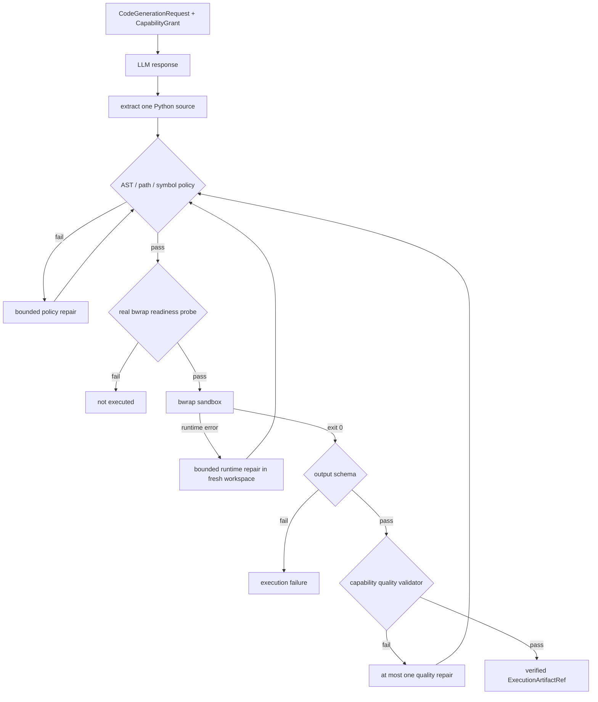
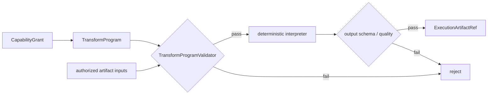
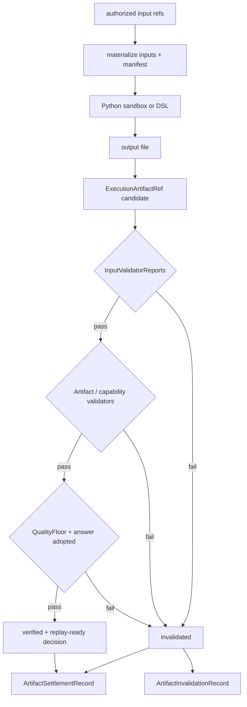

# 执行、Artifact 与质量检查

## 受限 Python CodeAct

[`LlmCodeActRunner`](../../src/statebus/runtime/llm_codeact.py) 处理模型生成的候选 Python。
候选源码经过 CapabilityGrant、静态策略、bubblewrap readiness、隔离执行、输出 schema 和
capability quality Validator 后形成 verified Artifact。LLM 提供适应性，Runtime 管理文件权限
和对象状态。

生成请求 `CodeGenerationRequest` 绑定 task/session/step/attempt、capability、ApprovedPlan hash、
Grant hash、输入 Ref、input manifest digest、获准路径、输出 schema、operation semantics、
completion criteria、Validator 和 Runtime/model/Prompt signature。生成 Prompt 给出可导入模块、
确切输入文件、唯一输出路径、字段与排序要求；运行环境只挂载这些获准资源。

模型响应只接受三种窄格式：纯 Python 源码、单个 Python fenced block，或只含 `code` 字段的 JSON。解析后计算 source hash 与 raw response hash，再进入 AST/符号表审计。



静态策略只开放批准的导入、符号和路径字面量，输出写入固定 output relpath。策略检查
`eval`、`exec`、`compile`、`open`、动态 import、网络/进程/系统模块、危险属性、绝对路径和
`..`，同时限制源码字节、AST 节点数和循环数，并用 `symtable` 核对全局名。当前执行路径为
同步函数与注册模块。

bubblewrap readiness 探针实际进入同一最小 profile，验证非 root 进程、独立网络命名空间、
只读输入、唯一可写 output mount，以及仓库与其他任务 workspace 的隔离状态。探针结果直接
决定该 attempt 是否进入 CodeAct 执行。

运行 profile 使用 PID/IPC/UTS/network namespace，输入目录和 generated source 只读，输出
目录单独可写，继承环境被清空，并施加 wall timeout、CPU、地址空间、输出文件大小、nofile
和进程数限制。静态策略、OS 隔离与业务 Validator 依次覆盖源码、运行环境和业务结果。

修复是有预算的。policy failure、Python runtime error 和 capability quality failure 分开记录，每次修复都在新 workspace 中重新经过 AST 策略；质量修复上限被限制为 0 或 1。Validator 只返回稳定错误码，不把 golden answer 暴露给模型。

CodeAct cache 保存 verified 结果，key 绑定 semantic input digest、source/model/Prompt/Runtime
signature、policy 和 output schema。读取时核对 task/session、Grant 和 Artifact 状态，复用范围
与当前 session 绑定。

adaptive LLM Python 路径由模型生成源码；`deterministic_codeact` 等 benchmark 模式使用注册
recipe 稳定测量 Runtime 机制。两种模式都经过 workspace 和 Validator。

---

## Transform DSL

对于字段稳定、操作可枚举的表格任务，[`TransformProgram`](../../src/statebus/contracts/adaptive.py)
用输入 ArtifactRef、输出合同和一组 `TransformStep` 表达变换，
[`TransformDslInterpreter`](../../src/statebus/runtime/transform_dsl.py) 在确定性解释器中执行。

当前注册操作按用途分为：

| 用途 | 操作 |
|:--|:--|
| 字段与行选择 | `select`、`rename`、`filter_eq`、`filter_contains`、`filter_in`、`filter_range`、`sort`、`limit` |
| 聚合、派生与排序 | `group_by`、`aggregate`、`aggregate_grouped`、`derive_safe`、`rank` |
| 跨期、比较与联结 | `compare_periods`、`compare_metric`、`join_by_key` |
| 分布与趋势 | `percentile_nearest_rank`、`trend_series` |
| 异常与结论投影 | `anomaly_check`、`anomaly_zscore`、`project_claim_fields` |

DSL 参数采用结构化字段和注册操作。字段来自已知输入 schema，join 的 right Ref 来自授权列表，
aggregate/function、derive kind、输出列和 row/column/byte budget 都有显式检查。路径、文件、
Python 表达式与 shell 字段不在 DSL 合同中。



解释器逐步对内存中的行对象应用注册函数，每一步后检查最大行数和列数，最终按稳定规则
排序、序列化并限制输出字节。`derive_safe` 接受 difference、ratio 和 pct_change 等注册 kind。

`run_verified()` 还会检查 Grant 是否过期、output contract 是否匹配、输入 Ref 是否完全在 Grant 中。输出写到 attempt workspace 的固定 `outputs/transform_result.json`，计算 hash，登记 Artifact，并在 schema 与 quality validator 通过后提升。

`rank` 只接受输入字段、方向、显式 tie-break 字段和输出字段，产生稳定的 ordinal rank；它不携带任何任务编号或业务常量。`percentile_nearest_rank` 接受数值字段、百分位和可选分组字段，按 nearest-rank 规则产生分位数。两者都只处理授权输入行，缺失或非有限数值会拒绝执行。

Planner/Runtime 根据 CanonicalTaskSpec 选择 capability，Retriever 提供获准证据，Summarizer
消费 verified Artifact。Executor 根据任务结构选择 DSL 或受限 Python：注册操作由 DSL 提供
稳定语义，开放计算进入 CodeAct。

每个 DSL op 同时实现参数校验、输出列推导、解释执行、预算行为和测试，使 Validator 与
`_apply()` 保持一致。

---

## Workspace、产物与质量签发

Executor 将输出写入 attempt workspace 的受控文件。[`WorkspaceManager`](../../src/statebus/runtime/workspace.py) 为 task/step 建立 inputs、outputs、logs、tmp、script 和 manifest 目录。输入由已授权 ArtifactRef 物化，并生成 `InputManifest`；输出由 `ArtifactOutputManifest` 记录 relpath、类型、大小和 SHA-256。

```text
workspace/<task or attempt>/
├── inputs/       # verified inputs, read-only in sandbox
├── outputs/      # only permitted write surface
├── logs/         # bounded execution diagnostics
├── tmp/          # attempt-local temporary data
├── script/       # generated/registered program
└── manifest/     # input and output manifests
```

`InputManifest` 将每个文件的 logical name、artifact type、relpath、blob hash 和 source Ref
绑定到 task/step。CapabilityGrant 和 ExecRequest 保存 manifest hash；输出 manifest 在执行后
由 Runtime 重新计算。

### 批准动作如何变成可验证产物

`CapabilityGrant` 批准一次 attempt 的输入、能力、输出合同和 workspace。Executor 完成后，Runtime 按下表验收；最后由 `RuntimeCommitGate` 签发 `verified ExecutionArtifactRef` 或记录 invalidation。

| 检查阶段 | 检查内容 | 通过后留下的记录 | 失败状态 |
| --- | --- | --- | --- |
| 输入物化 | Ref 身份、session、manifest、路径和 hash | `InputValidatorReport` | `input_validator_failed` |
| 进程结果 | attempt 是否仍有效、result admission、producer identity | `AttemptResultAdmissionReceipt` | 拒绝结果接收 |
| 文件内容 | 输出路径、文件类型、大小、SHA-256、workspace 范围 | `ArtifactVerificationReceipt` | `artifact_candidate_*` |
| 能力校验 | schema、业务字段、lineage、capability-specific validator | `ArtifactValidatorReport` | `validator_failed` |
| 任务质量 | `QualityFloor` 与 `answer_adopted` | `QualityFloorResult` | `quality_floor_failed` |
| 最终签发 | 汇总各报告 hash，更新 Artifact/Memory 状态 | `CommitGateDecision`、`ArtifactSettlementRecord` | `ArtifactInvalidationRecord` |



`ArtifactValidatorReport` 保存 validation scope、passed、fail reason、消费方、metrics 和 details；`InputValidatorReport` 记录要求与实际输入。报告 hash 会进入 settlement 和 MemoryCommit。Capability-specific validator 复算 IQR、跨期变化、聚合和字段约束，并保留 JSON 结构检查。

Python CodeAct runner 在 policy、sandbox、output schema 和 capability quality 全部通过后生成
candidate Artifact；更外层的 [`RuntimeCommitGate`](../../src/statebus/runtime/commit_gate.py) 结合
input/artifact Validator、整体 QualityFloor 与 answer adopted 状态签发最终状态。
各层验证结果通过报告 hash 关联。

全部检查通过时，Artifact 从 candidate 提升为 verified，MemoryCommit 进入 committed；任一检查失败时，Artifact 变为 invalidated，ReplayClass 转为 assist，并写 `ArtifactInvalidationRecord`。Summarizer 与后续任务只读取 verified 产物。

StateBus 分别记录进程 exit code、schema、业务事实和最终答案采用状态。任务 Validator 覆盖
输入 lineage、输出 schema、关键业务事实与来源；benchmark Gold 保留在确定性校验侧。
