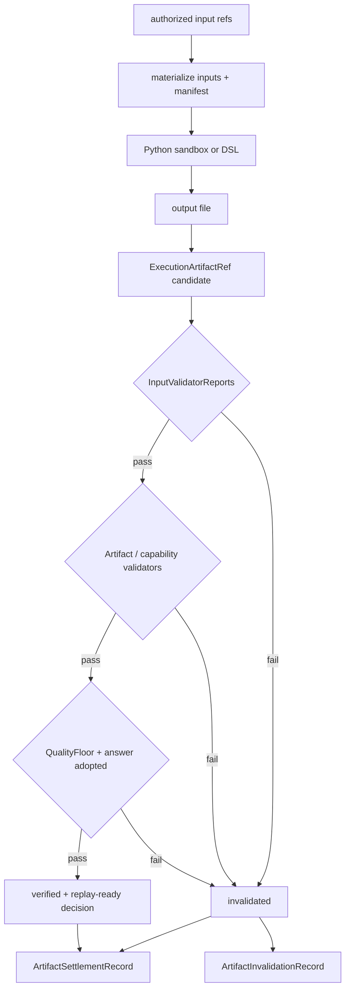

# Workspace、产物与质量门

Executor 的输出不是 stdout 中的一段文本，而是 attempt workspace 中的受控文件。[`WorkspaceManager`](../../../statebus/runtime/workspace.py) 为 task/step 建立 inputs、outputs、logs、tmp、script 和 manifest 目录。输入由已授权 ArtifactRef 物化，并生成 `InputManifest`；输出由 `ArtifactOutputManifest` 记录 relpath、类型、大小和 SHA-256。

```text
workspace/<task or attempt>/
├── inputs/       # verified inputs, read-only in sandbox
├── outputs/      # only permitted write surface
├── logs/         # bounded execution diagnostics
├── tmp/          # attempt-local temporary data
├── script/       # generated/registered program
└── manifest/     # input and output manifests
```

`InputManifest` 将每个文件的 logical name、artifact type、relpath、blob hash 和 source Ref 绑定到 task/step。CapabilityGrant 和 ExecRequest 保存 manifest hash，避免同一路径在批准后被替换。输出 manifest 在执行后重新计算，不能由模型自行声明。



`ArtifactValidatorReport` 保存 validation scope、passed、fail reason、消费方、metrics 和 details；`InputValidatorReport` 记录要求与实际输入。报告 hash 会进入 settlement 和 MemoryCommit。Capability-specific validator 可以复算 IQR、跨期变化、聚合或字段约束，而不是只检查 JSON 可解析。

Python CodeAct runner 在 policy、sandbox、output schema 和 capability quality 全部通过后生成 verified artifact；更外层的 [`RuntimeCommitGate`](../../../statebus/runtime/commit_gate.py) 还会结合 input/artifact validator、整体 QualityFloor 与 answer adopted 状态决定最终 settlement 和记忆提交。不同层次的“verified”必须能用报告 hash 关联，不能只看一个布尔值。

Commit Gate 通过时，Artifact 从先前状态提升为 verified，MemoryCommit 才进入 committed；失败时 Artifact 变为 invalidated，Memory 不提交，ReplayClass 降到 assist，并写 `ArtifactInvalidationRecord`。失败文件可以留作诊断，但 Summarizer 与后续 task 不得把它当成可信输入。

进程 exit code 0、schema 正确、业务事实正确和最终答案采用是四件事。StateBus 逐层记录它们，避免“代码跑完了”被误认为“结果可提交”。新增任务 Validator 时，应同时覆盖输入 lineage、输出 schema、关键业务事实与来源，且不要把 benchmark golden answer 暴露给生成模型。
