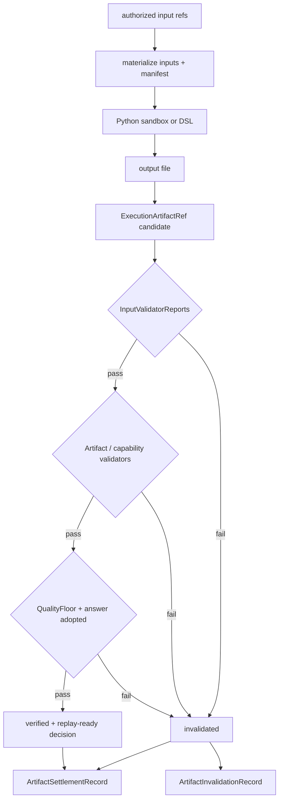

# Workspace、产物与质量门

Executor 的输出不是 stdout 中的一段文本，而是 attempt workspace 中的受控文件。[`WorkspaceManager`](../../../statebus/runtime/workspace.py) 为 task/step 建立 inputs、outputs、logs、tmp、script 和 manifest 目录。输入由已授权 ArtifactRef 物化，并生成 `InputManifest`；输出由 `ArtifactOutputManifest` 记录 relpath、类型、大小和 SHA-256。

```text
workspace/<task or attempt>/
├── inputs/       # verified inputs, read-only in sandbox
├── outputs/      # only permitted write surface
├── logs/         # bounded execution diagnostics
├── tmp/          # attempt-local temporary data
├── script/       # generated/registered program
└── manifest/     # input and output manifests
```

`InputManifest` 将每个文件的 logical name、artifact type、relpath、blob hash 和 source Ref
绑定到 task/step。CapabilityGrant 和 ExecRequest 保存 manifest hash；输出 manifest 在执行后
由 Runtime 重新计算。



`ArtifactValidatorReport` 保存 validation scope、passed、fail reason、消费方、metrics 和 details；`InputValidatorReport` 记录要求与实际输入。报告 hash 会进入 settlement 和 MemoryCommit。Capability-specific validator 可以复算 IQR、跨期变化、聚合或字段约束，而不是只检查 JSON 可解析。

Python CodeAct runner 在 policy、sandbox、output schema 和 capability quality 全部通过后生成
verified Artifact；更外层的 [`RuntimeCommitGate`](../../../statebus/runtime/commit_gate.py) 结合
input/artifact Validator、整体 QualityFloor 与 answer adopted 状态决定最终 settlement 和记忆提交。
各层验证结果通过报告 hash 关联。

Commit Gate 通过时，Artifact 从先前状态提升为 verified，MemoryCommit 进入 committed；未通过时
Artifact 变为 invalidated，ReplayClass 转为 assist，并写 `ArtifactInvalidationRecord`。Summarizer
与后续任务的可见面只包含 verified 产物。

StateBus 分别记录进程 exit code、schema、业务事实和最终答案采用状态。任务 Validator 覆盖
输入 lineage、输出 schema、关键业务事实与来源；benchmark Gold 保留在确定性校验侧。
