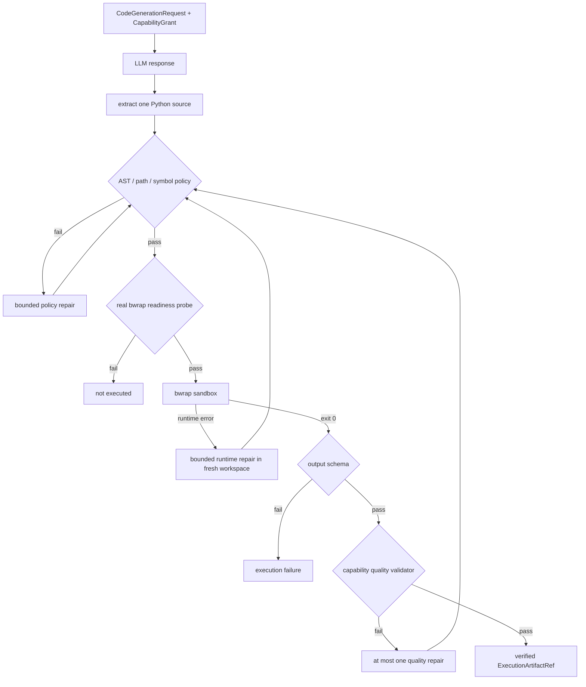

# 受限 Python CodeAct

[`LlmCodeActRunner`](../../../statebus/runtime/llm_codeact.py) 处理模型生成的候选 Python。
候选源码经过 CapabilityGrant、静态策略、bubblewrap readiness、隔离执行、输出 schema 和
capability quality Validator 后形成 verified Artifact。LLM 提供适应性，Runtime 管理文件权限
和可信状态。

生成请求 `CodeGenerationRequest` 绑定 task/session/step/attempt、capability、ApprovedPlan hash、
Grant hash、输入 Ref、input manifest digest、获准路径、输出 schema、operation semantics、
completion criteria、Validator 和 Runtime/model/Prompt signature。生成 Prompt 给出可导入模块、
确切输入文件、唯一输出路径、字段与排序要求；运行环境只挂载这些获准资源。

模型响应只接受三种窄格式：纯 Python 源码、单个 Python fenced block，或只含 `code` 字段的 JSON。解析后计算 source hash 与 raw response hash，再进入 AST/符号表审计。

静态策略只开放批准的导入、符号和路径字面量，输出写入固定 output relpath。策略检查
`eval`、`exec`、`compile`、`open`、动态 import、网络/进程/系统模块、危险属性、绝对路径和
`..`，同时限制源码字节、AST 节点数和循环数，并用 `symtable` 核对全局名。当前执行面为
同步函数与注册模块。

bubblewrap readiness 探针实际进入同一最小 profile，验证非 root 进程、独立网络命名空间、
只读输入、唯一可写 output mount，以及仓库与其他任务 workspace 的隔离状态。探针结果直接
决定该 attempt 是否进入 CodeAct 执行。

运行 profile 使用 PID/IPC/UTS/network namespace，输入目录和 generated source 只读，输出
目录单独可写，继承环境被清空，并施加 wall timeout、CPU、地址空间、输出文件大小、nofile
和进程数限制。静态策略、OS 隔离与业务 Validator 依次覆盖源码、运行环境和业务结果。

修复是有预算的。policy failure、Python runtime error 和 capability quality failure 分开记录，每次修复都在新 workspace 中重新经过 AST 策略；质量修复上限被限制为 0 或 1。Validator 只返回稳定错误码，不把 golden answer 暴露给模型。

CodeAct cache 保存 verified 结果，key 绑定 semantic input digest、source/model/Prompt/Runtime
signature、policy 和 output schema。读取时核对 task/session、Grant 和 Artifact 状态，复用范围
与当前 session 绑定。

adaptive LLM Python 路径由模型生成源码；`deterministic_codeact` 等 benchmark 模式使用注册
recipe 稳定测量 Runtime 机制。两种模式都经过 workspace 和 Validator。
