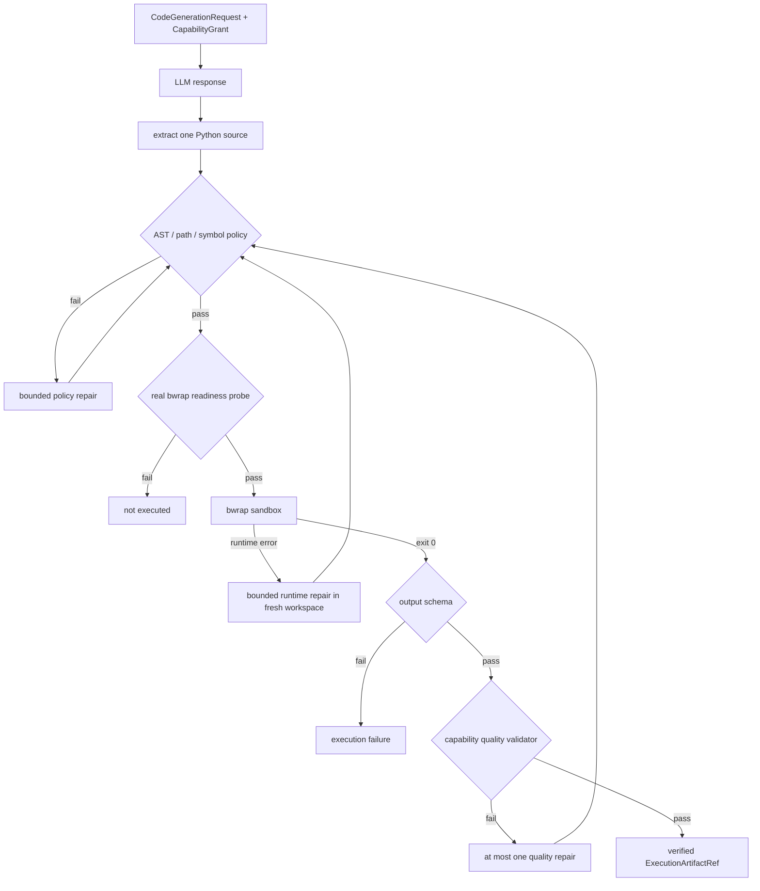

# 受限 Python CodeAct

[`LlmCodeActRunner`](../../../v2/runtime/llm_codeact.py) 处理的是模型生成的候选 Python。候选源码只有在 CapabilityGrant、静态策略、bubblewrap readiness、隔离执行、输出 schema 和 capability quality validator 全部通过后，才形成 verified artifact。LLM 提供适应性，但不拥有文件权限和可信状态的最终决定权。

生成请求 `CodeGenerationRequest` 绑定 task/session/step/attempt、capability、ApprovedPlan hash、Grant hash、输入 Ref、input manifest digest、允许路径、输出 schema、operation semantics、completion criteria、Validator 和 Runtime/model/prompt signature。生成 Prompt 明确告诉模型可导入模块、确切输入文件、唯一输出路径、字段与排序要求，并禁止读取原始数据集路径、网络和环境变量。

模型响应只接受三种窄格式：纯 Python 源码、单个 Python fenced block，或只含 `code` 字段的 JSON。解析后计算 source hash 与 raw response hash，再进入 AST/符号表审计。

静态策略会拒绝 `eval`、`exec`、`compile`、`open`、动态 import、网络/进程/系统模块、危险属性、绝对路径和 `..`。路径必须是 policy 中列出的字面量；输出必须写入固定 output relpath。策略还限制源码字节、AST 节点数和循环数，并用 `symtable` 检查未定义全局名。Class、async、await、yield 等不需要的执行面也被关闭。

bubblewrap readiness 不是简单检查 `bwrap` 是否在 PATH。探针实际进入同一最小 profile，验证进程非 root、网络不可用、输入与 sandbox 外不可写、仓库和其他任务 workspace 不可见，同时确认唯一 output mount 可写。探针失败时，LLM CodeAct 不会静默退回宿主机 `resource` 或 `none` 后端。

运行 profile 使用 PID/IPC/UTS/network namespace，输入目录和 generated source 只读，输出目录单独可写，继承环境被清空，并施加 wall timeout、CPU、地址空间、输出文件大小、nofile 和进程数限制。静态策略不能替代 OS 隔离，bubblewrap 也不能替代业务 Validator，因此两层同时存在。

修复是有预算的。policy failure、Python runtime error 和 capability quality failure 分开记录，每次修复都在新 workspace 中重新经过 AST 策略；质量修复上限被限制为 0 或 1。Validator 只返回稳定错误码，不把 golden answer 暴露给模型。

CodeAct cache 只接受 verified 结果，key 绑定 semantic input digest、source/model/prompt/runtime signature、policy 和 output schema。取 cache 时还要确认 task/session、Grant 仍获准且 Artifact 可读，不能跨 session 直接复用一个旧文件。

这里描述的是 adaptive LLM Python 路径。`deterministic_codeact` 等 benchmark 模式可能使用注册 recipe 来稳定测量 Runtime 机制；它们仍经过 workspace 和 Validator，但不能写成“每次都由 LLM 临场生成源码”。

