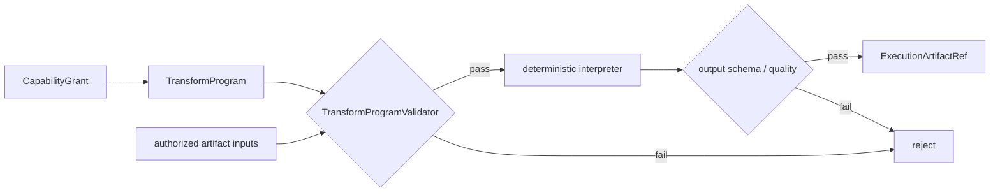

# Transform DSL

对于字段稳定、操作可枚举的表格任务，Python 并不是唯一合理执行表示。[`TransformProgram`](../../../statebus/contracts/adaptive.py) 用输入 ArtifactRef、输出合同和一组 `TransformStep` 表达变换，[`TransformDslInterpreter`](../../../statebus/runtime/transform_dsl.py) 在确定性解释器中执行。

当前注册操作按用途分为：

| 用途 | 操作 |
|:--|:--|
| 字段与行选择 | `select`、`rename`、`filter_eq`、`filter_contains`、`filter_in`、`filter_range`、`sort`、`limit` |
| 聚合与派生 | `group_by`、`aggregate`、`aggregate_grouped`、`derive_safe` |
| 跨期与联结 | `compare_periods`、`join_by_key` |
| 异常与结论投影 | `anomaly_check`、`anomaly_zscore`、`project_claim_fields` |

DSL 参数不能包含路径、文件、表达式或 Python 字段，也不能出现 `eval`、`exec`、`lambda`、`import`、shell、`..` 等 token。字段必须来自已知输入 schema，join 的 right ref 必须在授权列表中，aggregate/function、derive kind、输出列和 row/column/byte budget 都有显式检查。

解释器不调用 `eval`。它逐步对内存中的行对象应用注册函数，每一步后检查最大行数和列数，最终按稳定规则排序/序列化并限制输出字节。`derive_safe` 只接受 difference、ratio 和 pct_change 等注册 kind，而不是任意表达式字符串。

`run_verified()` 还会检查 Grant 是否过期、output contract 是否匹配、输入 Ref 是否完全在 Grant 中。输出写到 attempt workspace 的固定 `outputs/transform_result.json`，计算 hash，登记 Artifact，并在 schema 与 quality validator 通过后提升。

DSL 的价值不是“用硬编码代替 Agent”。Planner/Runtime 仍根据 CanonicalTaskSpec 选择 capability，Retriever 仍提供获准证据，Summarizer 仍消费 verified Artifact。区别只在 Executor 的执行表示：适合注册操作的任务用 DSL 获得更窄的安全面和更稳定的语义，开放计算再使用受限 Python。

新增 DSL op 需要同时实现参数校验、输出列推导、解释执行、预算行为和测试。只在 `_apply()` 增加一个分支而不更新 Validator，会造成策略与执行面不一致。

