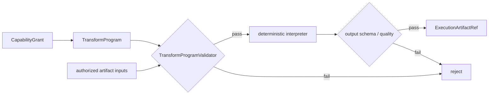

# Transform DSL

对于字段稳定、操作可枚举的表格任务，[`TransformProgram`](../../../src/statebus/contracts/adaptive.py)
用输入 ArtifactRef、输出合同和一组 `TransformStep` 表达变换，
[`TransformDslInterpreter`](../../../src/statebus/runtime/transform_dsl.py) 在确定性解释器中执行。

当前注册操作按用途分为：

| 用途 | 操作 |
|:--|:--|
| 字段与行选择 | `select`、`rename`、`filter_eq`、`filter_contains`、`filter_in`、`filter_range`、`sort`、`limit` |
| 聚合、派生与排序 | `group_by`、`aggregate`、`aggregate_grouped`、`derive_safe`、`rank` |
| 跨期、比较与联结 | `compare_periods`、`compare_metric`、`join_by_key` |
| 分布与趋势 | `percentile_nearest_rank`、`trend_series` |
| 异常与结论投影 | `anomaly_check`、`anomaly_zscore`、`project_claim_fields` |

DSL 参数采用结构化字段和注册操作。字段来自已知输入 schema，join 的 right Ref 来自授权列表，
aggregate/function、derive kind、输出列和 row/column/byte budget 都有显式检查。路径、文件、
Python 表达式与 shell 字段不在 DSL 合同中。

```mermaid
flowchart LR
    G[CapabilityGrant] --> P[TransformProgram]
    P --> V{TransformProgramValidator}
    I[authorized artifact inputs] --> V
    V -->|pass| E[deterministic interpreter]
    V -->|fail| X[reject]
    E --> S{output schema / quality}
    S -->|pass| A[ExecutionArtifactRef]
    S -->|fail| X
```

解释器逐步对内存中的行对象应用注册函数，每一步后检查最大行数和列数，最终按稳定规则
排序、序列化并限制输出字节。`derive_safe` 接受 difference、ratio 和 pct_change 等注册 kind。

`run_verified()` 还会检查 Grant 是否过期、output contract 是否匹配、输入 Ref 是否完全在 Grant 中。输出写到 attempt workspace 的固定 `outputs/transform_result.json`，计算 hash，登记 Artifact，并在 schema 与 quality validator 通过后提升。

`rank` 只接受输入字段、方向、显式 tie-break 字段和输出字段，产生稳定的 ordinal rank；它不携带任何任务编号或业务常量。`percentile_nearest_rank` 接受数值字段、百分位和可选分组字段，按 nearest-rank 规则产生分位数。两者都只处理授权输入行，缺失或非有限数值会拒绝执行。

Planner/Runtime 根据 CanonicalTaskSpec 选择 capability，Retriever 提供获准证据，Summarizer
消费 verified Artifact。Executor 根据任务结构选择 DSL 或受限 Python：注册操作由 DSL 提供
稳定语义，开放计算进入 CodeAct。

每个 DSL op 同时实现参数校验、输出列推导、解释执行、预算行为和测试，使 Validator 与
`_apply()` 保持一致。
