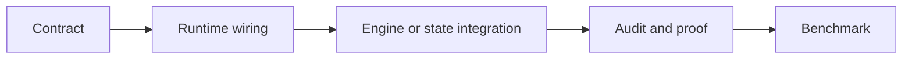

# 扩展、任务样本与验证

## 核心代码地图

下面按“我要找什么”组织。函数和类名比行号稳定，阅读时可用 `rg` 定位。

### 任务与计划

| 对象/行为 | 入口 | 相邻实现 |
|:--|:--|:--|
| `CanonicalTaskSpec` / compiler input/result | [`contracts/models.py`](../../src/statebus/contracts/models.py) | [`runtime/compiler.py`](../../src/statebus/runtime/compiler.py) |
| adaptive envelope / proposal / approved plan / grant | [`contracts/adaptive.py`](../../src/statebus/contracts/adaptive.py) | [`runtime/plan_policy.py`](../../src/statebus/runtime/plan_policy.py) |
| capability descriptor/registry | [`runtime/capability_registry.py`](../../src/statebus/runtime/capability_registry.py) | [`runtime/domain_packs.py`](../../src/statebus/runtime/domain_packs.py) |
| adaptive mainline assembly | [`runtime/adaptive_mainline.py`](../../src/statebus/runtime/adaptive_mainline.py) | [`runtime/adaptive_runtime.py`](../../src/statebus/runtime/adaptive_runtime.py) |
| role capability dispatch | [`runtime/adaptive_dispatcher.py`](../../src/statebus/runtime/adaptive_dispatcher.py) | [`runtime/role_path.py`](../../src/statebus/runtime/role_path.py) |

### 消息与会话

| 对象/行为 | 入口 | 相邻实现 |
|:--|:--|:--|
| Protobuf schema | [`control/statebus_control.proto`](../../src/statebus/control/statebus_control.proto) | [`control/schema.py`](../../src/statebus/control/schema.py) |
| typed control dataclasses/codec | [`control/messages.py`](../../src/statebus/control/messages.py) | [`control/transport.py`](../../src/statebus/control/transport.py) |
| subprocess Worker | [`control/subprocess_worker.py`](../../src/statebus/control/subprocess_worker.py) | [`runtime/driver.py`](../../src/statebus/runtime/driver.py) |
| step lifecycle / timeout | [`runtime/supervisor.py`](../../src/statebus/runtime/supervisor.py) | [`runtime/session.py`](../../src/statebus/runtime/session.py) |

### 检索、状态与来源

| 对象/行为 | 入口 | 相邻实现 |
|:--|:--|:--|
| retrieval request/result/pipeline | [`retrieval/models.py`](../../src/statebus/retrieval/models.py)、[`retrieval/pipeline.py`](../../src/statebus/retrieval/pipeline.py) | [`runtime/retrieval_adapter.py`](../../src/statebus/runtime/retrieval_adapter.py) |
| Ref 类型 | [`refs/models.py`](../../src/statebus/refs/models.py) | [`contracts/models.py`](../../src/statebus/contracts/models.py) |
| layered state backend | [`state/store.py`](../../src/statebus/state/store.py) | [`state/disk.py`](../../src/statebus/state/disk.py) |
| dense semantic state | [`state/semantic_state.py`](../../src/statebus/state/semantic_state.py) | [`runtime/state_consumption.py`](../../src/statebus/runtime/state_consumption.py) |
| locator / manifest / fan-in | [`provenance/hydration.py`](../../src/statebus/provenance/hydration.py) | [`runtime/evidence_projection.py`](../../src/statebus/runtime/evidence_projection.py) |

### 模型侧状态与推理复用



| 对象/行为 | 入口 | 相邻实现与证据 |
|:--|:--|:--|
| Embedding selection | [`state/semantic_state.py`](../../src/statebus/state/semantic_state.py) | [`runtime/state_consumption.py`](../../src/statebus/runtime/state_consumption.py)、`STATE_CONSUMED` receipt |
| candidate probability / LogitState | [`contracts/logit.py`](../../src/statebus/contracts/logit.py)、[`runtime/logit_state.py`](../../src/statebus/runtime/logit_state.py) | [`state/logit_state.py`](../../src/statebus/state/logit_state.py)、[`runtime/logit_gate.py`](../../src/statebus/runtime/logit_gate.py) |
| canonical Prefix / exact-token identity | [`contracts/prefix.py`](../../src/statebus/contracts/prefix.py)、[`runtime/prefix_identity.py`](../../src/statebus/runtime/prefix_identity.py) | [`runtime/role_path.py`](../../src/statebus/runtime/role_path.py)、[`runtime/vllm_metrics.py`](../../src/statebus/runtime/vllm_metrics.py) |
| Prefix 调度与反馈 | [`benchmark/kv_prefix_schedule.py`](../../src/statebus/benchmark/kv_prefix_schedule.py) | [`runtime/prefix_feedback.py`](../../src/statebus/runtime/prefix_feedback.py)、[`benchmark/kv_prefix_experiment.py`](../../src/statebus/benchmark/kv_prefix_experiment.py) |
| 显式 KV 合同与标准任务流程接入 | [`contracts/engine_local_kv.py`](../../src/statebus/contracts/engine_local_kv.py)、[`integrations/vllm_kv/role_client.py`](../../src/statebus/integrations/vllm_kv/role_client.py) | [`runtime/smoke.py`](../../src/statebus/runtime/smoke.py)、`runtime/engine_local_kv_mainline.json` |
| KV 私有 API 与 Worker 生命周期 | [`integrations/vllm_kv/middleware.py`](../../src/statebus/integrations/vllm_kv/middleware.py)、[`integrations/vllm_kv/worker_extension.py`](../../src/statebus/integrations/vllm_kv/worker_extension.py) | [`integrations/vllm_kv/connector.py`](../../src/statebus/integrations/vllm_kv/connector.py)、[`integrations/vllm_kv/registry.py`](../../src/statebus/integrations/vllm_kv/registry.py) |
| KV paged tensor capture/load | [`integrations/vllm_kv/paged_cache.py`](../../src/statebus/integrations/vllm_kv/paged_cache.py) | [`integrations/vllm_kv/telemetry.py`](../../src/statebus/integrations/vllm_kv/telemetry.py)、`KVForwardProof` |

### 记忆与执行

| 对象/行为 | 入口 | 相邻实现 |
|:--|:--|:--|
| MemoryQuery/Ref/Commit/Consumption | [`memory/models.py`](../../src/statebus/memory/models.py) | [`memory/store.py`](../../src/statebus/memory/store.py) |
| Replay decision / exact key | [`runtime/replay.py`](../../src/statebus/runtime/replay.py) | [`runtime/ledger.py`](../../src/statebus/runtime/ledger.py) |
| LLM Python CodeAct | [`runtime/llm_codeact.py`](../../src/statebus/runtime/llm_codeact.py) | [`runtime/codeact_sandbox.py`](../../src/statebus/runtime/codeact_sandbox.py) |
| Transform DSL | [`runtime/transform_dsl.py`](../../src/statebus/runtime/transform_dsl.py) | [`contracts/adaptive.py`](../../src/statebus/contracts/adaptive.py) |
| capability business validators | [`runtime/capability_validators.py`](../../src/statebus/runtime/capability_validators.py) | [`runtime/capability_recompute.py`](../../src/statebus/runtime/capability_recompute.py) |
| workspace / artifact lifecycle | [`runtime/workspace.py`](../../src/statebus/runtime/workspace.py) | [`runtime/commit_gate.py`](../../src/statebus/runtime/commit_gate.py) |

### 证据与 benchmark

| 对象/行为 | 入口 | 相邻实现 |
|:--|:--|:--|
| Telemetry | [`runtime/telemetry.py`](../../src/statebus/runtime/telemetry.py) | [`benchmark/metric_aggregation.py`](../../src/statebus/benchmark/metric_aggregation.py) |
| formal task adapter/registry | [`benchmark/task_registry.py`](../../src/statebus/benchmark/task_registry.py)、[`benchmark/formal_registry_adapter.py`](../../src/statebus/benchmark/formal_registry_adapter.py) | [`benchmark/adaptive_formal.py`](../../src/statebus/benchmark/adaptive_formal.py) |
| continuous family | [`benchmark/continuous_task_family.py`](../../src/statebus/benchmark/continuous_task_family.py) | [`benchmark/continuous_runner.py`](../../src/statebus/benchmark/continuous_runner.py) |
| Logit Retry Decision challenge | [`benchmark/logit_retry_challenge.py`](../../src/statebus/benchmark/logit_retry_challenge.py) | [`tests/unit/mechanisms/test_logit_gate.py`](../../tests/unit/mechanisms/test_logit_gate.py)、[`tests/benchmarks/mechanisms/test_logit_retry_challenge.py`](../../tests/benchmarks/mechanisms/test_logit_retry_challenge.py) |
| Prefix mechanism probe | [`benchmark/kv_prefix_experiment.py`](../../src/statebus/benchmark/kv_prefix_experiment.py) | [`tests/unit/mechanisms/test_prefix_render_identity.py`](../../tests/unit/mechanisms/test_prefix_render_identity.py)、[`tests/benchmarks/mechanisms/test_kv_prefix_control_plane.py`](../../tests/benchmarks/mechanisms/test_kv_prefix_control_plane.py) |
| KV continuation 任务与 A/B | [`benchmark/engine_local_kv_tasks.py`](../../src/statebus/benchmark/engine_local_kv_tasks.py)、[`benchmark/engine_local_kv_experiment.py`](../../src/statebus/benchmark/engine_local_kv_experiment.py) | [`scripts/experiments/engine_local_kv`](../../scripts/experiments/engine_local_kv)、[`tests/benchmarks/mechanisms/test_engine_local_kv_mainline_suite.py`](../../tests/benchmarks/mechanisms/test_engine_local_kv_mainline_suite.py) |

---

## 常见扩展流程

### 新增正式任务或任务族

先定义可复现输入和 `CanonicalTaskSpec`，包括 task family、intent、required outputs/tools、结构化 arguments 和 quality checks。连续任务还要在 manifest 中写 depends-on rounds、produces/consumes 与 minimum reuse class。正式模式不依赖自由文本启发式编译。

随后确认现有 capability 是否覆盖该 intent。若覆盖，补 formal adapter 的 operation semantics、source rows/output schema 和 Validator；若不覆盖，再新增 capability。最后把任务加入 task registry 或 continuous family loader，并补质量、角色职责和公平性测试。

```text
sample/manifest
  -> CanonicalTaskSpec
  -> formal adapter
  -> capability routing
  -> Validator / expected facts contract
  -> benchmark + tests
```

### 新增 capability

Capability descriptor 至少需要稳定 ID/version、owner role、execution kind、输入 Ref kind、输出 contract、Validator IDs、风险/预算。然后在 Dispatcher 中接入执行路径，在 PlanPolicy 中确认 owner/edge/contract 校验能够识别它，在 capability validator registry 中登记业务复算器。

若 capability 使用 LLM bounded Python，还要建立 `CodeGenerationPolicy`：允许 imports、固定 input/output paths、source/AST/loop/repair budgets 和 sandbox policy。若使用 DSL，应优先组合已有 op；只有无法表达时才扩 DSL。

### 接入 Transform DSL 操作

一次 DSL 操作接入同时更新 allowed op、参数校验、输出列推导、解释执行、稳定序列化和预算
测试。join 与派生字段操作同时校验 Ref 授权和字段 collision，使 Validator 与执行路径保持一致。

### 新增数值状态类型或存储后端

新的数值状态需要明确 dtype、byte order、shape/layout、encoder/producer signature、manifest、blob hash、lease、消费算法和 receipt。随后在 RefKind/StorageKind、LayeredStoragePolicy、publish/resolve/release、Control RefHandle、Telemetry 与跨进程测试中接入。

Store 为新增后端记录 preferred/selected/fallback，解析路径限定在受控 root，release 采用幂等
实现。跨进程解析测试通过后，该后端进入 formal 非文本状态载体目录。

### 新增模型侧复用机制

模型侧机制分为正式 Ref 与 engine-local 优化。正式 Ref 接入 RefKind、Registry、typed Protobuf、
授权、lease 与 GC；engine-local 优化保留普通路径，并记录 engine/model/tokenizer identity、
启用范围、fallback、资源所有者和机制证明。Worker-local handle 由引擎 registry 管理。

```text
logical request contract
  -> deterministic identity/admission
  -> default-off runtime wiring
  -> engine integration
  -> mechanism proof + failure audit
  -> quality parity
  -> serialized A/B
```

Prefix 类机制记录 position-0 Token identity、完整 block 与 task-local counter delta；显式 KV
类机制记录 capture/load/release、logical Token accounting、scheduler/Worker 双证明、TTL/容量
与 fallback。两类机制使用独立命中指标。

### 新增记忆类型或兼容字段

扩展 `MemoryType` 或 metadata 前，先判断该字段属于候选排序还是硬兼容。检索信号进入 MemoryQuery/RRF；会使旧结果失效的条件进入 CompatibilityDecision/Replay key。同步更新 canonical payload、持久化恢复、reason code、Telemetry 和 negative test。

### 新增 Telemetry 指标

事件先定义分母与聚合方式。逐次计数进入 additive event，任务终态值进入
`TASK_SUMMARY_METRICS`，每个指标只选择一种累计位置。展示层读取白名单字段，完整 event
contract 负责运行汇总。

---

## 验证矩阵

StateBus 将合同、消息、状态、模型侧复用、执行和记忆分别映射到确定性测试与专项
实验。下表列出各模块的回归入口。

| 模块 | 回归入口 |
|:--|:--|
| TaskSpec / Ref 合同 | `tests/unit/contracts/test_contracts_and_refs.py` |
| Runtime identity / lifecycle | `tests/unit/runtime/test_runtime_identity.py`、`test_runtime_session_and_ledger.py` |
| Protobuf / subprocess | `tests/unit/runtime/test_control_plane.py`、`test_subprocess_executor.py` |
| Semantic state / memory / replay | `tests/unit/runtime/test_state_materialization.py`、`tests/unit/memory/test_memory_runtime.py`、`tests/unit/runtime/test_replay.py`、`test_replay_gate.py` |
| CodeAct | `tests/unit/codeact/test_llm_codeact_policy.py`、`test_llm_codeact_sandbox.py` |
| Transform DSL | `tests/unit/runtime/test_transform_dsl.py` |
| Logit / Prefix / KV | `tests/unit/mechanisms/test_logit_state.py`、`test_logit_gate.py`、`test_prefix_render_identity.py`、`test_engine_local_kv_role_client.py` |
| Mainline integration | `tests/integration/runtime/test_adaptive_driver.py`、`test_adaptive_dispatcher.py`、`test_fixed_canonical_mainline.py` |
| Utility / mechanism benchmark contracts | `tests/benchmarks/utility/`、`tests/benchmarks/mechanisms/` |

常用 deterministic 入口：

```bash
source deploy/activate_statebus_host.sh
python -m pytest -q tests/unit/runtime/test_control_plane.py tests/unit/contracts/test_contracts_and_refs.py
python -m pytest -q tests/unit/mechanisms/test_prefix_render_identity.py tests/unit/mechanisms/test_logit_gate.py
python -m pytest -q tests/unit/mechanisms/test_engine_local_kv_role_client.py
```

容器使用项目内 Python 环境，宿主机使用 `deploy/activate_statebus_host.sh` 激活本地 conda。
LLM、bubblewrap 与 Embedding 测试同时记录服务健康状态和 GPU 映射。

回归测试覆盖 Ref 类型分离、formal task 预编译、Agent 候选状态、CapabilityGrant 输入与期限、
invalidated 产物可见性、Memory 兼容与消费记录、attempt 隔离和 Telemetry 单次计数。

模型侧测试覆盖 Prefix 角色可见性交集与位置 0 布局、真实 tokenizer/chat template 的 exact
identity、KV handle 的 engine/model/tokenizer/task/token digest、Consumer Token 账、双证明、
fallback 和 release 后 registry 归零。Prefix hit、Logit transfer 和 KV load 分别聚合。

正式时延实验按串行 runner 执行；并发 API 和手工 case 进入诊断记录。

文档验证包括 `git diff --check`、相对链接和 Mermaid fence；源码入口与实验数字分别链接到
确定性测试和原始 summary。

---

## 环境与配置

当前 checkout 的 host-side Python 环境入口：

~~~bash
cd /home/qcrs/statebus/os
source ./deploy/activate_statebus_host.sh
python -c 'import statebus; print(statebus.__file__)'
~~~

该环境用于 Runtime、offline tests 和 dispatcher；它不包含 vLLM。

vLLM 使用独立环境，由 scripts/vllm/manage_qwen3_32b.sh 管理。启动前必须检查 NVIDIA driver、空闲或获准的 GPU、模型路径和 /health、/v1/models；默认首轮 profile 以 os/AGENTS.md 为准，GPU 与 context 以当前检查结果为准。

容器、模型服务和 host Runtime 的 ownership 分开：

| 层 | 位置 | 作用 |
| --- | --- | --- |
| host Runtime | statebus_host + src/statebus | tests、launcher |
| host vLLM | vllm-qwen-cu121 + /data/models/Qwen3-32B | OpenAI-compatible model service |
| openEuler container | 已有 statebus-dev-qcrs | sibling project 管理的运行参考；本 checkout 不例行替换 |

离线检查：

~~~bash
source deploy/activate_statebus_host.sh
PYTHONDONTWRITEBYTECODE=1 python -m pytest -q tests/unit tests/integration tests/benchmarks
tests/benchmarks/run_statebus.sh mainline-24 --dry-run
~~~

Live runner 可能产生 runs、服务日志和模型请求；运行前阅读 AGENTS.md 的 GPU、容器、输出目录规则。

---

## 任务与样本目录

任务定义与 benchmark 样本分属两个目录：

- tasks/ 保存 task manifest、公开输入和 validator；
- src/statebus/benchmark/samples/ 保存可复用 fixture、gold、compiled input 和 utility sample。

### 当前任务入口

| 范围 | 入口 | 用途 |
| --- | --- | --- |
| contest mainline | src/statebus/benchmark/contest_dsl_taskpack.py、contest_dsl_mainline.py | finance 12 轮 + service_ops 12 轮；SB-FULL/P-TEXT 两种 variant |
| Memory / State mechanism | src/statebus/benchmark/contest_mechanisms.py、memory_ablation.py | 16 个 Memory + 8 个 State 计划位置 |
| formal task manifests | tasks/formal/*/task_manifest.yaml | formal task contract 和 validator |
| semantic holdout | src/statebus/benchmark/samples/semantic_holdout/ | State mechanism 的 holdout 输入和 gold |
| model-assist utility | src/statebus/benchmark/samples/model_assist_utility_v1/ | APC、KV、Logit 的 28 位置 long-text suite |
| explicit KV fixtures | src/statebus/benchmark/samples/engine_local_kv_continuation/ | parent prompt、compiled cases 和 connector 输入 |
| prefix fixture | src/statebus/benchmark/samples/continuous_task_families/kv_prefix_reuse/ | engine-local prefix layout 和 corpus identity 探针 |

### 标准任务流程 taskpack

标准任务流程 runner 由 taskpack 选择 family、轮次和输入 lineage。12 轮是每个 family 的 runner 参数；SB-FULL 和 P-TEXT 各自运行 finance 与 service_ops 两个 family，因此精选 evidence 的 task 分母为 48。

入口：

~~~text
src/statebus/benchmark/contest_dsl_taskpack.py
src/statebus/benchmark/contest_dsl_mainline.py
scripts/run_contest_dsl_mainchains.sh
~~~

### 机制和 utility 样本

机制 runner 的 Memory 和 State 位置使用各自的 manifest、history 和 quality check。当前机制结果见 [`tests/evidence/mechanisms/`](../../tests/evidence/mechanisms)，24 个位置均通过质量检查。质量检查记录任务输出有效性，State 生命周期和业务字段变化分别记录在机制事件中。

utility sample 的计分位置由 model_assist_utility/taskpack.py 的 PLAN_POSITIONS 生成：APC 8、KV 8、Logit 12。warmup 和 calibration 不计入 28 个位置。

### Gold、validator 和结果

任务质量由 task-specific validator、JSON contract、Artifact verification 和当前 quality check 共同决定。精选五件结果文件：

- tests/evidence/mainline/tasks.jsonl、tasks.csv、results.json；
- tests/evidence/mechanisms/results.json、tasks.jsonl、tasks.csv；
- tests/evidence/model-assist/metrics.json、report.md。

历史 report 的任务数量仅用于历史记录；当前 checkout 的运行事实从精选结果 raw run ID 进入 `runs/` 追溯。
