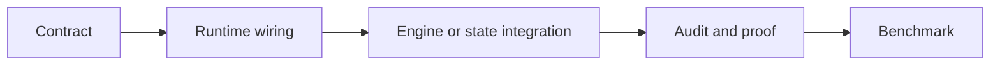

# 核心代码地图

下面按“我要找什么”组织，而不是按目录机械罗列。函数和类名比行号稳定，阅读时可用 `rg` 定位。

## 任务与计划

| 对象/行为 | 入口 | 相邻实现 |
|:--|:--|:--|
| `CanonicalTaskSpec` / compiler input/result | [`contracts/models.py`](../../../src/statebus/contracts/models.py) | [`runtime/compiler.py`](../../../src/statebus/runtime/compiler.py) |
| adaptive envelope / proposal / approved plan / grant | [`contracts/adaptive.py`](../../../src/statebus/contracts/adaptive.py) | [`runtime/plan_policy.py`](../../../src/statebus/runtime/plan_policy.py) |
| capability descriptor/registry | [`runtime/capability_registry.py`](../../../src/statebus/runtime/capability_registry.py) | [`runtime/domain_packs.py`](../../../src/statebus/runtime/domain_packs.py) |
| adaptive mainline assembly | [`runtime/adaptive_mainline.py`](../../../src/statebus/runtime/adaptive_mainline.py) | [`runtime/adaptive_runtime.py`](../../../src/statebus/runtime/adaptive_runtime.py) |
| role capability dispatch | [`runtime/adaptive_dispatcher.py`](../../../src/statebus/runtime/adaptive_dispatcher.py) | [`runtime/role_path.py`](../../../src/statebus/runtime/role_path.py) |

## 控制面与会话

| 对象/行为 | 入口 | 相邻实现 |
|:--|:--|:--|
| Protobuf schema | [`control/statebus_control.proto`](../../../src/statebus/control/statebus_control.proto) | [`control/schema.py`](../../../src/statebus/control/schema.py) |
| typed control dataclasses/codec | [`control/messages.py`](../../../src/statebus/control/messages.py) | [`control/transport.py`](../../../src/statebus/control/transport.py) |
| subprocess Worker | [`control/subprocess_worker.py`](../../../src/statebus/control/subprocess_worker.py) | [`runtime/driver.py`](../../../src/statebus/runtime/driver.py) |
| step lifecycle / timeout | [`runtime/supervisor.py`](../../../src/statebus/runtime/supervisor.py) | [`runtime/session.py`](../../../src/statebus/runtime/session.py) |

## 检索、状态与来源

| 对象/行为 | 入口 | 相邻实现 |
|:--|:--|:--|
| retrieval request/result/pipeline | [`retrieval/models.py`](../../../src/statebus/retrieval/models.py)、[`retrieval/pipeline.py`](../../../src/statebus/retrieval/pipeline.py) | [`runtime/retrieval_adapter.py`](../../../src/statebus/runtime/retrieval_adapter.py) |
| Ref 类型 | [`refs/models.py`](../../../src/statebus/refs/models.py) | [`contracts/models.py`](../../../src/statebus/contracts/models.py) |
| layered state backend | [`state/store.py`](../../../src/statebus/state/store.py) | [`state/disk.py`](../../../src/statebus/state/disk.py) |
| dense semantic state | [`state/semantic_state.py`](../../../src/statebus/state/semantic_state.py) | [`runtime/state_consumption.py`](../../../src/statebus/runtime/state_consumption.py) |
| locator / manifest / fan-in | [`provenance/hydration.py`](../../../src/statebus/provenance/hydration.py) | [`runtime/evidence_projection.py`](../../../src/statebus/runtime/evidence_projection.py) |

## 模型侧状态与推理复用

```mermaid
flowchart LR
    C[Contract] --> R[Runtime wiring]
    R --> E[Engine or state integration]
    E --> A[Audit and proof]
    A --> B[Benchmark]
```

| 对象/行为 | 入口 | 相邻实现与证据 |
|:--|:--|:--|
| Embedding selection | [`state/semantic_state.py`](../../../src/statebus/state/semantic_state.py) | [`runtime/state_consumption.py`](../../../src/statebus/runtime/state_consumption.py)、`STATE_CONSUMED` receipt |
| candidate probability / LogitState | [`contracts/logit.py`](../../../src/statebus/contracts/logit.py)、[`runtime/logit_state.py`](../../../src/statebus/runtime/logit_state.py) | [`state/logit_state.py`](../../../src/statebus/state/logit_state.py)、[`runtime/logit_gate.py`](../../../src/statebus/runtime/logit_gate.py) |
| canonical Prefix / exact-token identity | [`contracts/prefix.py`](../../../src/statebus/contracts/prefix.py)、[`runtime/prefix_identity.py`](../../../src/statebus/runtime/prefix_identity.py) | [`runtime/role_path.py`](../../../src/statebus/runtime/role_path.py)、[`runtime/vllm_metrics.py`](../../../src/statebus/runtime/vllm_metrics.py) |
| Prefix 调度与反馈 | [`benchmark/kv_prefix_schedule.py`](../../../src/statebus/benchmark/kv_prefix_schedule.py) | [`runtime/prefix_feedback.py`](../../../src/statebus/runtime/prefix_feedback.py)、[`benchmark/kv_prefix_experiment.py`](../../../src/statebus/benchmark/kv_prefix_experiment.py) |
| 显式 KV 合同与主链接入 | [`contracts/engine_local_kv.py`](../../../src/statebus/contracts/engine_local_kv.py)、[`integrations/vllm_kv/role_client.py`](../../../src/statebus/integrations/vllm_kv/role_client.py) | [`runtime/smoke.py`](../../../src/statebus/runtime/smoke.py)、`runtime/engine_local_kv_mainline.json` |
| KV 私有 API 与 Worker 生命周期 | [`integrations/vllm_kv/middleware.py`](../../../src/statebus/integrations/vllm_kv/middleware.py)、[`integrations/vllm_kv/worker_extension.py`](../../../src/statebus/integrations/vllm_kv/worker_extension.py) | [`integrations/vllm_kv/connector.py`](../../../src/statebus/integrations/vllm_kv/connector.py)、[`integrations/vllm_kv/registry.py`](../../../src/statebus/integrations/vllm_kv/registry.py) |
| KV paged tensor capture/load | [`integrations/vllm_kv/paged_cache.py`](../../../src/statebus/integrations/vllm_kv/paged_cache.py) | [`integrations/vllm_kv/telemetry.py`](../../../src/statebus/integrations/vllm_kv/telemetry.py)、`KVForwardProof` |

## 记忆与执行

| 对象/行为 | 入口 | 相邻实现 |
|:--|:--|:--|
| MemoryQuery/Ref/Commit/Consumption | [`memory/models.py`](../../../src/statebus/memory/models.py) | [`memory/store.py`](../../../src/statebus/memory/store.py) |
| Replay decision / exact key | [`runtime/replay.py`](../../../src/statebus/runtime/replay.py) | [`runtime/ledger.py`](../../../src/statebus/runtime/ledger.py) |
| LLM Python CodeAct | [`runtime/llm_codeact.py`](../../../src/statebus/runtime/llm_codeact.py) | [`runtime/codeact_sandbox.py`](../../../src/statebus/runtime/codeact_sandbox.py) |
| Transform DSL | [`runtime/transform_dsl.py`](../../../src/statebus/runtime/transform_dsl.py) | [`contracts/adaptive.py`](../../../src/statebus/contracts/adaptive.py) |
| capability business validators | [`runtime/capability_validators.py`](../../../src/statebus/runtime/capability_validators.py) | [`runtime/capability_recompute.py`](../../../src/statebus/runtime/capability_recompute.py) |
| workspace / artifact lifecycle | [`runtime/workspace.py`](../../../src/statebus/runtime/workspace.py) | [`runtime/commit_gate.py`](../../../src/statebus/runtime/commit_gate.py) |

## 证据、benchmark 与 Studio

| 对象/行为 | 入口 | 相邻实现 |
|:--|:--|:--|
| Telemetry | [`runtime/telemetry.py`](../../../src/statebus/runtime/telemetry.py) | [`benchmark/metric_aggregation.py`](../../../src/statebus/benchmark/metric_aggregation.py) |
| formal task adapter/registry | [`benchmark/task_registry.py`](../../../src/statebus/benchmark/task_registry.py)、[`benchmark/formal_registry_adapter.py`](../../../src/statebus/benchmark/formal_registry_adapter.py) | [`benchmark/adaptive_formal.py`](../../../src/statebus/benchmark/adaptive_formal.py) |
| continuous family | [`benchmark/continuous_task_family.py`](../../../src/statebus/benchmark/continuous_task_family.py) | [`benchmark/continuous_runner.py`](../../../src/statebus/benchmark/continuous_runner.py) |
| Logit Retry Gate challenge | [`benchmark/logit_retry_challenge.py`](../../../src/statebus/benchmark/logit_retry_challenge.py) | [`tests/unit/mechanisms/test_logit_gate.py`](../../../tests/unit/mechanisms/test_logit_gate.py)、[`tests/benchmarks/mechanisms/test_logit_retry_challenge.py`](../../../tests/benchmarks/mechanisms/test_logit_retry_challenge.py) |
| Prefix mechanism probe | [`benchmark/kv_prefix_experiment.py`](../../../src/statebus/benchmark/kv_prefix_experiment.py) | [`tests/unit/mechanisms/test_prefix_render_identity.py`](../../../tests/unit/mechanisms/test_prefix_render_identity.py)、[`tests/benchmarks/mechanisms/test_kv_prefix_control_plane.py`](../../../tests/benchmarks/mechanisms/test_kv_prefix_control_plane.py) |
| KV continuation 任务与 A/B | [`benchmark/engine_local_kv_tasks.py`](../../../src/statebus/benchmark/engine_local_kv_tasks.py)、[`benchmark/engine_local_kv_experiment.py`](../../../src/statebus/benchmark/engine_local_kv_experiment.py) | [`scripts/experiments/engine_local_kv`](../../../scripts/experiments/engine_local_kv/)、[`tests/benchmarks/mechanisms/test_engine_local_kv_mainline_suite.py`](../../../tests/benchmarks/mechanisms/test_engine_local_kv_mainline_suite.py) |
| Studio API/jobs | [`studio/app.py`](../../../src/statebus/studio/app.py)、[`studio/jobs.py`](../../../src/statebus/studio/jobs.py) | [`studio/recipes.py`](../../../src/statebus/studio/recipes.py) |
| Studio task-flow adapter | [`studio/task_flow.py`](../../../src/statebus/studio/task_flow.py) | [`src/studio-ui/src/types.ts`](../../../src/studio-ui/src/types.ts) |
| Studio pages/flow | [`EvidencePage.tsx`](../../../src/studio-ui/src/pages/EvidencePage.tsx)、[`LiveStudioPage.tsx`](../../../src/studio-ui/src/pages/LiveStudioPage.tsx) | [`AgentFlowCanvas.tsx`](../../../src/studio-ui/src/components/AgentFlowCanvas.tsx) |
