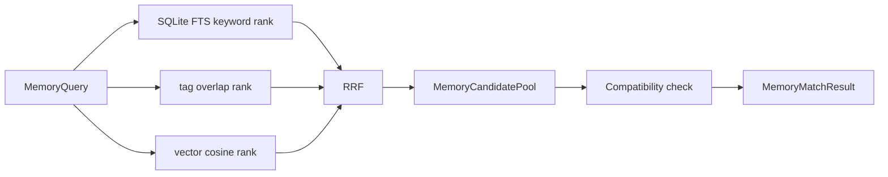
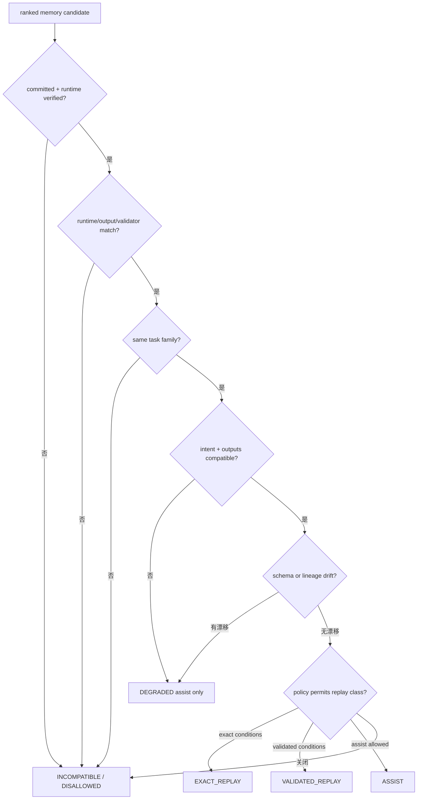
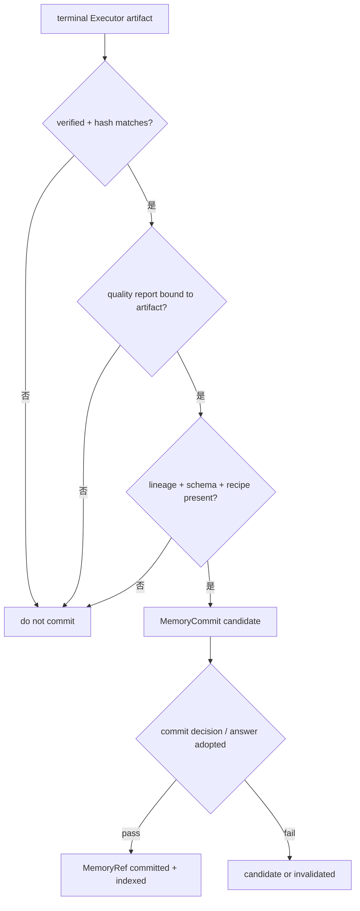

# Memory 检索、消费与 Replay

## 混合召回与 RRF

一次 Runtime 记忆查询由 [`MemoryQuery`](../../src/statebus/memory/models.py) 表达。它把 text、tags 和可选 dense embedding 三种独立信号放在同一个合同中，同时携带当前 task/spec、允许的 memory type、复用策略、Runtime signature、输出合同、输入 lineage/schema 和 Validator digest。

三种检索源不直接比较原始分数。关键词可能来自 SQLite FTS，标签是离散重合度，向量是余弦相似度，它们的数值空间不同。[`lookup_hybrid()`](../../src/statebus/memory/store.py) 分别得到有序列表，再使用 Reciprocal Rank Fusion：

```text
RRF(memory) = sum(1 / (k + rank_source(memory)))
```

默认 `k=60`。同一 memory 同时出现在 keyword、tag 与 vector 前列时会获得更高融合分数；分数相同时以 memory ID 稳定排序。RRF 只决定候选顺序，兼容性检查在融合之后执行，因此排名很高的旧结果仍可能被拒绝。



查询必须包含 task ID、spec hash 和至少一种检索信号；limit 和 RRF k 必须为正。`allowed_memory_types` 可限制 evidence、strategy、execution artifact、validated replay 等类别。处于 invalidated 状态的记忆不会作为有效候选，类型不在允许集合中的对象也会在融合前过滤。

`MemoryCandidatePool` 保存候选 ID、类型与 taxonomy，`source_ranks` 保留每一路原始排序，`MemoryRerankResult` 保存融合后的排名、score、ReplayClass 与 selected 标记。`MemoryMatchResult` 将候选池、rerank、兼容判定和最终 matches 放在同一个可 hash 对象中，后续 Telemetry 可以追溯“候选从哪一路来、为何被选或被拒”。

`MemoryIndexStore` 的持久 metadata 使用 SQLite，并建立 FTS5 表保存 task theme、summary、source task/agent 与 tags。embedding 通过独立 registry 保存，向量排序只处理已登记且未 invalidated 的 commit。metadata 真源与向量信号分开，可以在向量缺失时保留关键词/标签路径，也能避免用向量索引替代完整记忆合同。

检索层不负责把 MemoryRef 放进 Agent 输入。它只交付带决策记录的候选；角色可见性、复用级别与实际消费由下一层处理。

相关回归主要位于 [`tests/unit/memory/test_memory_runtime.py`](../../tests/unit/memory/test_memory_runtime.py)。

---

## 兼容性检查与真实消费

语义相似用于发现历史候选。[`MemoryIndexStore._compatibility_decision()`](../../src/statebus/memory/store.py)
在 RRF 之后逐个检查 commit、Runtime、任务合同、schema、lineage 和复用策略，形成
`MemoryCompatibilityDecision`，再决定候选如何进入当前任务。



memory 未提交、Runtime 验证未通过、Runtime signature、输出合同、Validator digest 或 task
family 不一致时，决策为 `INCOMPATIBLE/DISALLOWED`。intent/required outputs、task arguments、
input schema 或 lineage 变化时，ReplayClass 降为 assist 或 validated replay。

通过兼容性检查后，Runtime 为目标角色构造 capability 对应的输入视图。Executor 得到经验证的
execution recipe 或 Artifact 关系，Summarizer 得到可引用摘要与来源。

实际使用由 `MemoryConsumptionRecord` 记录；candidate pool 只描述发现阶段。记录包含 query hash、memory ID、consumer role/step、输入 Ref、ReplayClass、compatibility verdict、输入 payload hash、消费前后 decision surface hash、behavioral effect、下游 Ref，以及是否跳过生成步骤、是否跳过 LLM call、是否发生 recipe recompute。

```text
candidate discovered
  -> policy approved and compatible
  -> injected into a role input
  -> role reads it and emits consumption record
  -> decision surface changes / step is skipped / call is skipped
```

`consumed` 表示记忆进入某个角色并被读取；`behavioral effect` 表示读取改变了当前执行。背景提示被读取但计划和选择保持不变时，记录为 `consumed` 与 `no_effect`。

不兼容候选退出复用路径。Runtime 记录 reasons，沿当前任务的检索/执行路径重新计算；`recipe_recomputed`、skipped step 和 skipped LLM call 记录这次选择。

消费记录的构造与效果分类主要位于 [`state_consumption.py`](../../src/statebus/runtime/state_consumption.py) 和 [`adaptive_dispatcher.py`](../../src/statebus/runtime/adaptive_dispatcher.py)。记忆真实性回归可从 [`tests/unit/memory/test_memory_runtime.py`](../../tests/unit/memory/test_memory_runtime.py) 与 [`tests/benchmarks/mechanisms/test_contest_mechanisms.py`](../../tests/benchmarks/mechanisms/test_contest_mechanisms.py) 阅读。

---

## 记忆提交与分级重放

新任务产生的结果不会自动进入长期记忆。[`AdaptiveMainline._commit_verified_memory()`](../../src/statebus/runtime/adaptive_mainline.py) 只在 Runtime 完成、CanonicalTaskSpec 存在、input lineage 完整、query embedding 存在、终端 Executor artifact 已 verified、文件 hash 一致、QualityReport 与 artifact hash 一致、execution recipe 存在时构造 `MemoryCommit`。



`MemoryRef` 保存 memory type、ReplayClass、source task/agent、created time、task theme、tags、role path、producer run、summary、spec hash、artifact/state/embedding refs、manifest hash、commit/validation status 与 metadata。metadata 继续绑定 Runtime signature、output contract、Validator digest、QualityReport hash、input lineage/schema、execution recipe/hash 和 artifact blob hash。

`MemoryCommit` 同时保存完整 CanonicalTaskSpec、required outputs、quality floor 与来源 artifact hash。Store 的 `commit_candidate()` 只有在质量检查通过且 answer adopted 时把状态提升为 committed；失败结果不会因为已经写入 sidecar 就进入正常检索。

重放分为三档：

| ReplayClass | 可做什么 | 主要条件 |
|:--|:--|:--|
| `ASSIST` | 提供历史策略、摘要或路线提示，当前任务仍计算 | policy 允许，候选不满足更强重放或存在可接受漂移 |
| `VALIDATED_REPLAY` | 恢复已验证产物后继续验证/总结，可跳过部分步骤 | task family/intent/outputs 兼容、output contract 相同、Runtime 不为 incompatible、产物 verified |
| `EXACT_REPLAY` | 在严格相同输入集合恢复结果，可跳过更多步骤 | exact key 完全相同、Runtime compatible、输入 artifact hashes 和版本一致 |

[`replay_exact_key()`](../../src/statebus/runtime/replay.py) 将 CanonicalTaskSpec、输入 Artifact hashes、
Runtime signature、code template version、extractor version 和 output contract 一起摘要。
key 完全相同时进入 exact replay；任务合同与输出兼容且存在有限差异时进入 validated replay；
assist 提供历史策略、摘要和路线提示，并执行当前任务计算。

EvidencePack 和 HydrateManifest 有专门的 replay hash。执行输入 hash 会排除当前 query 派生的 ranking observation，保留来源文档、locator、hydrated content 与 schema；Manifest hash 使用稳定排序，避免候选顺序变化造成虚假 cache miss，来源与 extractor 约束保持不变。

每次 replay 决策写入 [`ReplayLedgerEntry`](../../src/statebus/runtime/ledger.py)，其中保存 candidate/memory/artifact、ReplayClass、decision reason、compatibility、Runtime signature、spec/planner handoff、input artifact hashes、output contract、版本、exact key、degraded 标志和 skipped step count。Ledger 直接记录跳过原因与相关对象。
