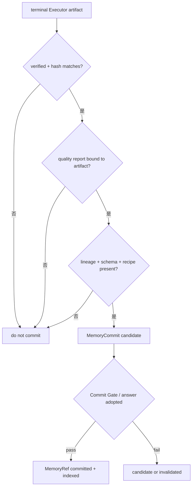

# 记忆提交与分级重放

新任务产生的结果不会自动进入长期记忆。[`AdaptiveMainline._commit_verified_memory()`](../../../statebus/runtime/adaptive_mainline.py) 只在 Runtime 完成、CanonicalTaskSpec 存在、input lineage 完整、query embedding 存在、终端 Executor artifact 已 verified、文件 hash 一致、QualityReport 与 artifact hash 一致、execution recipe 存在时构造 `MemoryCommit`。

`MemoryRef` 保存 memory type、ReplayClass、source task/agent、created time、task theme、tags、role path、producer run、summary、spec hash、artifact/state/embedding refs、manifest hash、commit/validation status 与 metadata。metadata 进一步绑定 Runtime signature、output contract、Validator digest、QualityReport hash、input lineage/schema、execution recipe/hash 和 artifact blob hash。

`MemoryCommit` 同时保存完整 CanonicalTaskSpec、required outputs、quality floor 与来源 artifact hash。Store 的 `commit_candidate()` 只有在质量门通过且 answer adopted 时把状态提升为 committed；失败结果不会因为已经写入 sidecar 就进入正常检索。

重放分为三档：

| ReplayClass | 可做什么 | 主要条件 |
|:--|:--|:--|
| `ASSIST` | 提供历史策略、摘要或路线提示，当前任务仍计算 | policy 允许，候选不满足更强重放或存在可接受漂移 |
| `VALIDATED_REPLAY` | 恢复已验证产物后继续验证/总结，可跳过部分步骤 | task family/intent/outputs 兼容、output contract 相同、Runtime 不为 incompatible、产物 verified |
| `EXACT_REPLAY` | 在严格相同输入面恢复结果，可跳过更多步骤 | exact key 完全相同、Runtime compatible、输入 artifact hashes 和版本一致 |

[`replay_exact_key()`](../../../statebus/runtime/replay.py) 将 CanonicalTaskSpec、输入 artifact hashes、Runtime signature、code template version、extractor version 和 output contract 一起摘要。exact replay 只有 key 完全相同才成立；validated replay 可以接受有限差异，但仍要求任务合同与输出兼容；assist 不应被叙述成“直接复用答案”。

EvidencePack 和 HydrateManifest 有专门的 replay hash。执行输入 hash 会排除当前 query 派生的 ranking observation，保留来源文档、locator、hydrated content 与 schema；Manifest hash 使用稳定排序，避免候选顺序变化造成虚假 cache miss，同时不放松来源与 extractor 约束。

每次 replay 决策写入 [`ReplayLedgerEntry`](../../../statebus/runtime/ledger.py)，其中保存 candidate/memory/artifact、ReplayClass、decision reason、compatibility、Runtime signature、spec/planner handoff、input artifact hashes、output contract、版本、exact key、degraded 标志和 skipped step count。Ledger 让“为什么跳过”可以被追溯，而不是只看最终耗时猜测。

