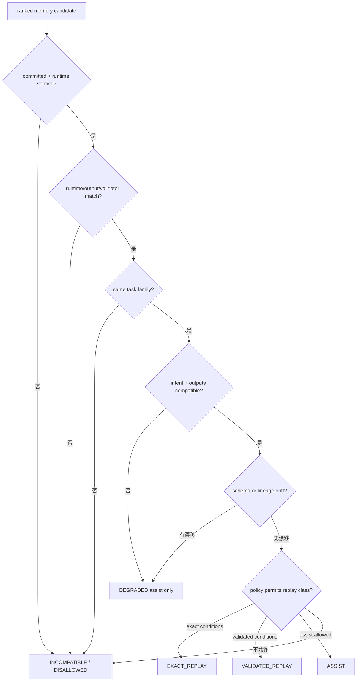

# 兼容门与真实消费

语义相似只能说明历史对象值得检查，不能说明它可以改变当前任务。[`MemoryIndexStore._compatibility_decision()`](../../../v2/memory/store.py) 在 RRF 之后逐个检查 commit、Runtime、任务合同、schema、lineage 和复用策略，形成 `MemoryCompatibilityDecision`。



硬不兼容条件包括 memory 未提交、未通过 Runtime 验证、Runtime signature 不符、输出合同不符、Validator digest 不符或 task family 不同。intent/required outputs 变化、task arguments 变化、input schema drift 和 lineage 变化会限制重放级别；它们通常仍可在策略允许时作为 assist，而不能恢复旧结果。

通过兼容门后，Runtime 仍需为目标角色构造受限输入视图。Executor 可以得到经验证的 execution recipe 或 artifact 关系，Summarizer 可以得到可引用的摘要与来源；角色不能看到与自己 capability 无关的任意历史 payload。

实际使用由 `MemoryConsumptionRecord` 记录，而不是由 candidate pool 推断。该记录包含 query hash、memory ID、consumer role/step、输入 Ref、ReplayClass、compatibility verdict、输入 payload hash、消费前后 decision surface hash、behavioral effect、下游 Ref，以及是否跳过生成步骤、是否跳过 LLM call、是否发生 recipe recompute。

```text
18 queries have candidates
        ≠ 18 actual uses

candidate discovered
  -> policy approved and compatible
  -> injected into a role input
  -> role reads it and emits consumption record
  -> decision surface changes / step is skipped / call is skipped
```

`consumed` 表示记忆确实进入某个角色并被读取；`behavioral effect` 表示读取改变了当前执行。两者还要区分：某条记忆可以被当作背景提示读取，但最终计划和选择没有变化，此时它不是“减少重复工作”的证据。

不兼容拒绝不是任务失败。Runtime 记录 reasons，然后沿当前任务的检索/执行路径重新计算。`recipe_recomputed`、skipped step 和 skipped LLM call 使正向复用与负向拒绝都可以在同一套事件里解释。

消费记录的构造与效果分类主要位于 [`state_consumption.py`](../../../v2/runtime/state_consumption.py) 和 [`adaptive_dispatcher.py`](../../../v2/runtime/adaptive_dispatcher.py)。记忆真实性回归可从 [`test_memory_runtime.py`](../../../tests/v2/test_memory_runtime.py) 与 [`test_adaptive_formal_compare.py`](../../../tests/v2/test_adaptive_formal_compare.py) 阅读。

