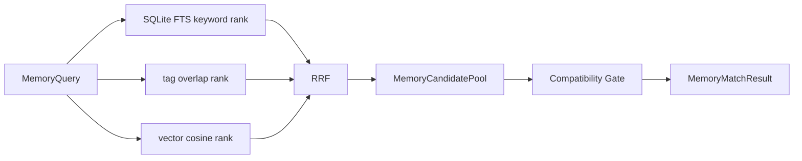

# 混合召回与 RRF

一次 Runtime 记忆查询由 [`MemoryQuery`](../../../statebus/memory/models.py) 表达。它把 text、tags 和可选 dense embedding 三种独立信号放在同一个合同中，同时携带当前 task/spec、允许的 memory type、复用策略、Runtime signature、输出合同、输入 lineage/schema 和 Validator digest。

三种检索源不直接比较原始分数。关键词可能来自 SQLite FTS，标签是离散重合度，向量是余弦相似度，它们的数值空间不同。[`lookup_hybrid()`](../../../statebus/memory/store.py) 分别得到有序列表，再使用 Reciprocal Rank Fusion：

```text
RRF(memory) = sum(1 / (k + rank_source(memory)))
```

默认 `k=60`。同一 memory 同时出现在 keyword、tag 与 vector 前列时会获得更高融合分数；分数相同时以 memory ID 稳定排序。RRF 只决定候选顺序，Compatibility Gate 在融合之后执行，因此排名很高的旧结果仍可能被拒绝。



查询必须包含 task ID、spec hash 和至少一种检索信号；limit 和 RRF k 必须为正。`allowed_memory_types` 可限制 evidence、strategy、execution artifact、validated replay 等类别。处于 invalidated 状态的记忆不会作为有效候选，类型不在允许集合中的对象也会在融合前过滤。

`MemoryCandidatePool` 保存候选 ID、类型与 taxonomy，`source_ranks` 保留每一路原始排序，`MemoryRerankResult` 保存融合后的排名、score、ReplayClass 与 selected 标记。`MemoryMatchResult` 将候选池、rerank、兼容判定和最终 matches 放在同一个可 hash 对象中，后续 Telemetry 可以追溯“候选从哪一路来、为何被选或被拒”。

`MemoryIndexStore` 的持久 metadata 使用 SQLite，并建立 FTS5 表保存 task theme、summary、source task/agent 与 tags。embedding 通过独立 registry 保存，向量排序只处理已登记且未 invalidated 的 commit。metadata 真源与向量信号分开，可以在向量缺失时保留关键词/标签路径，也能避免用向量索引替代完整记忆合同。

检索层不负责把 MemoryRef 放进 Agent 输入。它只交付带决策记录的候选；角色可见性、复用级别与实际消费由下一层处理。

相关回归主要位于 [`test_memory_store.py`](../../../tests/test_memory_store.py) 和 [`test_hybrid_memory_query.py`](../../../tests/test_hybrid_memory_query.py)。

