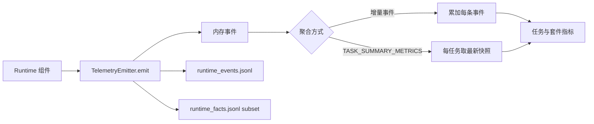
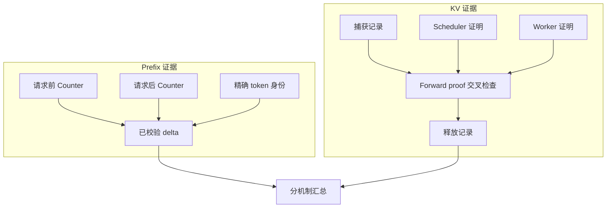
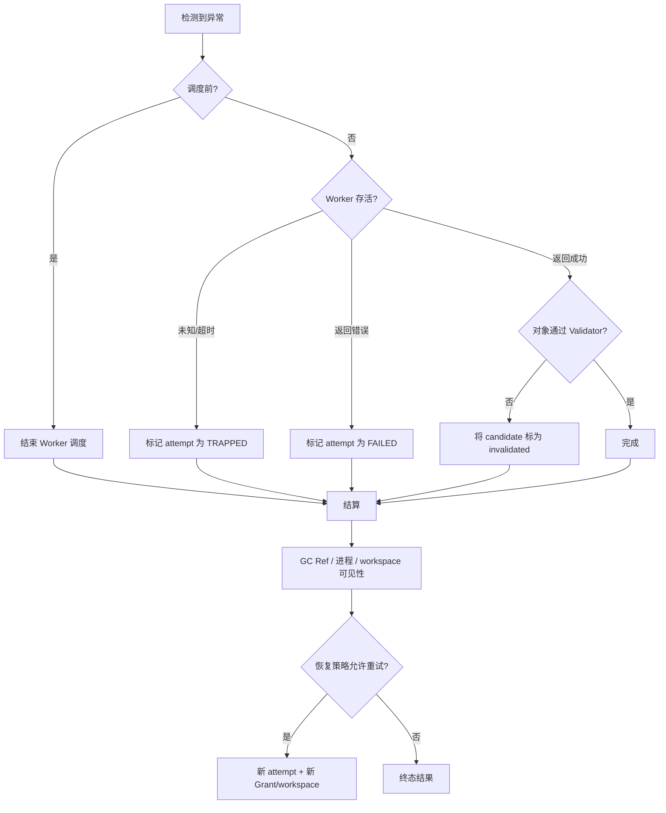
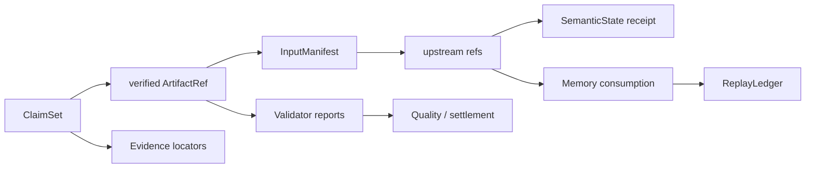

# 运行记录、指标与恢复

## Telemetry 与指标聚合

[`TelemetryEvent`](../../src/statebus/runtime/telemetry.py) 保存 event ID、trace/task/step/attempt、span、event type、时间、role、channel、severity、payload、metrics 和 schema version。`TelemetryEmitter` 同时维护内存事件、runtime event JSONL 与精简的 runtime fact JSONL。

事件分为增量事实与终态快照。`STATE_PUBLISHED`、`STEP_COMPLETED`、`MEMORY_HYBRID_QUERIED` 等每发生一次就可以累加；`TASK_SUMMARY_METRICS` 表示某任务当前终态，只取每个 task 最新一条。若把所有 summary snapshot 都相加，重写或恢复时会重复计数。



主要记录可以按机制理解。表中既有事件名，也有终态 metric 或专项 audit 字段；它们的聚合方式不同。

| 机制 | 代表事件 | 说明 |
|:--|:--|:--|
| 计划与步骤 | `ADAPTIVE_PLAN_APPROVED`、`STEP_DISPATCHED/RUNNING/COMPLETED/FAILED/TRAPPED` | 计划和 Worker 生命周期 |
| 检索 | `RETRIEVAL_CANDIDATE_POOL_BUILT`、`RETRIEVAL_RERANKED`、`EVIDENCE_PACK_BUILT` | 候选、排序与证据包 |
| 非文本状态 | `STATE_PUBLISHED/RESOLVED/CONSUMED/RELEASED` | 物理对象与消费完整记录 |
| Logit decision | `logit_state_publish/consume/release_count`、`logit_gate_accept/retry/fail_closed_count` | 候选概率是否真实改变执行授权 |
| Prefix | `prefix_cache_observation.json` 的 before/after counters、query/hit token delta、exact identity | 当前任务窗口是否出现 APC block reuse |
| 显式 KV | `capture/load/fallback_count`、`inherited_kv_tokens`、`computed_prefill_tokens`、`KVForwardProof` | Consumer 是否真实加载 parent KV 并只计算 suffix |
| 产物 | `ARTIFACT_MATERIALIZED/PUBLISHED/VALIDATED/COMMITTED` | workspace 文件与对象状态 |
| 记忆 | `MEMORY_HYBRID_QUERIED`、`REPLAY_DECIDED`、`MEMORY_COMMIT_VERIFIED` | 候选、复用分级与写回 |
| 执行 | `EVIDENCE_PROJECTED`、`CAPABILITY_QUALITY_EVALUATED`、`LLM_CODEACT_EXECUTED` | Grant、程序和 Validator |
| 清理 | `GC_ISSUED` | 终态资源结算 |

event payload 用于身份和原因，metrics 用于数值聚合。例如 `STATE_CONSUMED` 的 payload
包含 ref、selected candidate 和 PIDs，metrics 包含 selected bytes/consume count。正式分母
由对应事件合同定义并写入任务终态。

Emitter 还测量自身日志开销，包括 emit、event/fact write、flush 和 handle open 时间/次数，
从而把 Telemetry 固定成本与业务阶段分开统计。

### Adaptive Memory 阶段计时

`RUNTIME_PHASE_TIMING` 是诊断 interval，写入完整 runtime event log；它与 additive/snapshot metric、runtime fact、authority receipt 分开保存，展示层不新增字段。
每次调用保留 task/step/attempt、phase、单调时钟起止值和 duration_ms。`returned` 只表示
调用正常返回（返回的结果仍可能被拒绝），`raised` 表示调用抛异常；异常继续沿原路径传播。
duration 在 emit 前结束，因此不包含该条计时日志的写入时间。

当前覆盖 bound provider invocation、Memory lookup（包含 compatibility）、Memory 输入授权
与 hydration、DSL input hydration、Memory read verification、transform execution、独立
recompute、quality validation、verified materialization、Attempt result admission 和 Memory commit。
同一 Grant 下重复授权检查保留为多次调用，不缓存或合并。`transform_verified_materialization` 包含 interpreter 的再次执行和产物写出，表示执行阶段的综合耗时。DSL 各段独立测量，当前字段未覆盖全部 Runtime 阶段；这些值不做加总，也不从 E2E 反推 Runtime exclusive overhead。

Memory lookup 的 query 与 compatibility 尚未拆分；embedding generation、LLM Python 内部
execution/verification 尚未获得本组独立计时。缺少事件意味着未观测，不自动填零。
provider skip 仍由原有 skip/read/result-admission receipts 证明，不由计时事件缺席证明。

P4 `rows.json` 和 `producer_rows.json` 保留对应原始 phase events。`timing_accounting` 的
总时间覆盖 `_run_runtime` 调用，失败 attempt 和 producer 成本都计入；未启动的 lane 保留
null 和 not_started_count。缺失或非法耗时只报告 observed subtotal，不伪造完整 total。
只有全部计划配对成功、producer 成功且 timing 完整时才计算 pooled descriptive break-even；
只有完整配对才计算正向收益结论。计时 instrumentation 本身有开销，新增计时后的结果需结合对应 artifact 解释。

Logit decision 的任务终态指标还包括 extraction attempt/available count、跨 PID transfer count、
传输字节、retry trigger、top gap、entropy、decision position 与 sequence length。完整完整记录同时
核对 publish、跨 PID consume、release、最终状态和 Worker dispatch。受控挑战的 19 次状态
使用独立诊断分母，Embedding state transfer 和正式任务数分别聚合。

### Prefix 观测计算

Prefix 使用同一任务窗口前后的单调 counter：

```text
query_delta = query_tokens_after - query_tokens_before
hit_delta   = hit_tokens_after - hit_tokens_before
task_local_hit_rate = hit_delta / query_delta
```

before/after 来自同一 engine instance、cache epoch 和相同标签 series，并满足
`0 <= hit_delta <= query_delta`。task-local counter delta 作为正式命中观测；metrics 读取失败
时 observation 记录为 `unavailable`。

### 显式 KV 观测计算

Consumer 的 Token 账满足：

```text
logical_prompt_tokens = inherited_kv_tokens + computed_prefill_tokens
computed_prefill_tokens = suffix_tokens
connector_load_count = 1
```

这些字段与 scheduler 报告的 cached token 和 Worker `KVForwardProof` 对齐。正式
continuation 样本同时记录 capture/load/release 各一次、实际层数与字节大于零、fallback 为
0；`handle_id`、请求 body 和 TTFT 作为辅助字段。



Prefix 的 query/hit 与 KV 的 inherited/computed 都以 token 为单位，但使用不同分母。Prefix
记录 vLLM 自动匹配的完整前缀 block，KV 记录 Consumer 从显式 handle 继承的指定 parent，
实验总览分别展示两组结果。

展示层使用白名单 event/metric/payload，并压缩数组和长字符串；磁盘保留完整原始 JSONL，
事件记录用于现场进度与结果展示。

新增事件或专项 audit 字段时，同步确定 additive/snapshot 类型、唯一分母、展示字段和
runtime fact 属性。聚合器随 event type 一起更新。正式时延实验记录串行顺序、warmup、模型
服务实例和 lane；并发 API 调用保留为吞吐或诊断数据。

---

## 异常恢复与资源结算

StateBus 将异常表示为对象状态变化。各阶段采用对应恢复策略：计划拒绝时结束调度，
StateRef 校验失败时结束 payload 解析，CodeAct policy 失败时结束执行，Validator 失败时保留
candidate 并关闭下游可见性，memory incompatible 时回到当前任务重算。

| 失败位置 | 检测信号 | 处理方式 | 保留证据 |
|:--|:--|:--|:--|
| Task/Plan | compiler error、PlanPolicyIssue | 拒绝或一次 schema-only repair | spec/proposal/report hash |
| Dispatch | Grant/Ref/contract mismatch | `STEP_REJECTED_PRE_DISPATCH`，结束 Worker 调度 | rejection code + current refs |
| Worker transport | ACK timeout、heartbeat timeout | `TRAPPED`，关闭 attempt 可见性 | last heartbeat、attempt、process info |
| SemanticState | contract/shape/hash/encoder/lease/path 失败 | 进入 release/GC | sidecar、Ref、reason |
| Logit decision | 概率 unavailable、hash/lease/PID 不符、二次低 margin | telemetry 模式只记录；retry_once 模式拒绝 dispatch | producer/decision receipt、transport audit、tombstone |
| Prefix | 共同证据冲突、token identity unavailable、metrics delta 无效 | 回到 independent/full prefill，或将 observation 标为 unavailable | layout audit、exact identity、counter snapshot/delta |
| 显式 KV | parent token、engine generation、handle 状态、双证明不一致 | 结束 continuation，并记录该 lane 的失败状态 | role audit、service telemetry、forward proof、release record |
| Memory | commit/runtime/schema/lineage 不兼容 | 记录 decision，当前任务重算 | candidate rank + reasons |
| CodeAct | AST/path、bwrap readiness、timeout、runtime error | 终止当前执行；预算内创建新 workspace 修复 | source/policy/readiness/stdout/stderr hashes |
| Artifact | input/schema/business/provenance 失败 | invalidated，关闭 Summarizer 可见性 | Validator + settlement/invalidation |



Prefix 异常切换为普通 Prefill。共同可见证据为空或 digest 冲突时使用 independent
Prompt；metrics 暂时不可读时将 observation 记为 `unavailable`。alignment/policy 决定后续
路径，业务正确性继续由 EvidencePack 和 Validator 处理。

显式 KV 的 Consumer 请求可能只携带 suffix。进入 `/continue` 前验证 parent token digest、
model/tokenizer/layout、engine generation、TTL 和 one-shot 状态；返回后交叉检查 scheduler
与 Worker proof。专项 `continuation` 实验把 fallback count 固定为 0。产品模式采用 full
replay fallback 时，审计分别累计 fallback 与真实 load。

重试以 attempt 隔离。新的 attempt 重新签发 Grant，创建新 workspace，并复用仍为
verified/active 且可重新授权的上游 Ref。旧 Worker 的晚到结果进入 late-result 记录；旧
candidate 保留诊断 hash，状态保持原终态。

Logit Retry Decision 的“重试一次”是执行候选的受限 recheck，保持同一闭集 candidate surface
和既有授权范围。第二次 action 仍为 retry、状态提取 unavailable 或跨进程回执校验失败时，
Runtime 在业务 Worker 启动前进入 `fail_closed`。每次 LogitState 尝试独立发布和释放。

记忆不兼容是正常分支，Run 继续执行当前任务。Runtime 记录
`runtime_signature_mismatch`、`output_contract_mismatch`、`input_schema_drift` 或
`input_lineage_changed` 等 reason，重算结果与拒绝记录一并进入来源关系。

CodeAct 的 policy、runtime 和 quality repair 使用新的 workspace，并重新审计 source；超过
预算后进入失败终态。bwrap readiness 未通过时，LLM Python 路径结束并保存诊断记录。

资源结算先关闭下游可见性，再记录 settlement，最后 GC。StateRef lease/物理载体、Worker
进程组、workspace candidate 与 Memory proposal 各有所有者，清理采用幂等实现。业务结束
后所有资源进入终态，为下一次运行提供干净的 session 与设备状态。

KV handle 由 Worker-local registry 结算，Prefix cache block 由 vLLM 自行淘汰，StateRef 由
StatePool GC 处理。Telemetry 分别记录三类资源的释放事件。

---

## Run 目录、sidecar 与 Ledger

Run 根目录是一次执行的事实集合，不同 runner 的具体子目录会略有差异，但通常包含 Runtime/Telemetry、state metadata/manifests、workspace、memory index 和 case summary/trace。说明书与实验汇总直接读取这些事实。

```text
<run-root>/
├── console.log                  # runner stdout/stderr
├── runtime/
│   ├── telemetry/
│   │   ├── runtime_events.jsonl
│   │   └── runtime_facts.jsonl
│   ├── adaptive_mainline_manifest.json
│   ├── engine_local_kv_mainline.json   # KV mode enabled 时的 role audit
│   └── sidecars/ ...
├── logs/
│   ├── prefix_cache_observation.json   # Prefix policy enabled 时
│   ├── logit_gate.json                 # Logit decision enabled 时
│   └── task_metrics.json
├── state/
│   ├── metadata/ ...
│   ├── manifests/ ...
│   └── mmap/ ...
├── workspaces/ ...
├── memory_index/ ...
└── <case>/
    ├── summary.json
    ├── planner_trace.json
    └── executor_initial_raw.txt
```

上图是阅读地图；不同 runner 的目录名可以不同。应以 `adaptive_mainline_manifest.json` 中记录的 runtime/state/memory/workspace roots 和当前 summary 为准。

一次最终结论可以按下面的关系回溯：



[`ReplayLedgerEntry`](../../src/statebus/runtime/ledger.py) 保存 session/task、candidate、memory/artifact、ReplayClass、decision reason、compatibility verdict、Runtime signature、signature manifest bundle、spec/planner handoff、input artifact hashes、output contract、code/extractor version、exact key、degraded 标志和 skipped step count。它回答“为什么允许这次跳过”。

Artifact settlement/invalidation 保存前后状态、commit decision reason、QualityFloor、Validator report hashes 和 replay-ready。SemanticState sidecar 保存物理载体与 Dense contract，消费事件保存 PID、selected rows/IDs 和 effect。将这些记录连接起来，可以区分“对象存在”“对象被读取”“对象改变行为”“对象通过质量检查”四种事实。

固定 evidence snapshot 是经过显式发布的展示层，与临时 Run 使用独立的 snapshot ID/git SHA/Run ID。实时运行、历史 Run、PPT 基线和说明书数字按这些标识区分。

模型侧三条机制的原始证据入口不同：

| 机制 | 单任务原始记录 | 套件汇总 |
|:--|:--|:--|
| Logit decision | `logs/logit_gate.json`、Logit sidecar/tombstone、runtime events | challenge `summary.json` |
| Prefix | `logs/prefix_cache_observation.json`、rendered request audit | paired repeat `repeat_summary.json` |
| 显式 KV | `runtime/engine_local_kv_mainline.json`、service telemetry/proof | 10-round `summary.json` |

专项 runner 的目录会多出 `rounds/<task>/<mode>/`、环境快照和服务快照。报告中的 p50、计数与逐任务值回到这些 JSON，文档表格只做呈现。
