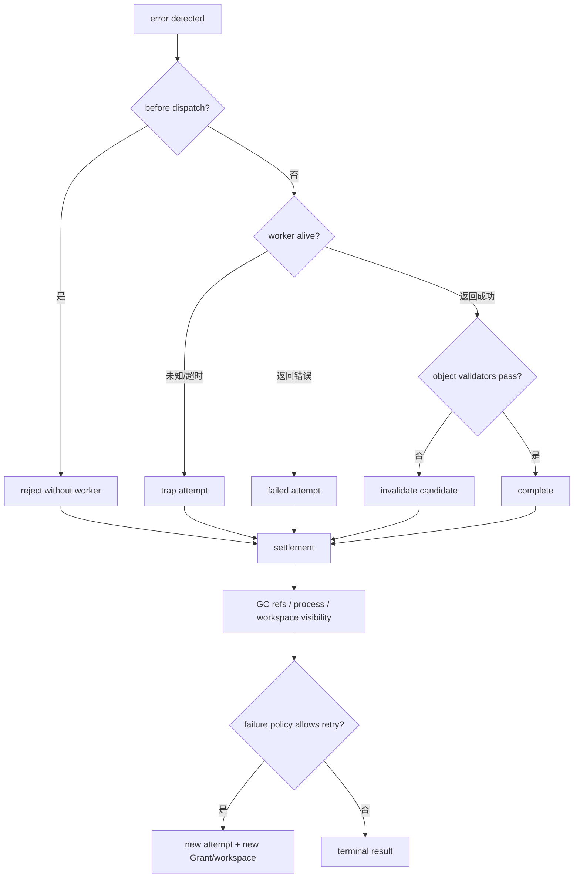

# 失败恢复与资源结算

StateBus 将失败视为对象状态变化，而不是 console 中的一段异常文本。不同边界有不同恢复策略：计划拒绝不启动 Worker，StateRef 校验失败不映射 payload，CodeAct policy 失败不进入 sandbox，Validator 失败保留 candidate 但关闭下游可见性，memory incompatible 则回到当前任务重算。

| 失败位置 | 检测信号 | 处理方式 | 保留证据 |
|:--|:--|:--|:--|
| Task/Plan | compiler error、PlanPolicyIssue | 拒绝或一次 schema-only repair | spec/proposal/report hash |
| Dispatch | Grant/Ref/contract mismatch | `STEP_REJECTED_PRE_DISPATCH`，不启动 Worker | rejection code + current refs |
| Worker transport | ACK timeout、heartbeat timeout | `TRAPPED`，关闭 attempt 可见性 | last heartbeat、attempt、process info |
| SemanticState | contract/shape/hash/encoder/lease/path 失败 | 不建立只读 view，release/GC | sidecar、Ref、reason |
| Logit Gate | 概率 unavailable、hash/lease/PID 不符、二次低 margin | telemetry 模式只记录；retry_once 模式拒绝 dispatch | producer/gate receipt、transport audit、tombstone |
| Memory | commit/runtime/schema/lineage 不兼容 | 记录 decision，当前任务重算 | candidate rank + reasons |
| CodeAct | AST/path、bwrap readiness、timeout、runtime error | 不执行或终止；预算内 fresh-workspace repair | source/policy/readiness/stdout/stderr hashes |
| Artifact | input/schema/business/provenance 失败 | invalidated，Summarizer 不可见 | Validator + settlement/invalidation |
| Studio | runner 非零、服务重启、用户取消 | failed/canceled；保留 Run，可新建运行 | studio_job、events、console |

重试以 attempt 隔离。新的 attempt 重新签发 Grant，创建新 workspace，并只复用仍然 verified/active 的上游 Ref。旧 Worker 的晚到结果因 attempt ID 不再是当前值而被拒绝。旧 candidate 可以保留诊断 hash，但不能被重新提升。

Logit Retry Gate 的“重试一次”是执行候选的受限 recheck，不等于任意重启完整任务。它保持同一闭集 candidate surface 和既有授权范围；第二次状态仍建议 retry、状态提取不可用或跨进程回执校验失败时，Runtime 在业务 Worker 启动前 fail closed。每次 LogitState 尝试都独立发布和释放，不沿用第一次 shared memory payload。

记忆不兼容是正常分支，不应把 Run 标为失败。Runtime 写清楚 `runtime_signature_mismatch`、`output_contract_mismatch`、`input_schema_drift` 或 `input_lineage_changed` 等 reason，然后执行当前任务。这样系统既能展示复用，也能证明错误历史没有污染结果。

CodeAct 的修复也不覆盖旧执行。policy、runtime 和 quality repair 使用新的 workspace，并重新审计 source；超过预算后明确失败。bwrap 不就绪时 LLM Python 不回退到宿主机执行。

资源结算先关闭下游可见性，再记录 settlement，最后 GC。StateRef lease/物理载体、Worker 进程组、workspace candidate 与 Memory proposal 各有所有者，清理必须幂等。即使业务失败，资源也必须进入终态；否则下一次 Studio Run 可能看到旧 Ref 或被旧进程占用设备。
