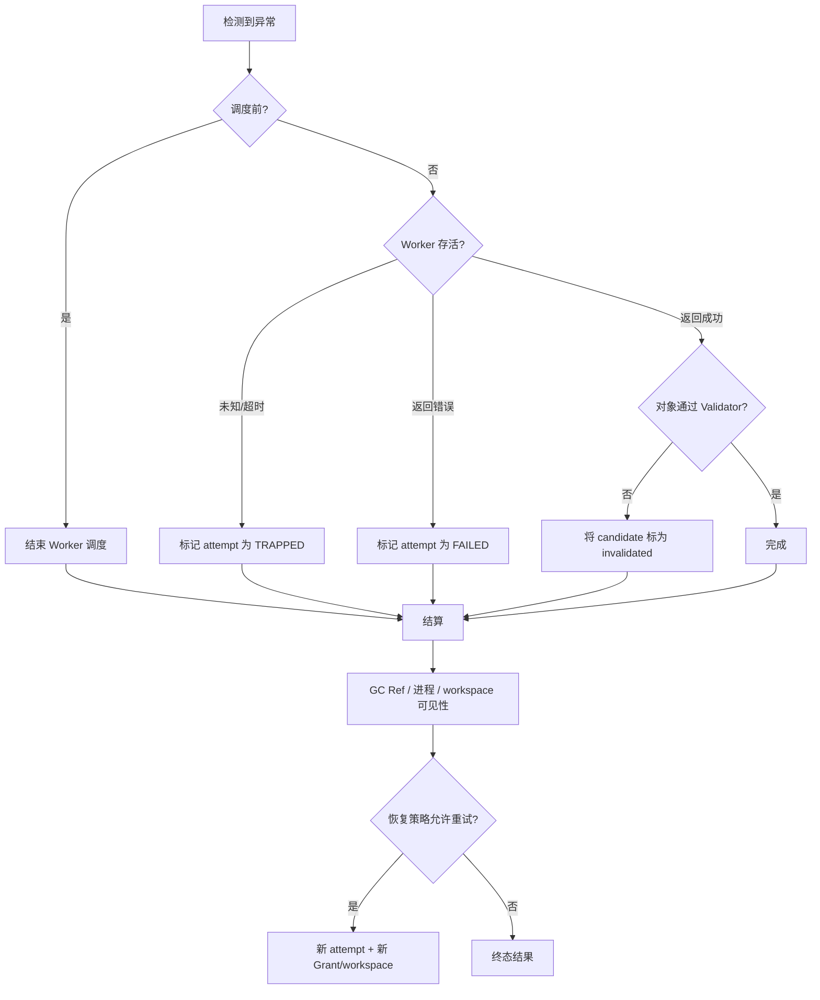

# 异常恢复与资源结算

StateBus 将异常表示为对象状态变化。各阶段采用对应恢复策略：计划拒绝时结束调度，
StateRef 校验失败时结束 payload 解析，CodeAct policy 失败时结束执行，Validator 失败时保留
candidate 并关闭下游可见性，memory incompatible 时回到当前任务重算。

| 失败位置 | 检测信号 | 处理方式 | 保留证据 |
|:--|:--|:--|:--|
| Task/Plan | compiler error、PlanPolicyIssue | 拒绝或一次 schema-only repair | spec/proposal/report hash |
| Dispatch | Grant/Ref/contract mismatch | `STEP_REJECTED_PRE_DISPATCH`，结束 Worker 调度 | rejection code + current refs |
| Worker transport | ACK timeout、heartbeat timeout | `TRAPPED`，关闭 attempt 可见性 | last heartbeat、attempt、process info |
| SemanticState | contract/shape/hash/encoder/lease/path 失败 | 进入 release/GC | sidecar、Ref、reason |
| Logit Gate | 概率 unavailable、hash/lease/PID 不符、二次低 margin | telemetry 模式只记录；retry_once 模式拒绝 dispatch | producer/gate receipt、transport audit、tombstone |
| Prefix | 共同证据冲突、token identity unavailable、metrics delta 无效 | 回到 independent/full prefill，或将 observation 标为 unavailable | layout audit、exact identity、counter snapshot/delta |
| 显式 KV | parent token、engine generation、handle 状态、双证明不一致 | 结束 continuation，并记录该 lane 的失败状态 | role audit、service telemetry、forward proof、release record |
| Memory | commit/runtime/schema/lineage 不兼容 | 记录 decision，当前任务重算 | candidate rank + reasons |
| CodeAct | AST/path、bwrap readiness、timeout、runtime error | 终止当前执行；预算内创建新 workspace 修复 | source/policy/readiness/stdout/stderr hashes |
| Artifact | input/schema/business/provenance 失败 | invalidated，关闭 Summarizer 可见性 | Validator + settlement/invalidation |
| Studio | runner 非零、服务重启、用户取消 | failed/canceled；保留 Run，可新建运行 | studio_job、events、console |

Prefix 异常切换为普通 Prefill。共同可见证据为空或 digest 冲突时使用 independent
Prompt；metrics 暂时不可读时将 observation 记为 `unavailable`。alignment/policy 决定后续
路径，业务正确性继续由 EvidencePack 和 Validator 处理。

显式 KV 的 Consumer 请求可能只携带 suffix。进入 `/continue` 前验证 parent token digest、
model/tokenizer/layout、engine generation、TTL 和 one-shot 状态；返回后交叉检查 scheduler
与 Worker proof。专项 `continuation` 实验把 fallback count 固定为 0。产品模式采用 full
replay fallback 时，审计分别累计 fallback 与真实 load。

重试以 attempt 隔离。新的 attempt 重新签发 Grant，创建新 workspace，并复用仍为
verified/active 且可重新授权的上游 Ref。旧 Worker 的晚到结果进入 late-result 记录；旧
candidate 保留诊断 hash，状态保持原终态。

Logit Retry Gate 的“重试一次”是执行候选的受限 recheck，保持同一闭集 candidate surface
和既有授权范围。第二次 action 仍为 retry、状态提取 unavailable 或跨进程回执校验失败时，
Runtime 在业务 Worker 启动前进入 `fail_closed`。每次 LogitState 尝试独立发布和释放。

记忆不兼容是正常分支，Run 继续执行当前任务。Runtime 记录
`runtime_signature_mismatch`、`output_contract_mismatch`、`input_schema_drift` 或
`input_lineage_changed` 等 reason，重算结果与拒绝记录一并进入证据链。

CodeAct 的 policy、runtime 和 quality repair 使用新的 workspace，并重新审计 source；超过
预算后进入失败终态。bwrap readiness 未通过时，LLM Python 路径结束并保存诊断记录。

资源结算先关闭下游可见性，再记录 settlement，最后 GC。StateRef lease/物理载体、Worker
进程组、workspace candidate 与 Memory proposal 各有所有者，清理采用幂等实现。业务结束
后所有资源进入终态，为下一次 Studio Run 提供干净的 session 与设备状态。

KV handle 由 Worker-local registry 结算，Prefix cache block 由 vLLM 自行淘汰，StateRef 由
StatePool GC 处理。Telemetry 分别记录三类资源的释放事件。
