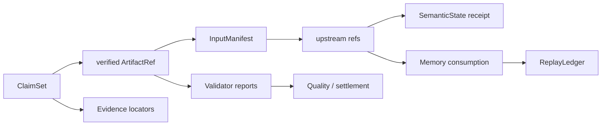

# Run 目录、sidecar 与 Ledger

Run 根目录是一次执行的事实集合，不同 runner 的具体子目录会略有差异，但通常包含 Runtime/Telemetry、state metadata/manifests、workspace、memory index、case summary/trace 和 Studio 作业文件。说明书、Studio 与实验汇总读取这些事实，而不是从屏幕截图反推结果。

```text
<run-root>/
├── command.json                 # Studio 配方展开后的 argv（Studio Run）
├── studio_job.json              # 作业状态（Studio Run）
├── studio_events.jsonl          # 前端可见事件（Studio Run）
├── console.log                  # runner stdout/stderr
├── runtime/
│   ├── telemetry/
│   │   ├── runtime_events.jsonl
│   │   └── runtime_facts.jsonl
│   ├── adaptive_mainline_manifest.json
│   ├── engine_local_kv_mainline.json   # KV mode enabled 时的 role audit
│   └── sidecars/ ...
├── logs/
│   ├── prefix_cache_observation.json   # Prefix policy enabled 时
│   ├── logit_gate.json                 # Logit Gate enabled 时
│   └── task_metrics.json
├── state/
│   ├── metadata/ ...
│   ├── manifests/ ...
│   └── mmap/ ...
├── workspaces/ ...
├── memory_index/ ...
└── <case>/
    ├── summary.json
    ├── planner_trace.json
    └── executor_initial_raw.txt
```

上图是阅读地图，不是要求所有 runner 生成完全相同的目录名。应以 `adaptive_mainline_manifest.json` 中记录的 runtime/state/memory/workspace roots 和当前 summary 为准。

一次最终结论可以按下面的关系回溯：



[`ReplayLedgerEntry`](../../../statebus/runtime/ledger.py) 保存 session/task、candidate、memory/artifact、ReplayClass、decision reason、compatibility verdict、Runtime signature、signature manifest bundle、spec/planner handoff、input artifact hashes、output contract、code/extractor version、exact key、degraded 标志和 skipped step count。它回答“为什么允许这次跳过”。

Artifact settlement/invalidation 保存前后状态、Commit Gate reason、QualityFloor、Validator report hashes 和 replay-ready。SemanticState sidecar 保存物理载体与 Dense contract，消费事件保存 PID、selected rows/IDs 和 effect。将这些记录连接起来，可以区分“对象存在”“对象被读取”“对象改变行为”“对象通过质量门”四种事实。

Studio 的 `task_flow.py` 读取 summary、trace 与 execution record，生成便于展示的对象视图；它不会替代原始 sidecar。正式审计如果发现 UI 与 Run 不一致，应以 Run 合同与 hash 为准并修复适配器，而不是手工改 UI 数字。

固定 evidence snapshot 是经过显式发布的展示层，不属于每个临时 Run。实时运行、历史 Run、PPT 基线和说明书数字应通过明确的 snapshot ID/git SHA/Run ID 区分。

模型侧三条机制的原始证据入口不同：

| 机制 | 单任务原始记录 | 套件汇总 |
|:--|:--|:--|
| Logit Gate | `logs/logit_gate.json`、Logit sidecar/tombstone、runtime events | challenge `summary.json` |
| Prefix | `logs/prefix_cache_observation.json`、rendered request audit | paired repeat `repeat_summary.json` |
| 显式 KV | `runtime/engine_local_kv_mainline.json`、service telemetry/proof | 10-round `summary.json` |

专项 runner 的目录会多出 `rounds/<task>/<mode>/`、环境快照和服务快照。报告中的 p50、计数与逐任务值应能回到这些 JSON；文档表格不是新的事实源。
