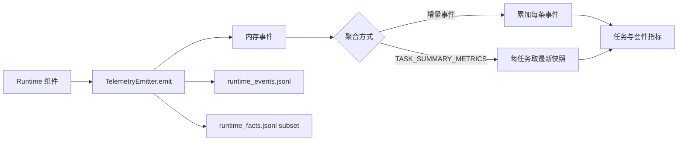
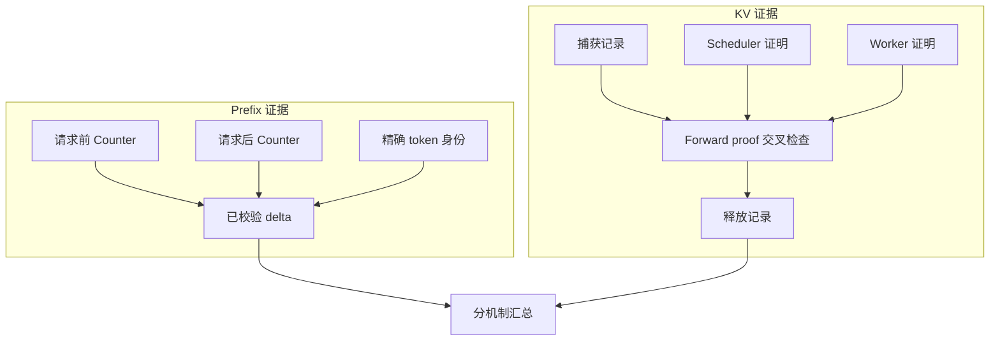

# Telemetry 与指标聚合

[`TelemetryEvent`](../../../statebus/runtime/telemetry.py) 保存 event ID、trace/task/step/attempt、span、event type、时间、role、channel、severity、payload、metrics 和 schema version。`TelemetryEmitter` 同时维护内存事件、runtime event JSONL 与精简的 runtime fact JSONL。

事件分为增量事实与终态快照。`STATE_PUBLISHED`、`STEP_COMPLETED`、`MEMORY_HYBRID_QUERIED` 等每发生一次就可以累加；`TASK_SUMMARY_METRICS` 表示某任务当前终态，只取每个 task 最新一条。若把所有 summary snapshot 都相加，重写或恢复时会重复计数。



主要记录可以按机制理解。表中既有事件名，也有终态 metric 或专项 audit 字段；它们的聚合方式不同。

| 机制 | 代表事件 | 说明 |
|:--|:--|:--|
| 计划与步骤 | `ADAPTIVE_PLAN_APPROVED`、`STEP_DISPATCHED/RUNNING/COMPLETED/FAILED/TRAPPED` | 计划和 Worker 生命周期 |
| 检索 | `RETRIEVAL_CANDIDATE_POOL_BUILT`、`RETRIEVAL_RERANKED`、`EVIDENCE_PACK_BUILT` | 候选、排序与证据包 |
| 非文本状态 | `STATE_PUBLISHED/RESOLVED/CONSUMED/RELEASED` | 物理对象与消费闭环 |
| Logit Gate | `logit_state_publish/consume/release_count`、`logit_gate_accept/retry/fail_closed_count` | 候选概率是否真实改变执行授权 |
| Prefix | `prefix_cache_observation.json` 的 before/after counters、query/hit token delta、exact identity | 当前任务窗口是否出现 APC block reuse |
| 显式 KV | `capture/load/fallback_count`、`inherited_kv_tokens`、`computed_prefill_tokens`、`KVForwardProof` | Consumer 是否真实加载 parent KV 并只计算 suffix |
| 产物 | `ARTIFACT_MATERIALIZED/PUBLISHED/VALIDATED/COMMITTED` | workspace 文件与可信状态 |
| 记忆 | `MEMORY_HYBRID_QUERIED`、`REPLAY_DECIDED`、`MEMORY_COMMIT_VERIFIED` | 候选、复用分级与写回 |
| 执行 | `EVIDENCE_PROJECTED`、`CAPABILITY_QUALITY_EVALUATED`、`LLM_CODEACT_EXECUTED` | Grant、程序和 Validator |
| 清理 | `GC_ISSUED` | 终态资源结算 |

event payload 用于身份和原因，metrics 用于数值聚合。例如 `STATE_CONSUMED` 的 payload
包含 ref、selected candidate 和 PIDs，metrics 包含 selected bytes/consume count。正式分母
由对应事件合同定义并写入任务终态。

Emitter 还测量自身日志开销，包括 emit、event/fact write、flush 和 handle open 时间/次数，
从而把 Telemetry 固定成本与业务阶段分开统计。

Logit Gate 的任务终态指标还包括 extraction attempt/available count、跨 PID transfer count、
传输字节、retry trigger、top gap、entropy、decision position 与 sequence length。完整闭环同时
核对 publish、跨 PID consume、release、最终状态和 Worker dispatch。受控挑战的 19 次状态
使用独立诊断分母，Embedding state transfer 和正式任务数分别聚合。

## Prefix 观测计算

Prefix 使用同一任务窗口前后的单调 counter：

```text
query_delta = query_tokens_after - query_tokens_before
hit_delta   = hit_tokens_after - hit_tokens_before
task_local_hit_rate = hit_delta / query_delta
```

before/after 来自同一 engine instance、cache epoch 和相同标签 series，并满足
`0 <= hit_delta <= query_delta`。task-local counter delta 作为正式命中观测；metrics 读取失败
时 observation 记录为 `unavailable`。

## 显式 KV 观测计算

Consumer 的 Token 账满足：

```text
logical_prompt_tokens = inherited_kv_tokens + computed_prefill_tokens
computed_prefill_tokens = suffix_tokens
connector_load_count = 1
```

这些字段与 scheduler 报告的 cached token 和 Worker `KVForwardProof` 对齐。正式
continuation 样本同时记录 capture/load/release 各一次、实际层数与字节大于零、fallback 为
0；`handle_id`、请求 body 和 TTFT 作为辅助字段。



Prefix 的 query/hit 与 KV 的 inherited/computed 都以 token 为单位，但使用不同分母。Prefix
记录 vLLM 自动匹配的完整前缀 block，KV 记录 Consumer 从显式 handle 继承的指定 parent，
实验总览分别展示两组结果。

Studio 转发白名单 event/metric/payload，并压缩数组和长字符串；磁盘保留完整原始 JSONL，
界面事件用于现场进度与结果展示。

新增事件或专项 audit 字段时，同步确定 additive/snapshot 类型、唯一分母、Studio 展示字段和
runtime fact 属性。聚合器随 event type 一起更新。正式时延实验记录串行顺序、warmup、模型
服务实例和 lane；并发 API 调用保留为吞吐或诊断数据。
