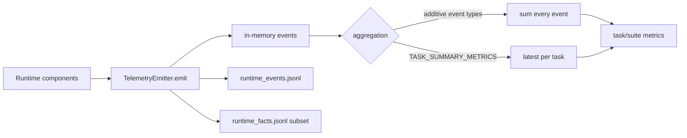

# Telemetry 与指标聚合

[`TelemetryEvent`](../../../v2/runtime/telemetry.py) 保存 event ID、trace/task/step/attempt、span、event type、时间、role、channel、severity、payload、metrics 和 schema version。`TelemetryEmitter` 同时维护内存事件、runtime event JSONL 与精简的 runtime fact JSONL。

事件分为增量事实与终态快照。`STATE_PUBLISHED`、`STEP_COMPLETED`、`MEMORY_HYBRID_QUERIED` 等每发生一次就可以累加；`TASK_SUMMARY_METRICS` 表示某任务当前终态，只取每个 task 最新一条。若把所有 summary snapshot 都相加，重写或恢复时会重复计数。

主要事件可以按机制理解：

| 机制 | 代表事件 | 说明 |
|:--|:--|:--|
| 计划与步骤 | `ADAPTIVE_PLAN_APPROVED`、`STEP_DISPATCHED/RUNNING/COMPLETED/FAILED/TRAPPED` | 计划和 Worker 生命周期 |
| 检索 | `RETRIEVAL_CANDIDATE_POOL_BUILT`、`RETRIEVAL_RERANKED`、`EVIDENCE_PACK_BUILT` | 候选、排序与证据包 |
| 非文本状态 | `STATE_PUBLISHED/RESOLVED/CONSUMED/RELEASED` | 物理对象与消费闭环 |
| Logit Gate | `logit_state_publish/consume/release_count`、`logit_gate_accept/retry/fail_closed_count` | 候选概率是否真实改变执行授权 |
| 产物 | `ARTIFACT_MATERIALIZED/PUBLISHED/VALIDATED/COMMITTED` | workspace 文件与可信状态 |
| 记忆 | `MEMORY_HYBRID_QUERIED`、`REPLAY_DECIDED`、`MEMORY_COMMIT_VERIFIED` | 候选、复用分级与写回 |
| 执行 | `EVIDENCE_PROJECTED`、`CAPABILITY_QUALITY_EVALUATED`、`LLM_CODEACT_EXECUTED` | Grant、程序和 Validator |
| 清理 | `GC_ISSUED` | 终态资源结算 |

event payload 用于身份和原因，metrics 用于数值聚合。比如 `STATE_CONSUMED` 的 payload 可以包含 ref、selected candidate 和 PIDs，metrics 可以包含 selected bytes/consume count。不要把 candidate ID 数组长度临时当成全局指标，正式分母应由对应事件合同定义。

Emitter 还测量自身日志开销，包括 emit、event/fact write、flush 和 handle open 时间/次数。这样可以把 Telemetry 自身固定成本与业务阶段区分，而不是默认日志免费。

Logit Gate 的任务终态指标还包括 extraction attempt/available count、跨 PID transfer count、传输字节、retry trigger、top gap、entropy、decision position 与 sequence length。分析时不能只看 `logit_gate_accept_count`：完整闭环至少要同时核对 publish、跨 PID consume、release、最终状态和 Worker dispatch 行为。受控挑战中的 19 次状态是独立诊断分母，不应与 embedding state transfer 或正式任务数相加。

Studio 只转发白名单 event/metric/payload，并压缩数组和长字符串；这不改变磁盘原始 JSONL。正式分析应读取 Run 内完整事件，界面事件用于现场理解和进度显示。

新增事件时需要确定它是 additive 还是 snapshot、唯一分母是什么、哪些 payload 可公开给 Studio，以及是否属于 runtime fact。只增加字符串 event type 而不更新聚合语义，容易造成指标重复或遗漏。
