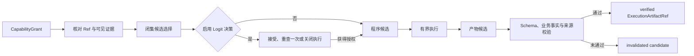
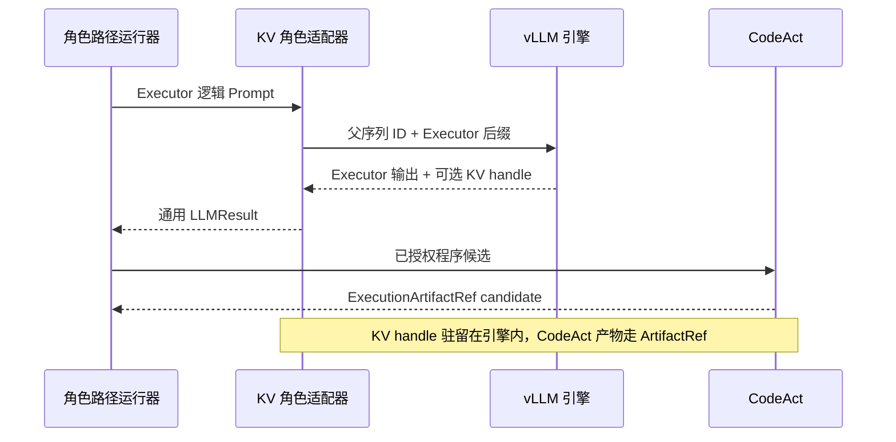
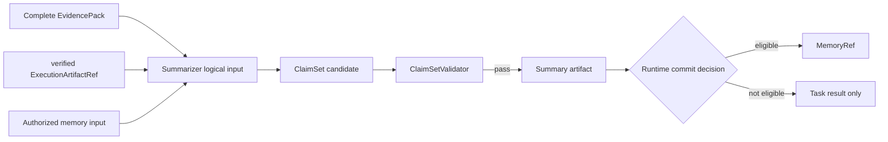
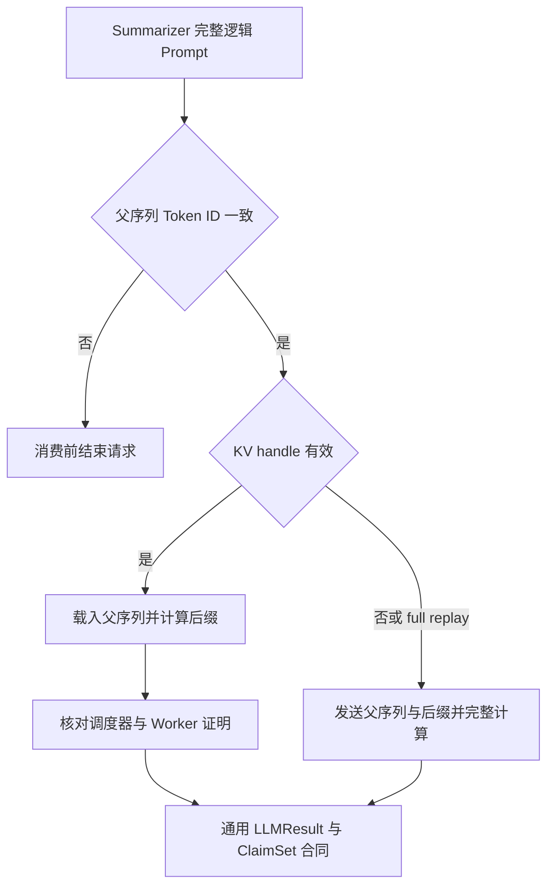

# 角色 Worker

## 四个角色

Runtime 当前的角色合同位于 `src/statebus/runtime/role_contract.py`，主要角色为 Planner、Retriever、Executor 和 Summarizer。角色生成候选；`PlanPolicy`、capability grant、Ref Registry、validator 和提交检查负责授权、对象校验和提交。

角色实现与路径：

| 角色 | 主要代码 | 输出对象 |
| --- | --- | --- |
| Planner | `runtime/adaptive_mainline.py`、`plan_policy.py` | `PlanProposal`、`ApprovedPlan` |
| Retriever | `retrieval/`、`runtime/evidence_projection.py` | `EvidencePack`、可选 `SemanticStateRef` |
| Executor | `runtime/adaptive_dispatcher.py`、`codeact.py` | candidate program、`ExecutionArtifactRef` |
| Summarizer | role provider 与 `runtime/claims.py` | validated `ClaimSet` |

APC、显式 KV 和 Logit 是模型侧可选模型路径，不增加新的业务角色。

---

## Planner：把任务语义压缩成待审批计划

Planner 面向任务合同。formal task 先由 TaskCompiler 形成 `CanonicalTaskSpec`，Runtime 再向
Planner 暴露任务目标、`AdaptiveTaskEnvelope`、获准输入 Ref 摘要、capability surface、角色
基数约束和重规划上下文。Planner 据此理解任务目标并组合获准能力。

Planner 的主要输出是 `PlanProposal`。提案中的每个 `PlanStepProposal` 声明角色、
`capability_id`、依赖关系、输入 Ref 及类型、输出合同和完成条件；计划还声明最终输出合同和
记忆策略。LLM 负责处理任务语义，输出以 untrusted candidate 状态进入 PlanPolicy。

`PlanPolicyValidator` 检查任务 ID、DAG 结构、角色顺序与基数、能力登记、输入引用、输出合同
白名单和 LLM Python 开关。schema repair 在固定合同内执行；校验通过后产生 `ApprovedPlan`，
其余情况以 planner hard rejection 结束。后续 CapabilityGrant 从批准版本派生。

| 角色合同 | Planner 的职责 |
|:--|:--|
| 可见输入 | 任务语义、允许输入、能力目录、角色与预算约束 |
| 候选输出 | `PlanProposal`、检索目标、步骤依赖与完成条件 |
| 权威校验 | `PlanPolicyValidator`、计划规范化和批准计划 hash |
| 后续职责 | 工具执行、产物物化与记忆提交由 Runtime 分派给对应组件 |

主要实现位于 [role_path.py](../../src/statebus/runtime/role_path.py)、[adaptive_mainline.py](../../src/statebus/runtime/adaptive_mainline.py)、[adaptive_plan_compiler.py](../../src/statebus/runtime/adaptive_plan_compiler.py) 与 [plan_policy.py](../../src/statebus/runtime/plan_policy.py)。任务进入 Planner 之前的编译过程另见[任务编译](runtime.md#任务编译与正式任务合同)，提案怎样变成能力授权另见[计划策略与能力授权](runtime.md#计划策略与能力授权)。

---

## Retriever：在受限语料中形成完整证据集合

Retriever 接收批准计划中的检索步骤和对应 `CapabilityGrant`。它根据任务查询形成
`EvidenceRequest`，查询数量、候选预算、证据类型和 `corpus_scope_ids` 由任务 envelope 与
Grant 固定；路由或工具存在多个候选时，在 Runtime 提供的 closed candidate surface 中选择。

角色决策之后，检索和对象物化由 Runtime 负责。检索管线对不同来源做 fan-out，记录候选池与检索日志，随后把选中内容规范化为 `CanonicalEvidencePack`。结构化片段通过 `HydrateManifest` 保留行、单元格或文本跨度的定位关系；需要稠密选择时，embedding 以 `SemanticStateRef` 发布到 StatePool，消费者凭 registry 记录、runtime signature 和消费回执读取。

EvidencePack 经过 coverage 检查。证据不足时，Retriever 在既定预算内提出一次扩展请求；
达到完整状态后，Pack 的 hash、任务与会话范围进入 Executor 和 Summarizer。检索分数用于
候选排序，事实确认由后续来源核验和 Validator 完成。

| 角色合同 | Retriever 的职责 |
|:--|:--|
| 可见输入 | `EvidenceRequest` 上下文、Grant、语料范围、闭集 route/tool surface |
| 候选输出 | 查询与路由选择、候选证据、检索日志 |
| Runtime 物化 | `CanonicalEvidencePack`、`HydrateManifest`、`SemanticStateRef` |
| 后续职责 | 执行产物与最终结论由 Executor、Validator 和 Summarizer 完成 |

主要实现位于 [role_path.py](../../src/statebus/runtime/role_path.py)、[retrieval_adapter.py](../../src/statebus/runtime/retrieval_adapter.py)、[evidence_coverage.py](../../src/statebus/runtime/evidence_coverage.py) 与 [src/statebus/retrieval](../../src/statebus/retrieval)。非文本语义状态和 Hydration 的细节分别见[稠密语义状态](state.md#稠密语义状态)与[Hydration 和证据](state.md#hydration-与证据合并)。

---

## Executor：把批准动作变成可验证产物

Executor 取得针对单次 attempt 签发的 `CapabilityGrant`，其中固定任务、会话、步骤、获准
capability、输入 Ref、输出合同、workspace 和 grant hash。执行输入来自 EvidencePack 与获准
Ref，并经过状态、会话归属、schema、hash 和兼容签名检查；非文本状态同时生成消费回执。

当执行步骤存在 2 到 8 个闭集 route/tool 候选且启用 Logit 决策时，Executor 先返回候选别名。
Runtime 从真实 choice-token 概率生成 `LogitStateRef`，交给独立 Worker；action 为
accept 时进入 Worker dispatch，为 retry 时展开一次合同后重查，其余状态以 fail closed 结束。
证据与 CapabilityGrant 在重查前后保持一致。

执行路径取决于批准 capability。确定性 handler 完成固定计算；Transform DSL 用注册操作集合
表达筛选、聚合、跨期比较等数据变换；adaptive CodeAct 由 LLM 生成受限 Python。三条路径
都在 attempt workspace 与获准输入集合内运行。

Python 候选经过 AST 与 policy 检查，再由隔离执行器运行；DSL 经过操作、字段和参数合同检查。
程序退出后产生 candidate Artifact。Runtime 核对文件范围、manifest、schema、行数、数值不变量、
内容 hash 和 lineage；满足完成条件后，Ref Registry 将 `ExecutionArtifactRef` 提升为 verified。
未通过项保留审计信息并转为 invalidated。

### Prefix 与 KV 在 Executor 一侧的位置

`RolePathRunner` 在调用模型前编译最终 prompt。启用 shared prefix alignment 时，它把 Executor 与 Summarizer 共同获权的 evidence 放在 token position 0；请求仍是完整 prompt，是否命中由同一 vLLM 的 APC 决定。

显式 KV 模式在普通 role client 外增加 `EngineLocalKVRoleClient`。Executor 调用改走私有 `/src/statebus/kv/produce`：服务按真实 tokenizer 把 prompt 切成 block-aligned parent 与 Executor suffix，`continuation` lane 捕获 parent KV，`full_replay` lane 只生成对照输出。上层仍收到普通 `LLMResult`。

模式为 `off` 时包装器直接返回普通 delegate。启用时适配 Executor 和 Summarizer，Planner、
Retriever、CapabilityGrant、CodeAct、Validator 与提交检查保持原有流程。KV handle 跨过
CodeAct 阶段暂存，CodeAct 输出通过 verified `ExecutionArtifactRef` 进入 Summarizer。

| 角色合同 | Executor 的职责 |
|:--|:--|
| 可见输入 | 当前 Grant、verified 输入 Ref、完整 EvidencePack、被授权的语义状态 |
| 候选输出 | 工具选择、TransformProgram 或 bounded Python、执行文件与 manifest |
| Runtime 物化 | `LogitStateRef`/GateReceipt、candidate 到 verified 的 `ExecutionArtifactRef`、执行记录与 validator receipt；可选 KV handle 由 Worker-local registry 管理 |
| 后续职责 | 结论组织与记忆提交由 Summarizer 和 Runtime 完成 |

调度与产物注册位于 [adaptive_dispatcher.py](../../src/statebus/runtime/adaptive_dispatcher.py)；CodeAct 主体位于 [llm_codeact.py](../../src/statebus/runtime/llm_codeact.py)，DSL 位于 [transform_dsl.py](../../src/statebus/runtime/transform_dsl.py)。更完整的执行过程见[Logit Retry Decision](runtime.md#logit-retry-decision)、[Engine-Local Prefix Reuse](runtime.md#engine-local-prefix-reuse)、[显式 KV Continuation](runtime.md#engine-local-kv-continuation)、[受限 Python CodeAct](execution.md#受限-python-codeact)、[Transform DSL](execution.md#transform-dsl)和[产物质量检查](execution.md#workspace产物与质量签发)。

---

## Summarizer：读取已验证输入并生成 ClaimSet

Summarizer 位于业务流程末端。调度器为其 Grant 配置至少一个已验证执行产物，以及一个与当前
任务、会话一致且 coverage 状态为 COMPLETE 的 EvidencePack。存在多级 Executor 时，中间
产物保留在依赖关系中，最后一级 verified Artifact 作为直接结论输入。

角色读取规范化产物行、EvidencePack locator 和获准记忆输入，生成 `ClaimSet` 候选。每条
Claim 把结论值与证据定位、产物来源和任务上下文连接起来。`ClaimSetValidator` 检查引用、
会话归属、声明值支撑关系和输出合同。

校验未通过时，步骤以 `claim_validation_failed` 结束；校验通过后，Runtime 写入 summary
Artifact，并结合任务完成状态、lineage、记忆查询状态和兼容策略决定 `MemoryRef` 提交。
Summarizer 产生写回候选，Runtime 完成最终提交。

### Prefix 与 KV 在 Summarizer 一侧的位置

Prefix 模式下，Summarizer 提交完整 logical Prompt。共同证据 envelope 位于位置 0，角色
指令、verified Artifact 内容和动态输出要求位于后缀；vLLM 自动复用已驻留的完整 Token
block。共同前缀取 Executor 与 Summarizer 可见证据的交集，Executor-only 内容保留在自己的
角色后缀中。

显式 KV 模式下，adapter 先用服务 tokenizer 重建完整 Summarizer Prompt，并逐 Token 核对
前 4,096 个 Token 与 Executor 捕获父序列的一致性。通过后向 `/src/statebus/kv/continue` 发送
handle 与 Summarizer 后缀；CodeAct 的 verified Artifact 仍在后缀中进入模型。

KV 模式沿用同一引用范围和质量检查。Telemetry 分别累计 continuation、full replay 与 fallback；
handle 在 Consumer `finally` 中 release，过期或 identity/compatibility 不一致时进入对应状态处理。

| 角色合同 | Summarizer 的职责 |
|:--|:--|
| 可见输入 | verified artifact、唯一完整 EvidencePack、Grant 允许的记忆输入 |
| 候选输出 | `ClaimSet`、摘要文本、可复用步骤和标签 |
| 权威校验 | `ClaimSetValidator`、summary artifact 写入、Runtime memory commit decision；KV 模式另核对 token identity 与 forward proof |
| 上游职责 | 工具选择、证据补充和执行产物修改由对应上游步骤完成 |

主要调度逻辑位于 [adaptive_dispatcher.py](../../src/statebus/runtime/adaptive_dispatcher.py)，Claim 校验位于 [claims.py](../../src/statebus/runtime/claims.py)，记忆提交由 [adaptive_mainline.py](../../src/statebus/runtime/adaptive_mainline.py) 收口。模型调用包装见 [role_client.py](../../src/statebus/integrations/vllm_kv/role_client.py)；跨任务写回与重放流程见[记忆提交与分级重放](memory.md)。
