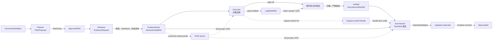

# 四 Agent 角色合同

StateBus 由 Planner、Retriever、Executor、Summarizer 四个认知角色与 Runtime 共同组成。
每个角色在 Runtime 投影的可见面内生成候选对象；计划策略、CapabilityGrant、Ref Registry、
Validator 和 Commit Gate 依次完成执行授权与可信状态迁移。

图中的 Agent 节点负责生成候选，箭头上的策略和校验节点负责系统判定。Retriever 在获准
语料范围内提出证据请求，Executor 生成 Python 或 Transform DSL 候选并交由质量门验证，
Summarizer 基于 EvidencePack 与 verified Artifact 组织结论。

虚线表示模型侧计算复用。共同 Prefix 由 Executor 与 Summarizer 都已获权且 digest 一致的
证据组成；显式 KV 复用这段 logical parent 的模型计算。CodeAct 产物继续通过
`ExecutionArtifactRef` 交给 Summarizer。

| 角色 | 主要候选输出 | Runtime 接管后的可信对象 | 职责范围 |
|:--|:--|:--|:--|
| [Planner](planner.md) | `PlanProposal`、检索目标、步骤依赖 | `ApprovedPlan` | 任务分解与能力编排 |
| [Retriever](retriever.md) | `EvidenceRequest`、闭集路由选择 | `CanonicalEvidencePack`、`HydrateManifest`、`SemanticStateRef` | 证据检索与状态发布 |
| [Executor](executor.md) | 闭集选择、TransformProgram 或受限 Python 候选 | `LogitGateReceipt`、verified `ExecutionArtifactRef` | 获准能力执行与产物生成 |
| [Summarizer](summarizer.md) | `ClaimSet` 候选、可复用步骤描述 | validated `ClaimSet`、受控的记忆提交输入 | 引用组织、结论生成与写回提案 |

源码中的 [role_contract.py](../../../statebus/runtime/role_contract.py) 为四个角色定义必需遥测键、
预期产物和访问范围，用于还原完整角色图。具体任务执行由
[adaptive_mainline.py](../../../statebus/runtime/adaptive_mainline.py)、
[adaptive_runtime.py](../../../statebus/runtime/adaptive_runtime.py) 和
[adaptive_dispatcher.py](../../../statebus/runtime/adaptive_dispatcher.py) 共同编排；角色合同与计划、
授权、对象状态和遥测共同构成运行事实。
