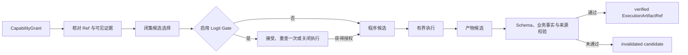
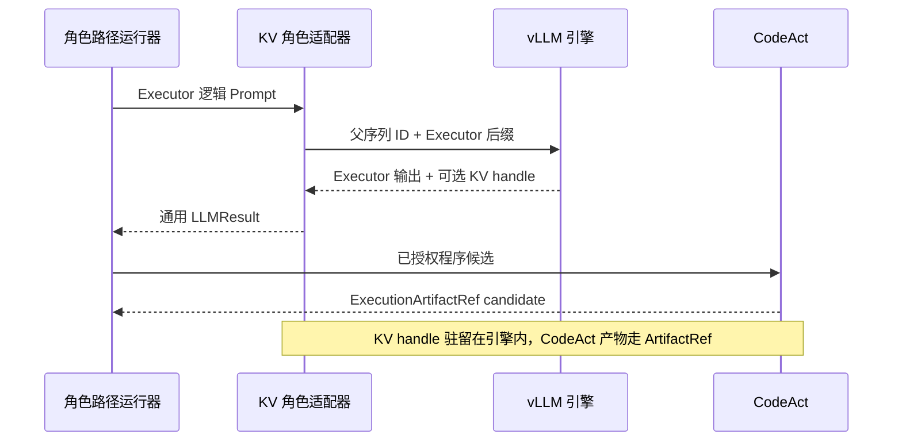

# Executor：把批准动作变成可验证产物

Executor 取得针对单次 attempt 签发的 `CapabilityGrant`，其中固定任务、会话、步骤、获准
capability、输入 Ref、输出合同、workspace 和 grant hash。执行输入来自 EvidencePack 与获准
Ref，并经过状态、会话归属、schema、hash 和兼容签名检查；非文本状态同时生成消费回执。

当执行步骤存在 2 到 8 个闭集 route/tool 候选且启用 Logit Gate 时，Executor 先返回候选别名。
Runtime 从真实 choice-token 概率生成 `LogitStateRef`，交给独立 Gate PID；Gate action 为
accept 时进入 Worker dispatch，为 retry 时展开一次合同后重查，其余状态以 fail closed 收敛。
证据与 CapabilityGrant 在重查前后保持一致。

执行路径取决于批准 capability。确定性 handler 完成固定计算；Transform DSL 用注册操作集合
表达筛选、聚合、跨期比较等数据变换；adaptive CodeAct 由 LLM 生成受限 Python。三条路径
都在 attempt workspace 与获准输入面内运行。

Python 候选经过 AST 与 policy 检查，再由隔离执行器运行；DSL 经过操作、字段和参数合同检查。
程序退出后产生 candidate Artifact。Runtime 核对文件范围、manifest、schema、行数、数值不变量、
内容 hash 和 lineage；满足完成条件后，Ref Registry 将 `ExecutionArtifactRef` 提升为 verified。
未通过项保留审计信息并转为 invalidated。

## Prefix 与 KV 在 Executor 一侧的位置

`RolePathRunner` 在调用模型前编译最终 prompt。启用 shared prefix alignment 时，它把 Executor 与 Summarizer 共同获权的 evidence 放在 token position 0；请求仍是完整 prompt，是否命中由同一 vLLM 的 APC 决定。

显式 KV 模式在普通 role client 外增加 `EngineLocalKVRoleClient`。Executor 调用改走私有 `/statebus/kv/produce`：服务按真实 tokenizer 把 prompt 切成 block-aligned parent 与 Executor suffix，`continuation` lane 捕获 parent KV，`full_replay` lane 只生成对照输出。上层仍收到普通 `LLMResult`。

模式为 `off` 时包装器直接返回普通 delegate。启用时适配 Executor 和 Summarizer，Planner、
Retriever、CapabilityGrant、CodeAct、Validator 与 Commit Gate 保持原有流程。KV handle 跨过
CodeAct 阶段暂存，CodeAct 输出通过 verified `ExecutionArtifactRef` 进入 Summarizer。

| 合同面 | Executor 的职责 |
|:--|:--|
| 可见输入 | 当前 Grant、verified 输入 Ref、完整 EvidencePack、被授权的语义状态 |
| 候选输出 | 工具选择、TransformProgram 或 bounded Python、执行文件与 manifest |
| Runtime 物化 | `LogitStateRef`/GateReceipt、candidate 到 verified 的 `ExecutionArtifactRef`、执行记录与 validator receipt；可选 KV handle 由 Worker-local registry 管理 |
| 后续职责 | 结论组织与记忆提交由 Summarizer 和 Runtime 完成 |

调度与产物注册位于 [adaptive_dispatcher.py](../../../statebus/runtime/adaptive_dispatcher.py)；CodeAct 主体位于 [llm_codeact.py](../../../statebus/runtime/llm_codeact.py)，DSL 位于 [transform_dsl.py](../../../statebus/runtime/transform_dsl.py)。更完整的执行链见[Logit Retry Gate](../runtime/logit-retry-gate.md)、[Engine-Local Prefix Reuse](../runtime/engine-local-prefix-reuse.md)、[显式 KV Continuation](../runtime/engine-local-kv-continuation.md)、[受限 Python CodeAct](../execution/bounded-python-codeact.md)、[Transform DSL](../execution/transform-dsl.md)和[产物质量门](../execution/artifact-and-quality-gate.md)。
