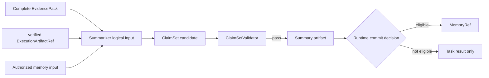
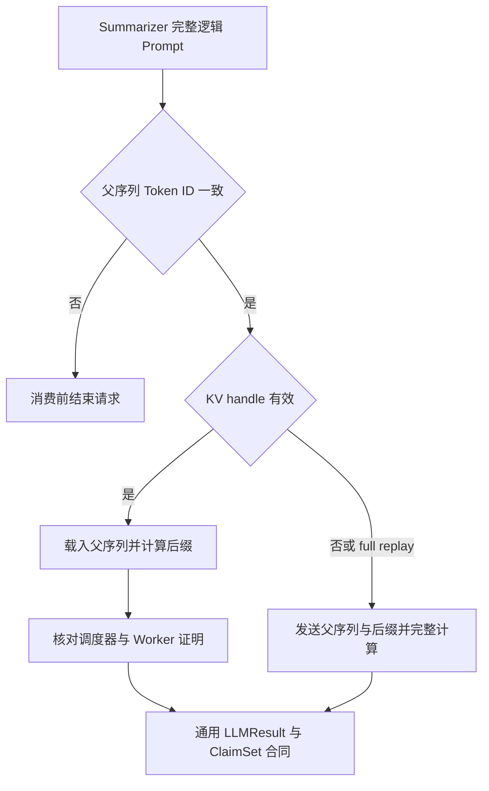

# Summarizer：只基于可信输入形成可核验结论

Summarizer 位于业务链末端。调度器为其 Grant 配置至少一个已验证执行产物，以及一个与当前
任务、会话一致且 coverage 状态为 COMPLETE 的 EvidencePack。存在多级 Executor 时，中间
产物保留在依赖链中，最后一级 verified Artifact 作为直接结论输入。

角色读取规范化产物行、EvidencePack locator 和获准记忆输入，生成 `ClaimSet` 候选。每条
Claim 把结论值与证据定位、产物来源和任务上下文连接起来。`ClaimSetValidator` 检查引用、
会话归属、声明值支撑关系和输出合同。

校验未通过时，步骤以 `claim_validation_failed` 结束；校验通过后，Runtime 写入 summary
Artifact，并结合任务完成状态、lineage、记忆查询状态和兼容策略决定 `MemoryRef` 提交。
Summarizer 产生写回候选，Runtime 完成最终提交。

## Prefix 与 KV 在 Summarizer 一侧的位置

Prefix 模式下，Summarizer 提交完整 logical Prompt。共同证据 envelope 位于位置 0，角色
指令、verified Artifact 内容和动态输出要求位于后缀；vLLM 自动复用已驻留的完整 Token
block。共同前缀取 Executor 与 Summarizer 可见证据的交集，Executor-only 内容保留在自己的
角色后缀中。

显式 KV 模式下，adapter 先用服务 tokenizer 重建完整 Summarizer Prompt，并逐 Token 核对
前 4,096 个 Token 与 Executor 捕获父序列的一致性。通过后向 `/statebus/kv/continue` 发送
handle 与 Summarizer 后缀；CodeAct 的 verified Artifact 仍在后缀中进入模型。

KV 模式沿用同一引用范围和质量门。Telemetry 分别累计 continuation、full replay 与 fallback；
handle 在 Consumer `finally` 中 release，过期或 identity/compatibility 不一致时进入对应状态处理。

| 合同面 | Summarizer 的职责 |
|:--|:--|
| 可见输入 | verified artifact、唯一完整 EvidencePack、Grant 允许的记忆输入 |
| 候选输出 | `ClaimSet`、摘要文本、可复用步骤和标签 |
| 权威校验 | `ClaimSetValidator`、summary artifact 写入、Runtime memory commit decision；KV 模式另核对 token identity 与 forward proof |
| 上游职责 | 工具选择、证据补充和执行产物修改由对应上游步骤完成 |

主要调度逻辑位于 [adaptive_dispatcher.py](../../../statebus/runtime/adaptive_dispatcher.py)，Claim 校验位于 [claims.py](../../../statebus/runtime/claims.py)，记忆提交由 [adaptive_mainline.py](../../../statebus/runtime/adaptive_mainline.py) 收口。模型调用包装见 [role_client.py](../../../statebus/integrations/vllm_kv/role_client.py)；跨任务写回与重放流程见[记忆提交与分级重放](../memory/commit-and-replay.md)。
